# palmerpenguins Analysis
Reuben Njue

``` r
pacman::p_load(conflicted, tidyverse, ggbeeswarm, palmerpenguins, wrappedtools)
conflict_scout()
conflict_prefer("penguins", "palmerpenguins") 
conflict_prefer("filter", "dplyr")
penguins
```

    # A tibble: 344 × 8
       species island    bill_length_mm bill_depth_mm flipper_length_mm body_mass_g
       <fct>   <fct>              <dbl>         <dbl>             <int>       <int>
     1 Adelie  Torgersen           39.1          18.7               181        3750
     2 Adelie  Torgersen           39.5          17.4               186        3800
     3 Adelie  Torgersen           40.3          18                 195        3250
     4 Adelie  Torgersen           NA            NA                  NA          NA
     5 Adelie  Torgersen           36.7          19.3               193        3450
     6 Adelie  Torgersen           39.3          20.6               190        3650
     7 Adelie  Torgersen           38.9          17.8               181        3625
     8 Adelie  Torgersen           39.2          19.6               195        4675
     9 Adelie  Torgersen           34.1          18.1               193        3475
    10 Adelie  Torgersen           42            20.2               190        4250
    # ℹ 334 more rows
    # ℹ 2 more variables: sex <fct>, year <int>

``` r
datasets::penguins
```

          species    island bill_len bill_dep flipper_len body_mass    sex year
    1      Adelie Torgersen     39.1     18.7         181      3750   male 2007
    2      Adelie Torgersen     39.5     17.4         186      3800 female 2007
    3      Adelie Torgersen     40.3     18.0         195      3250 female 2007
    4      Adelie Torgersen       NA       NA          NA        NA   <NA> 2007
    5      Adelie Torgersen     36.7     19.3         193      3450 female 2007
    6      Adelie Torgersen     39.3     20.6         190      3650   male 2007
    7      Adelie Torgersen     38.9     17.8         181      3625 female 2007
    8      Adelie Torgersen     39.2     19.6         195      4675   male 2007
    9      Adelie Torgersen     34.1     18.1         193      3475   <NA> 2007
    10     Adelie Torgersen     42.0     20.2         190      4250   <NA> 2007
    11     Adelie Torgersen     37.8     17.1         186      3300   <NA> 2007
    12     Adelie Torgersen     37.8     17.3         180      3700   <NA> 2007
    13     Adelie Torgersen     41.1     17.6         182      3200 female 2007
    14     Adelie Torgersen     38.6     21.2         191      3800   male 2007
    15     Adelie Torgersen     34.6     21.1         198      4400   male 2007
    16     Adelie Torgersen     36.6     17.8         185      3700 female 2007
    17     Adelie Torgersen     38.7     19.0         195      3450 female 2007
    18     Adelie Torgersen     42.5     20.7         197      4500   male 2007
    19     Adelie Torgersen     34.4     18.4         184      3325 female 2007
    20     Adelie Torgersen     46.0     21.5         194      4200   male 2007
    21     Adelie    Biscoe     37.8     18.3         174      3400 female 2007
    22     Adelie    Biscoe     37.7     18.7         180      3600   male 2007
    23     Adelie    Biscoe     35.9     19.2         189      3800 female 2007
    24     Adelie    Biscoe     38.2     18.1         185      3950   male 2007
    25     Adelie    Biscoe     38.8     17.2         180      3800   male 2007
    26     Adelie    Biscoe     35.3     18.9         187      3800 female 2007
    27     Adelie    Biscoe     40.6     18.6         183      3550   male 2007
    28     Adelie    Biscoe     40.5     17.9         187      3200 female 2007
    29     Adelie    Biscoe     37.9     18.6         172      3150 female 2007
    30     Adelie    Biscoe     40.5     18.9         180      3950   male 2007
    31     Adelie     Dream     39.5     16.7         178      3250 female 2007
    32     Adelie     Dream     37.2     18.1         178      3900   male 2007
    33     Adelie     Dream     39.5     17.8         188      3300 female 2007
    34     Adelie     Dream     40.9     18.9         184      3900   male 2007
    35     Adelie     Dream     36.4     17.0         195      3325 female 2007
    36     Adelie     Dream     39.2     21.1         196      4150   male 2007
    37     Adelie     Dream     38.8     20.0         190      3950   male 2007
    38     Adelie     Dream     42.2     18.5         180      3550 female 2007
    39     Adelie     Dream     37.6     19.3         181      3300 female 2007
    40     Adelie     Dream     39.8     19.1         184      4650   male 2007
    41     Adelie     Dream     36.5     18.0         182      3150 female 2007
    42     Adelie     Dream     40.8     18.4         195      3900   male 2007
    43     Adelie     Dream     36.0     18.5         186      3100 female 2007
    44     Adelie     Dream     44.1     19.7         196      4400   male 2007
    45     Adelie     Dream     37.0     16.9         185      3000 female 2007
    46     Adelie     Dream     39.6     18.8         190      4600   male 2007
    47     Adelie     Dream     41.1     19.0         182      3425   male 2007
    48     Adelie     Dream     37.5     18.9         179      2975   <NA> 2007
    49     Adelie     Dream     36.0     17.9         190      3450 female 2007
    50     Adelie     Dream     42.3     21.2         191      4150   male 2007
    51     Adelie    Biscoe     39.6     17.7         186      3500 female 2008
    52     Adelie    Biscoe     40.1     18.9         188      4300   male 2008
    53     Adelie    Biscoe     35.0     17.9         190      3450 female 2008
    54     Adelie    Biscoe     42.0     19.5         200      4050   male 2008
    55     Adelie    Biscoe     34.5     18.1         187      2900 female 2008
    56     Adelie    Biscoe     41.4     18.6         191      3700   male 2008
    57     Adelie    Biscoe     39.0     17.5         186      3550 female 2008
    58     Adelie    Biscoe     40.6     18.8         193      3800   male 2008
    59     Adelie    Biscoe     36.5     16.6         181      2850 female 2008
    60     Adelie    Biscoe     37.6     19.1         194      3750   male 2008
    61     Adelie    Biscoe     35.7     16.9         185      3150 female 2008
    62     Adelie    Biscoe     41.3     21.1         195      4400   male 2008
    63     Adelie    Biscoe     37.6     17.0         185      3600 female 2008
    64     Adelie    Biscoe     41.1     18.2         192      4050   male 2008
    65     Adelie    Biscoe     36.4     17.1         184      2850 female 2008
    66     Adelie    Biscoe     41.6     18.0         192      3950   male 2008
    67     Adelie    Biscoe     35.5     16.2         195      3350 female 2008
    68     Adelie    Biscoe     41.1     19.1         188      4100   male 2008
    69     Adelie Torgersen     35.9     16.6         190      3050 female 2008
    70     Adelie Torgersen     41.8     19.4         198      4450   male 2008
    71     Adelie Torgersen     33.5     19.0         190      3600 female 2008
    72     Adelie Torgersen     39.7     18.4         190      3900   male 2008
    73     Adelie Torgersen     39.6     17.2         196      3550 female 2008
    74     Adelie Torgersen     45.8     18.9         197      4150   male 2008
    75     Adelie Torgersen     35.5     17.5         190      3700 female 2008
    76     Adelie Torgersen     42.8     18.5         195      4250   male 2008
    77     Adelie Torgersen     40.9     16.8         191      3700 female 2008
    78     Adelie Torgersen     37.2     19.4         184      3900   male 2008
    79     Adelie Torgersen     36.2     16.1         187      3550 female 2008
    80     Adelie Torgersen     42.1     19.1         195      4000   male 2008
    81     Adelie Torgersen     34.6     17.2         189      3200 female 2008
    82     Adelie Torgersen     42.9     17.6         196      4700   male 2008
    83     Adelie Torgersen     36.7     18.8         187      3800 female 2008
    84     Adelie Torgersen     35.1     19.4         193      4200   male 2008
    85     Adelie     Dream     37.3     17.8         191      3350 female 2008
    86     Adelie     Dream     41.3     20.3         194      3550   male 2008
    87     Adelie     Dream     36.3     19.5         190      3800   male 2008
    88     Adelie     Dream     36.9     18.6         189      3500 female 2008
    89     Adelie     Dream     38.3     19.2         189      3950   male 2008
    90     Adelie     Dream     38.9     18.8         190      3600 female 2008
    91     Adelie     Dream     35.7     18.0         202      3550 female 2008
    92     Adelie     Dream     41.1     18.1         205      4300   male 2008
    93     Adelie     Dream     34.0     17.1         185      3400 female 2008
    94     Adelie     Dream     39.6     18.1         186      4450   male 2008
    95     Adelie     Dream     36.2     17.3         187      3300 female 2008
    96     Adelie     Dream     40.8     18.9         208      4300   male 2008
    97     Adelie     Dream     38.1     18.6         190      3700 female 2008
    98     Adelie     Dream     40.3     18.5         196      4350   male 2008
    99     Adelie     Dream     33.1     16.1         178      2900 female 2008
    100    Adelie     Dream     43.2     18.5         192      4100   male 2008
    101    Adelie    Biscoe     35.0     17.9         192      3725 female 2009
    102    Adelie    Biscoe     41.0     20.0         203      4725   male 2009
    103    Adelie    Biscoe     37.7     16.0         183      3075 female 2009
    104    Adelie    Biscoe     37.8     20.0         190      4250   male 2009
    105    Adelie    Biscoe     37.9     18.6         193      2925 female 2009
    106    Adelie    Biscoe     39.7     18.9         184      3550   male 2009
    107    Adelie    Biscoe     38.6     17.2         199      3750 female 2009
    108    Adelie    Biscoe     38.2     20.0         190      3900   male 2009
    109    Adelie    Biscoe     38.1     17.0         181      3175 female 2009
    110    Adelie    Biscoe     43.2     19.0         197      4775   male 2009
    111    Adelie    Biscoe     38.1     16.5         198      3825 female 2009
    112    Adelie    Biscoe     45.6     20.3         191      4600   male 2009
    113    Adelie    Biscoe     39.7     17.7         193      3200 female 2009
    114    Adelie    Biscoe     42.2     19.5         197      4275   male 2009
    115    Adelie    Biscoe     39.6     20.7         191      3900 female 2009
    116    Adelie    Biscoe     42.7     18.3         196      4075   male 2009
    117    Adelie Torgersen     38.6     17.0         188      2900 female 2009
    118    Adelie Torgersen     37.3     20.5         199      3775   male 2009
    119    Adelie Torgersen     35.7     17.0         189      3350 female 2009
    120    Adelie Torgersen     41.1     18.6         189      3325   male 2009
    121    Adelie Torgersen     36.2     17.2         187      3150 female 2009
    122    Adelie Torgersen     37.7     19.8         198      3500   male 2009
    123    Adelie Torgersen     40.2     17.0         176      3450 female 2009
    124    Adelie Torgersen     41.4     18.5         202      3875   male 2009
    125    Adelie Torgersen     35.2     15.9         186      3050 female 2009
    126    Adelie Torgersen     40.6     19.0         199      4000   male 2009
    127    Adelie Torgersen     38.8     17.6         191      3275 female 2009
    128    Adelie Torgersen     41.5     18.3         195      4300   male 2009
    129    Adelie Torgersen     39.0     17.1         191      3050 female 2009
    130    Adelie Torgersen     44.1     18.0         210      4000   male 2009
    131    Adelie Torgersen     38.5     17.9         190      3325 female 2009
    132    Adelie Torgersen     43.1     19.2         197      3500   male 2009
    133    Adelie     Dream     36.8     18.5         193      3500 female 2009
    134    Adelie     Dream     37.5     18.5         199      4475   male 2009
    135    Adelie     Dream     38.1     17.6         187      3425 female 2009
    136    Adelie     Dream     41.1     17.5         190      3900   male 2009
    137    Adelie     Dream     35.6     17.5         191      3175 female 2009
    138    Adelie     Dream     40.2     20.1         200      3975   male 2009
    139    Adelie     Dream     37.0     16.5         185      3400 female 2009
    140    Adelie     Dream     39.7     17.9         193      4250   male 2009
    141    Adelie     Dream     40.2     17.1         193      3400 female 2009
    142    Adelie     Dream     40.6     17.2         187      3475   male 2009
    143    Adelie     Dream     32.1     15.5         188      3050 female 2009
    144    Adelie     Dream     40.7     17.0         190      3725   male 2009
    145    Adelie     Dream     37.3     16.8         192      3000 female 2009
    146    Adelie     Dream     39.0     18.7         185      3650   male 2009
    147    Adelie     Dream     39.2     18.6         190      4250   male 2009
    148    Adelie     Dream     36.6     18.4         184      3475 female 2009
    149    Adelie     Dream     36.0     17.8         195      3450 female 2009
    150    Adelie     Dream     37.8     18.1         193      3750   male 2009
    151    Adelie     Dream     36.0     17.1         187      3700 female 2009
    152    Adelie     Dream     41.5     18.5         201      4000   male 2009
    153    Gentoo    Biscoe     46.1     13.2         211      4500 female 2007
    154    Gentoo    Biscoe     50.0     16.3         230      5700   male 2007
    155    Gentoo    Biscoe     48.7     14.1         210      4450 female 2007
    156    Gentoo    Biscoe     50.0     15.2         218      5700   male 2007
    157    Gentoo    Biscoe     47.6     14.5         215      5400   male 2007
    158    Gentoo    Biscoe     46.5     13.5         210      4550 female 2007
    159    Gentoo    Biscoe     45.4     14.6         211      4800 female 2007
    160    Gentoo    Biscoe     46.7     15.3         219      5200   male 2007
    161    Gentoo    Biscoe     43.3     13.4         209      4400 female 2007
    162    Gentoo    Biscoe     46.8     15.4         215      5150   male 2007
    163    Gentoo    Biscoe     40.9     13.7         214      4650 female 2007
    164    Gentoo    Biscoe     49.0     16.1         216      5550   male 2007
    165    Gentoo    Biscoe     45.5     13.7         214      4650 female 2007
    166    Gentoo    Biscoe     48.4     14.6         213      5850   male 2007
    167    Gentoo    Biscoe     45.8     14.6         210      4200 female 2007
    168    Gentoo    Biscoe     49.3     15.7         217      5850   male 2007
    169    Gentoo    Biscoe     42.0     13.5         210      4150 female 2007
    170    Gentoo    Biscoe     49.2     15.2         221      6300   male 2007
    171    Gentoo    Biscoe     46.2     14.5         209      4800 female 2007
    172    Gentoo    Biscoe     48.7     15.1         222      5350   male 2007
    173    Gentoo    Biscoe     50.2     14.3         218      5700   male 2007
    174    Gentoo    Biscoe     45.1     14.5         215      5000 female 2007
    175    Gentoo    Biscoe     46.5     14.5         213      4400 female 2007
    176    Gentoo    Biscoe     46.3     15.8         215      5050   male 2007
    177    Gentoo    Biscoe     42.9     13.1         215      5000 female 2007
    178    Gentoo    Biscoe     46.1     15.1         215      5100   male 2007
    179    Gentoo    Biscoe     44.5     14.3         216      4100   <NA> 2007
    180    Gentoo    Biscoe     47.8     15.0         215      5650   male 2007
    181    Gentoo    Biscoe     48.2     14.3         210      4600 female 2007
    182    Gentoo    Biscoe     50.0     15.3         220      5550   male 2007
    183    Gentoo    Biscoe     47.3     15.3         222      5250   male 2007
    184    Gentoo    Biscoe     42.8     14.2         209      4700 female 2007
    185    Gentoo    Biscoe     45.1     14.5         207      5050 female 2007
    186    Gentoo    Biscoe     59.6     17.0         230      6050   male 2007
    187    Gentoo    Biscoe     49.1     14.8         220      5150 female 2008
    188    Gentoo    Biscoe     48.4     16.3         220      5400   male 2008
    189    Gentoo    Biscoe     42.6     13.7         213      4950 female 2008
    190    Gentoo    Biscoe     44.4     17.3         219      5250   male 2008
    191    Gentoo    Biscoe     44.0     13.6         208      4350 female 2008
    192    Gentoo    Biscoe     48.7     15.7         208      5350   male 2008
    193    Gentoo    Biscoe     42.7     13.7         208      3950 female 2008
    194    Gentoo    Biscoe     49.6     16.0         225      5700   male 2008
    195    Gentoo    Biscoe     45.3     13.7         210      4300 female 2008
    196    Gentoo    Biscoe     49.6     15.0         216      4750   male 2008
    197    Gentoo    Biscoe     50.5     15.9         222      5550   male 2008
    198    Gentoo    Biscoe     43.6     13.9         217      4900 female 2008
    199    Gentoo    Biscoe     45.5     13.9         210      4200 female 2008
    200    Gentoo    Biscoe     50.5     15.9         225      5400   male 2008
    201    Gentoo    Biscoe     44.9     13.3         213      5100 female 2008
    202    Gentoo    Biscoe     45.2     15.8         215      5300   male 2008
    203    Gentoo    Biscoe     46.6     14.2         210      4850 female 2008
    204    Gentoo    Biscoe     48.5     14.1         220      5300   male 2008
    205    Gentoo    Biscoe     45.1     14.4         210      4400 female 2008
    206    Gentoo    Biscoe     50.1     15.0         225      5000   male 2008
    207    Gentoo    Biscoe     46.5     14.4         217      4900 female 2008
    208    Gentoo    Biscoe     45.0     15.4         220      5050   male 2008
    209    Gentoo    Biscoe     43.8     13.9         208      4300 female 2008
    210    Gentoo    Biscoe     45.5     15.0         220      5000   male 2008
    211    Gentoo    Biscoe     43.2     14.5         208      4450 female 2008
    212    Gentoo    Biscoe     50.4     15.3         224      5550   male 2008
    213    Gentoo    Biscoe     45.3     13.8         208      4200 female 2008
    214    Gentoo    Biscoe     46.2     14.9         221      5300   male 2008
    215    Gentoo    Biscoe     45.7     13.9         214      4400 female 2008
    216    Gentoo    Biscoe     54.3     15.7         231      5650   male 2008
    217    Gentoo    Biscoe     45.8     14.2         219      4700 female 2008
    218    Gentoo    Biscoe     49.8     16.8         230      5700   male 2008
    219    Gentoo    Biscoe     46.2     14.4         214      4650   <NA> 2008
    220    Gentoo    Biscoe     49.5     16.2         229      5800   male 2008
    221    Gentoo    Biscoe     43.5     14.2         220      4700 female 2008
    222    Gentoo    Biscoe     50.7     15.0         223      5550   male 2008
    223    Gentoo    Biscoe     47.7     15.0         216      4750 female 2008
    224    Gentoo    Biscoe     46.4     15.6         221      5000   male 2008
    225    Gentoo    Biscoe     48.2     15.6         221      5100   male 2008
    226    Gentoo    Biscoe     46.5     14.8         217      5200 female 2008
    227    Gentoo    Biscoe     46.4     15.0         216      4700 female 2008
    228    Gentoo    Biscoe     48.6     16.0         230      5800   male 2008
    229    Gentoo    Biscoe     47.5     14.2         209      4600 female 2008
    230    Gentoo    Biscoe     51.1     16.3         220      6000   male 2008
    231    Gentoo    Biscoe     45.2     13.8         215      4750 female 2008
    232    Gentoo    Biscoe     45.2     16.4         223      5950   male 2008
    233    Gentoo    Biscoe     49.1     14.5         212      4625 female 2009
    234    Gentoo    Biscoe     52.5     15.6         221      5450   male 2009
    235    Gentoo    Biscoe     47.4     14.6         212      4725 female 2009
    236    Gentoo    Biscoe     50.0     15.9         224      5350   male 2009
    237    Gentoo    Biscoe     44.9     13.8         212      4750 female 2009
    238    Gentoo    Biscoe     50.8     17.3         228      5600   male 2009
    239    Gentoo    Biscoe     43.4     14.4         218      4600 female 2009
    240    Gentoo    Biscoe     51.3     14.2         218      5300   male 2009
    241    Gentoo    Biscoe     47.5     14.0         212      4875 female 2009
    242    Gentoo    Biscoe     52.1     17.0         230      5550   male 2009
    243    Gentoo    Biscoe     47.5     15.0         218      4950 female 2009
    244    Gentoo    Biscoe     52.2     17.1         228      5400   male 2009
    245    Gentoo    Biscoe     45.5     14.5         212      4750 female 2009
    246    Gentoo    Biscoe     49.5     16.1         224      5650   male 2009
    247    Gentoo    Biscoe     44.5     14.7         214      4850 female 2009
    248    Gentoo    Biscoe     50.8     15.7         226      5200   male 2009
    249    Gentoo    Biscoe     49.4     15.8         216      4925   male 2009
    250    Gentoo    Biscoe     46.9     14.6         222      4875 female 2009
    251    Gentoo    Biscoe     48.4     14.4         203      4625 female 2009
    252    Gentoo    Biscoe     51.1     16.5         225      5250   male 2009
    253    Gentoo    Biscoe     48.5     15.0         219      4850 female 2009
    254    Gentoo    Biscoe     55.9     17.0         228      5600   male 2009
    255    Gentoo    Biscoe     47.2     15.5         215      4975 female 2009
    256    Gentoo    Biscoe     49.1     15.0         228      5500   male 2009
    257    Gentoo    Biscoe     47.3     13.8         216      4725   <NA> 2009
    258    Gentoo    Biscoe     46.8     16.1         215      5500   male 2009
    259    Gentoo    Biscoe     41.7     14.7         210      4700 female 2009
    260    Gentoo    Biscoe     53.4     15.8         219      5500   male 2009
    261    Gentoo    Biscoe     43.3     14.0         208      4575 female 2009
    262    Gentoo    Biscoe     48.1     15.1         209      5500   male 2009
    263    Gentoo    Biscoe     50.5     15.2         216      5000 female 2009
    264    Gentoo    Biscoe     49.8     15.9         229      5950   male 2009
    265    Gentoo    Biscoe     43.5     15.2         213      4650 female 2009
    266    Gentoo    Biscoe     51.5     16.3         230      5500   male 2009
    267    Gentoo    Biscoe     46.2     14.1         217      4375 female 2009
    268    Gentoo    Biscoe     55.1     16.0         230      5850   male 2009
    269    Gentoo    Biscoe     44.5     15.7         217      4875   <NA> 2009
    270    Gentoo    Biscoe     48.8     16.2         222      6000   male 2009
    271    Gentoo    Biscoe     47.2     13.7         214      4925 female 2009
    272    Gentoo    Biscoe       NA       NA          NA        NA   <NA> 2009
    273    Gentoo    Biscoe     46.8     14.3         215      4850 female 2009
    274    Gentoo    Biscoe     50.4     15.7         222      5750   male 2009
    275    Gentoo    Biscoe     45.2     14.8         212      5200 female 2009
    276    Gentoo    Biscoe     49.9     16.1         213      5400   male 2009
    277 Chinstrap     Dream     46.5     17.9         192      3500 female 2007
    278 Chinstrap     Dream     50.0     19.5         196      3900   male 2007
    279 Chinstrap     Dream     51.3     19.2         193      3650   male 2007
    280 Chinstrap     Dream     45.4     18.7         188      3525 female 2007
    281 Chinstrap     Dream     52.7     19.8         197      3725   male 2007
    282 Chinstrap     Dream     45.2     17.8         198      3950 female 2007
    283 Chinstrap     Dream     46.1     18.2         178      3250 female 2007
    284 Chinstrap     Dream     51.3     18.2         197      3750   male 2007
    285 Chinstrap     Dream     46.0     18.9         195      4150 female 2007
    286 Chinstrap     Dream     51.3     19.9         198      3700   male 2007
    287 Chinstrap     Dream     46.6     17.8         193      3800 female 2007
    288 Chinstrap     Dream     51.7     20.3         194      3775   male 2007
    289 Chinstrap     Dream     47.0     17.3         185      3700 female 2007
    290 Chinstrap     Dream     52.0     18.1         201      4050   male 2007
    291 Chinstrap     Dream     45.9     17.1         190      3575 female 2007
    292 Chinstrap     Dream     50.5     19.6         201      4050   male 2007
    293 Chinstrap     Dream     50.3     20.0         197      3300   male 2007
    294 Chinstrap     Dream     58.0     17.8         181      3700 female 2007
    295 Chinstrap     Dream     46.4     18.6         190      3450 female 2007
    296 Chinstrap     Dream     49.2     18.2         195      4400   male 2007
    297 Chinstrap     Dream     42.4     17.3         181      3600 female 2007
    298 Chinstrap     Dream     48.5     17.5         191      3400   male 2007
    299 Chinstrap     Dream     43.2     16.6         187      2900 female 2007
    300 Chinstrap     Dream     50.6     19.4         193      3800   male 2007
    301 Chinstrap     Dream     46.7     17.9         195      3300 female 2007
    302 Chinstrap     Dream     52.0     19.0         197      4150   male 2007
    303 Chinstrap     Dream     50.5     18.4         200      3400 female 2008
    304 Chinstrap     Dream     49.5     19.0         200      3800   male 2008
    305 Chinstrap     Dream     46.4     17.8         191      3700 female 2008
    306 Chinstrap     Dream     52.8     20.0         205      4550   male 2008
    307 Chinstrap     Dream     40.9     16.6         187      3200 female 2008
    308 Chinstrap     Dream     54.2     20.8         201      4300   male 2008
    309 Chinstrap     Dream     42.5     16.7         187      3350 female 2008
    310 Chinstrap     Dream     51.0     18.8         203      4100   male 2008
    311 Chinstrap     Dream     49.7     18.6         195      3600   male 2008
    312 Chinstrap     Dream     47.5     16.8         199      3900 female 2008
    313 Chinstrap     Dream     47.6     18.3         195      3850 female 2008
    314 Chinstrap     Dream     52.0     20.7         210      4800   male 2008
    315 Chinstrap     Dream     46.9     16.6         192      2700 female 2008
    316 Chinstrap     Dream     53.5     19.9         205      4500   male 2008
    317 Chinstrap     Dream     49.0     19.5         210      3950   male 2008
    318 Chinstrap     Dream     46.2     17.5         187      3650 female 2008
    319 Chinstrap     Dream     50.9     19.1         196      3550   male 2008
    320 Chinstrap     Dream     45.5     17.0         196      3500 female 2008
    321 Chinstrap     Dream     50.9     17.9         196      3675 female 2009
    322 Chinstrap     Dream     50.8     18.5         201      4450   male 2009
    323 Chinstrap     Dream     50.1     17.9         190      3400 female 2009
    324 Chinstrap     Dream     49.0     19.6         212      4300   male 2009
    325 Chinstrap     Dream     51.5     18.7         187      3250   male 2009
    326 Chinstrap     Dream     49.8     17.3         198      3675 female 2009
    327 Chinstrap     Dream     48.1     16.4         199      3325 female 2009
    328 Chinstrap     Dream     51.4     19.0         201      3950   male 2009
    329 Chinstrap     Dream     45.7     17.3         193      3600 female 2009
    330 Chinstrap     Dream     50.7     19.7         203      4050   male 2009
    331 Chinstrap     Dream     42.5     17.3         187      3350 female 2009
    332 Chinstrap     Dream     52.2     18.8         197      3450   male 2009
    333 Chinstrap     Dream     45.2     16.6         191      3250 female 2009
    334 Chinstrap     Dream     49.3     19.9         203      4050   male 2009
    335 Chinstrap     Dream     50.2     18.8         202      3800   male 2009
    336 Chinstrap     Dream     45.6     19.4         194      3525 female 2009
    337 Chinstrap     Dream     51.9     19.5         206      3950   male 2009
    338 Chinstrap     Dream     46.8     16.5         189      3650 female 2009
    339 Chinstrap     Dream     45.7     17.0         195      3650 female 2009
    340 Chinstrap     Dream     55.8     19.8         207      4000   male 2009
    341 Chinstrap     Dream     43.5     18.1         202      3400 female 2009
    342 Chinstrap     Dream     49.6     18.2         193      3775   male 2009
    343 Chinstrap     Dream     50.8     19.0         210      4100   male 2009
    344 Chinstrap     Dream     50.2     18.7         198      3775 female 2009

# Vizualize the following:

# count of sex within species

``` r
ggplot(penguins, aes(x = species, fill = sex)) +
  geom_bar(position = "dodge") 
```

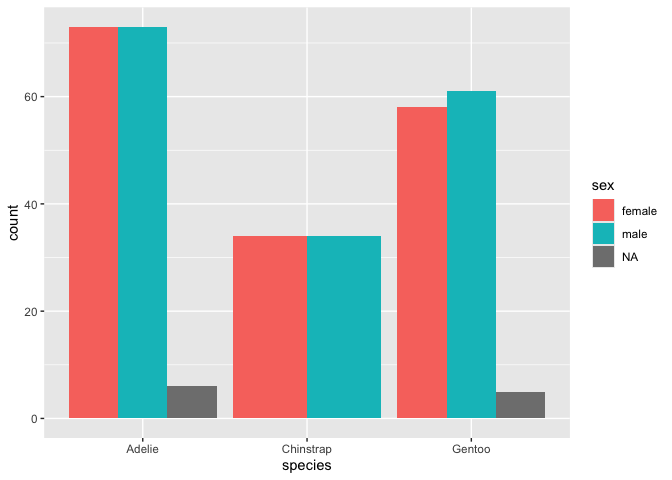

# boxplot+beeswarm for weight and species

``` r
ggplot(penguins, aes(x = species, y = body_mass_g,)) +
  geom_boxplot(outlier.alpha = 0) +
  geom_beeswarm(cex=1, size=1, alpha=.25)
```

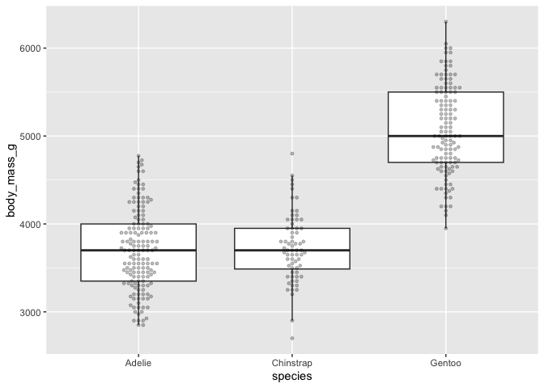

# boxplot+beeswarm weight for species AND sex

``` r
penguins |>
  filter(!is.na(sex)) |> # Filtering NAs for a cleaner plot
  ggplot(aes(x = sex, y = body_mass_g, color = species)) +
  geom_boxplot(outlier.alpha = 0) +
  geom_beeswarm(alpha = 0.6)
```

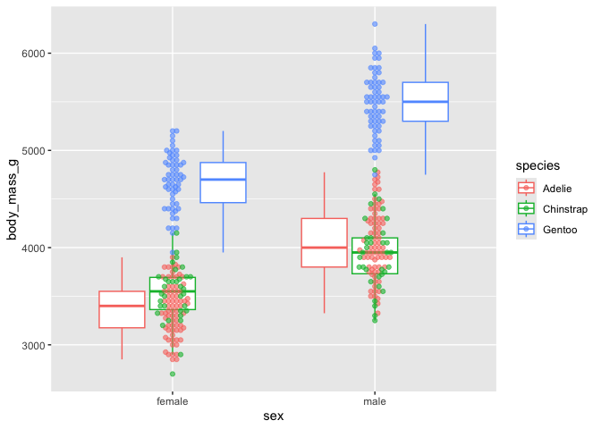

# scatterplot for flipper length vs. body mass

``` r
# Basic Scatterplot with Regression
ggplot(penguins, aes(x = flipper_length_mm, y = body_mass_g)) +
  geom_point(alpha = 0.5) +
  geom_smooth(method = "lm", color = "red") 
```

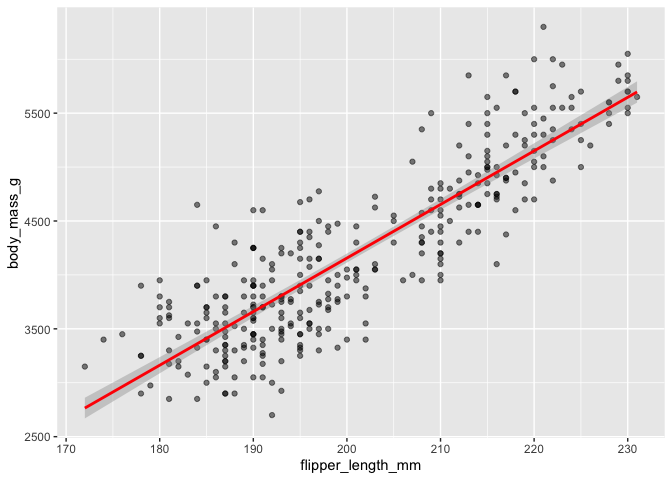

``` r
# Grouped Scatterplot with Custom Colors
# Defining a custom color palette
spec_colors <- c("Adelie" = "#FF8C00", "Chinstrap" = "#9932CC", "Gentoo" = "#057076")

# add a regression line to that plot
# do the same scatterplot and regression grouped by species and sex
# optionally, define your own colors for species (scale or name or rgb)
ggplot(penguins, aes(x = flipper_length_mm, y = body_mass_g, color = species)) +
  geom_point(alpha = 0.6) +
  geom_smooth(method = "lm", se = FALSE) + # se = FALSE removes the confidence interval ribbon
  facet_wrap(~sex) +
  scale_color_manual(values = spec_colors) +
  labs(title = "Regression of Mass vs. Flipper Length",
       subtitle = "Grouped by Species and Sex",
       x = "Flipper Length (mm)",
       y = "Body Mass (g)") +
  theme_minimal()
```

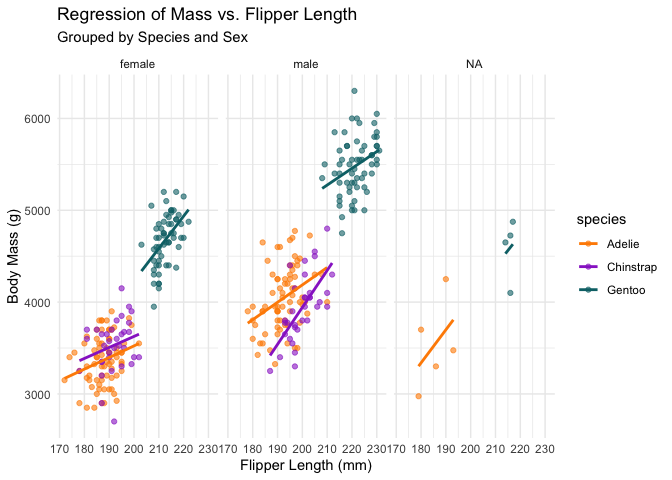

# distribution of body mass by species and sex (density, histogram)

``` r
penguins |>
  filter(!is.na(sex)) |>
  ggplot(aes(x = body_mass_g, fill = sex)) +
  geom_density(alpha=0.5)
```

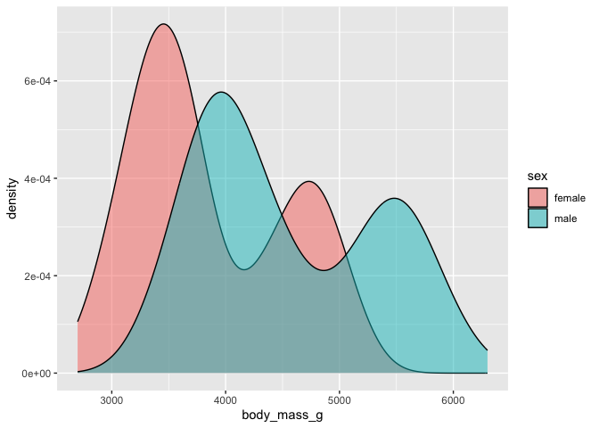

``` r
# without / with facetting
penguins |>
  filter(!is.na(sex)) |>
  ggplot(aes(x = body_mass_g)) +
  geom_density(alpha=0.5, fill="pink")+
  facet_grid(
    rows=vars(species),
    cols=vars(sex),
    margins=TRUE
  )
```

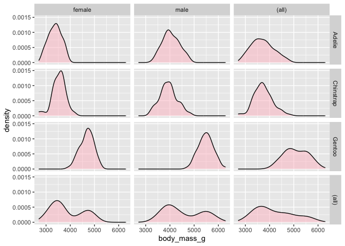

``` r
# Histogram: Faceted by Species
penguins |>
  filter(!is.na(sex)) |>
  ggplot(aes(x = body_mass_g, fill = sex)) +
  geom_histogram(position = "identity", alpha = 0.6, bins = 30) +
  facet_wrap(~species) +
  labs(title = "Body Mass Histogram by Species",
       subtitle = "Faceted by Species, Colored by Sex",
       x = "Body Mass (g)",
       y = "Count") +
  theme_light()
```

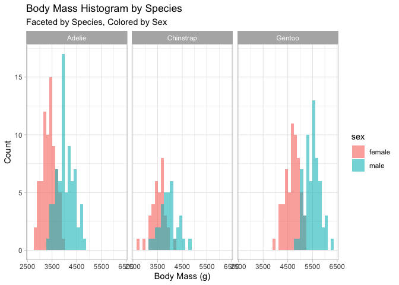

``` r
# Density plot: Faceted by Sex
penguins |>
  filter(!is.na(sex)) |>
  ggplot(aes(x = body_mass_g, fill = species)) +
  geom_density(alpha = 0.5) +
  facet_grid(sex ~ .) + # Stacked vertically for easier x-axis comparison
  scale_fill_manual(values = c("Adelie" = "#FF8C00", "Chinstrap" = "#9932CC", "Gentoo" = "#057076")) +
  labs(title = "Body Mass Distribution",
       x = "Body Mass (g)") +
  theme_minimal()
```

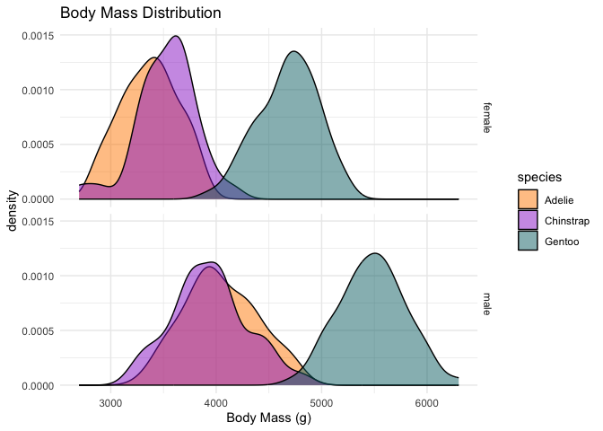

# Exercise: Distribution of penguin measures

# Using the penguin data, testing for which numerical measures a test for a gaussian distribution is meaningful

``` r
numvars <-            #define numerical variables
  wrappedtools::ColSeeker(
    data = penguins, exclude="year",  # can be omitted, as it is the default
    varclass = c("numeric", "integer")
  )
numvars$index
```

    [1] 3 4 5 6

``` r
head(numvars$names)
```

    [1] "bill_length_mm"    "bill_depth_mm"     "flipper_length_mm"
    [4] "body_mass_g"      

``` r
numvars$count
```

    [1] 4

``` r
penguins |>
  drop_na(all_of(numvars$names)) |>
  summarize(across(
    all_of(numvars$names),
    list(
      pks = ~ ksnormal(.x) |>
        formatP(mark = TRUE),
      psh = ~ shapiro.test(.x)$p.value |>
        formatP(mark = TRUE)
    )
  )) |>
  pivot_longer(everything(),
               names_to = c("variable", ".value"),
               names_pattern = "(.*)_(p.*)")
```

    # A tibble: 4 × 3
      variable          pks       psh      
      <chr>             <chr>     <chr>    
    1 bill_length_mm    0.001 *** 0.001 ***
    2 bill_depth_mm     0.001 *** 0.001 ***
    3 flipper_length_mm 0.001 *** 0.001 ***
    4 body_mass_g       0.001 *** 0.001 ***

``` r
# For those measures, test Normality in the total sample as well as for subgroups defined by species and sex

# 1. single measure, all penguins, plot and test

ksnormal(penguins$`body_mass_g`, lillie = FALSE)
```

    p_Normal_KS 
    0.001210179 

``` r
shapiro.test(penguins$`body_mass_g`)
```


        Shapiro-Wilk normality test

    data:  penguins$body_mass_g
    W = 0.95921, p-value = 3.679e-08

``` r
ggplot(penguins, aes(x = `body_mass_g`)) +
  geom_density(fill = "pink")
```

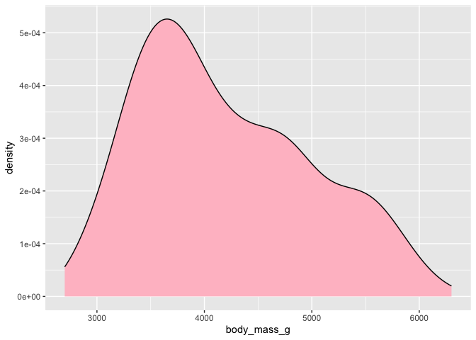

``` r
ggplot(penguins, aes(x = `body_mass_g`, fill = species)) +
  geom_density(alpha = .4)
```

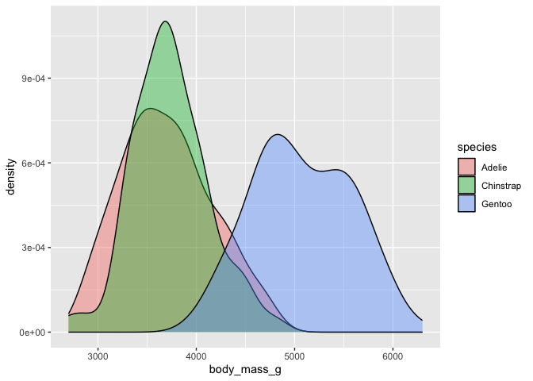

``` r
#one could even calculate the p_value seperatly 

p_ks <- ksnormal(penguins$body_mass_g, lillie =FALSE) |>
  formatP(ndigits = 5, mark = TRUE, pretext = TRUE)
print(p_ks)
```

    [1] "= 0.00121 **"

``` r
p_sh <- shapiro.test(penguins$body_mass_g) |>
  pluck("p.value") |>
  formatP(,ndigits=5, mark=TRUE, pretext=TRUE)
print(p_sh)
```

    [1] "< 0.00001 ***"

``` r
#creating density plot 

ggplot(penguins,aes(body_mass_g))+
  geom_density()+
  # insert title
  ggtitle(paste0("KS-Test: p ",p_ks,   
                 "/ Shapiro-Test: p ", p_sh))+
  # insert caption 
  labs(caption = paste0("KS-Test: p ", p_ks, 
                        "/ Shapiro-Test: p ", p_sh))+
  #annotate the figure 
  annotate(geom = "label",
           family = "sans",
           x = 5500, y = 4*10^-4,
           label = paste0("KS_Test: p", p_ks,
                          "\nShapiro_test: p", p_sh))
```

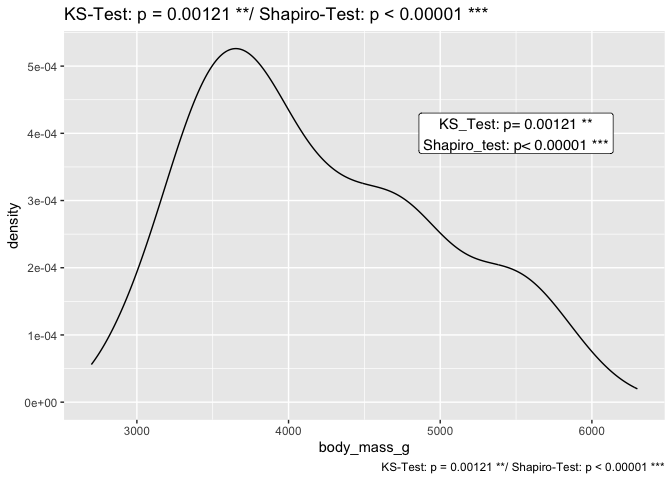

# 2. single measure, by species/sex, plot and test

``` r
test_results <- penguins |>
  filter(!is.na(sex), !is.na(body_mass_g)) |>
  group_by(species, sex) |>
  summarise(
    shapiro_p = shapiro.test(body_mass_g)$p.value,
    ks_p = ks.test(body_mass_g, "pnorm", 
                   mean = mean(body_mass_g), 
                   sd = sd(body_mass_g))$p.value,
    .groups = "drop"
  ) |>
  mutate(across(where(is.numeric), ~round(., 4)))

print(test_results)
```

    # A tibble: 6 × 4
      species   sex    shapiro_p  ks_p
      <fct>     <fct>      <dbl> <dbl>
    1 Adelie    female     0.198 0.882
    2 Adelie    male       0.416 0.680
    3 Chinstrap female     0.306 0.913
    4 Chinstrap male       0.891 0.930
    5 Gentoo    female     0.511 0.848
    6 Gentoo    male       0.985 0.980

# 3. all measures within species, plot and test

``` r
# Statistical Test: All Measures by Species
penguins |>
  select(species, where(is.numeric)) |>
  pivot_longer(cols = -species, names_to = "measure", values_to = "value") |>
  filter(!is.na(value)) |>
  group_by(species, measure) |>
  summarise(p_val = shapiro.test(value)$p.value, .groups = "drop") |>
  mutate(is_normal = p_val > 0.05) # p > 0.05 suggests normality
```

    # A tibble: 15 × 4
       species   measure              p_val is_normal
       <fct>     <chr>                <dbl> <lgl>    
     1 Adelie    bill_depth_mm     9.25e- 2 TRUE     
     2 Adelie    bill_length_mm    7.17e- 1 TRUE     
     3 Adelie    body_mass_g       3.24e- 2 FALSE    
     4 Adelie    flipper_length_mm 7.20e- 1 TRUE     
     5 Adelie    year              1.97e-13 FALSE    
     6 Chinstrap bill_depth_mm     1.42e- 1 TRUE     
     7 Chinstrap bill_length_mm    1.94e- 1 TRUE     
     8 Chinstrap body_mass_g       5.61e- 1 TRUE     
     9 Chinstrap flipper_length_mm 8.11e- 1 TRUE     
    10 Chinstrap year              6.55e- 9 FALSE    
    11 Gentoo    bill_depth_mm     2.77e- 2 FALSE    
    12 Gentoo    bill_length_mm    1.35e- 2 FALSE    
    13 Gentoo    body_mass_g       2.34e- 1 TRUE     
    14 Gentoo    flipper_length_mm 1.62e- 3 FALSE    
    15 Gentoo    year              9.69e-12 FALSE    

``` r
# Visual Check: All Measures by Species
penguins |>
  pivot_longer(cols = where(is.numeric), names_to = "measure", values_to = "value") |>
  ggplot(aes(sample = value, color = species)) +
  stat_qq() + stat_qq_line() +
  facet_wrap(measure ~ species, scales = "free") +
  theme_minimal() +
  theme(legend.position = "none")
```

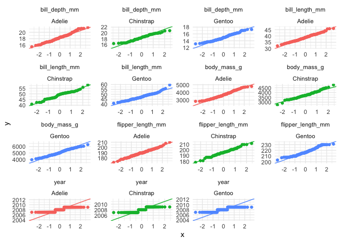

# 4. all measures within species and sex, plot and test

``` r
# Statistical Test: All Measures by Species and Sex
normality_results <- penguins |>
  filter(!is.na(sex)) |>
  pivot_longer(cols = where(is.numeric), names_to = "measure", values_to = "value") |>
  filter(!is.na(value)) |>
  group_by(species, sex, measure) |>
  summarise(p_val = round(shapiro.test(value)$p.value, 4), .groups = "drop")

print(normality_results)
```

    # A tibble: 30 × 4
       species sex    measure            p_val
       <fct>   <fct>  <chr>              <dbl>
     1 Adelie  female bill_depth_mm     0.436 
     2 Adelie  female bill_length_mm    0.895 
     3 Adelie  female body_mass_g       0.198 
     4 Adelie  female flipper_length_mm 0.491 
     5 Adelie  female year              0     
     6 Adelie  male   bill_depth_mm     0.0335
     7 Adelie  male   bill_length_mm    0.607 
     8 Adelie  male   body_mass_g       0.416 
     9 Adelie  male   flipper_length_mm 0.498 
    10 Adelie  male   year              0     
    # ℹ 20 more rows

``` r
# Visual Check 
penguins |>
  filter(!is.na(sex)) |>
  pivot_longer(cols = where(is.numeric), names_to = "measure", values_to = "value") |>
  ggplot(aes(x = value, fill = sex)) +
  geom_density(alpha = 0.5) +
  facet_wrap(measure ~ species, scales = "free") +
  labs(title = "Distribution of All Measures by Species and Sex") +
  theme_minimal()
```

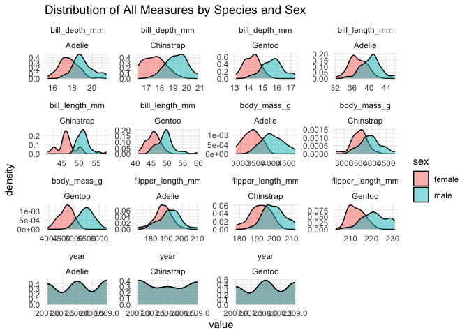
