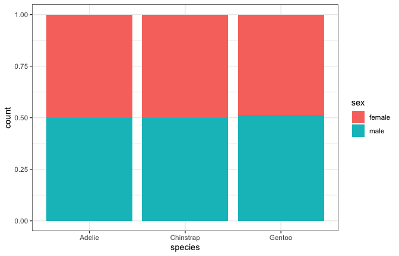
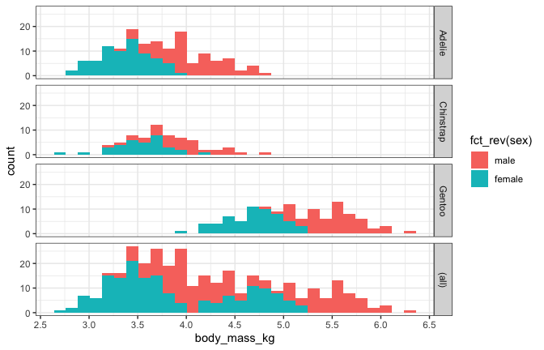
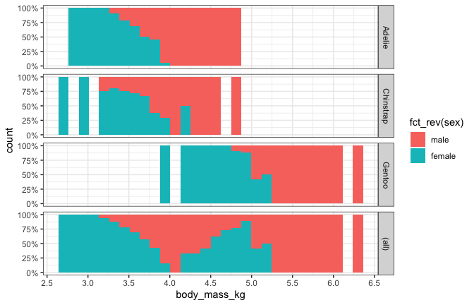
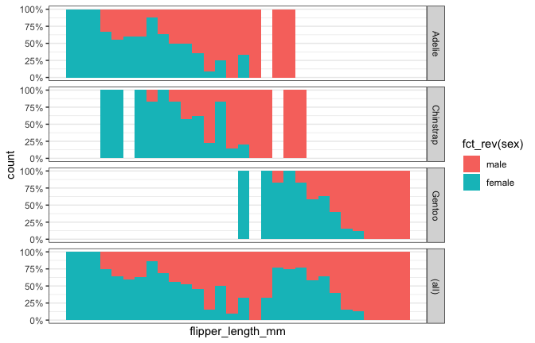
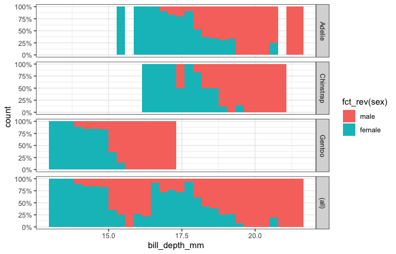
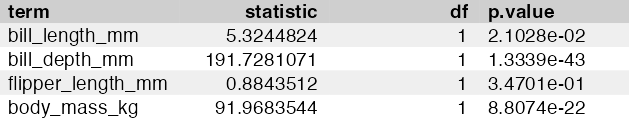
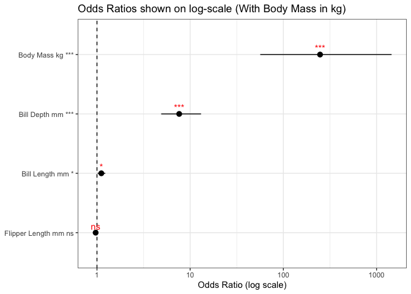
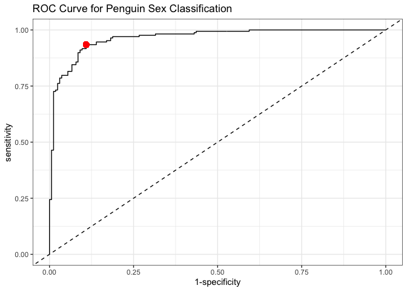
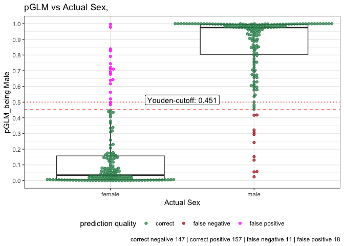

# glm_modeling using palmerpenguin dataset


``` r
pacman::p_load(conflicted, plotrix, tidyverse, coin, ggsignif, patchwork, ggbeeswarm, flextable, broom, palmerpenguins, rlist, here, nlme, multcomp, foreign, DescTools, # ez, 
               lme4, merTools, easystats, ggpubr, wrappedtools, dplyr, car, rpart, rpart.plot, pROC
)

conflicts_prefer(palmerpenguins::penguins,
                 dplyr::filter,
                 modelbased::standardize)
set_flextable_defaults(big.mark = " ",
                       font.size = 7,
                       theme_fun = theme_zebra,
                       padding.bottom = 1,
                       padding.top = 1,
                       padding.left = 3,
                       padding.right = 4
)
theme_set(theme_bw())
```

``` r
rawdata <- penguins |>
  drop_na(sex, bill_length_mm, bill_depth_mm,
          flipper_length_mm, body_mass_g) |>
  mutate(
    sex = factor(sex), # Female will be the baseline (0), Male will be 1
    body_mass_kg = body_mass_g / 1000 # Convert grams to Kilograms
    ) 
head(rawdata)
```

    # A tibble: 6 × 9
      species island    bill_length_mm bill_depth_mm flipper_length_mm body_mass_g
      <fct>   <fct>              <dbl>         <dbl>             <int>       <int>
    1 Adelie  Torgersen           39.1          18.7               181        3750
    2 Adelie  Torgersen           39.5          17.4               186        3800
    3 Adelie  Torgersen           40.3          18                 195        3250
    4 Adelie  Torgersen           36.7          19.3               193        3450
    5 Adelie  Torgersen           39.3          20.6               190        3650
    6 Adelie  Torgersen           38.9          17.8               181        3625
    # ℹ 3 more variables: sex <fct>, year <int>, body_mass_kg <dbl>

It’s always nice to start with data visualization

``` r
ggplot(rawdata, aes(species, fill = sex))+
  geom_bar(position = "fill")
```



``` r
ggplot(rawdata,aes(body_mass_kg,fill=fct_rev(sex)))+
  geom_histogram() + #position="dodge")+
  facet_grid(rows = vars(species),
             margins = TRUE)+
  scale_x_continuous(breaks=seq(0,10,.5))
```



``` r
cat("<br>\n\n")
```

    <br>

``` r
ggplot(rawdata,aes(body_mass_kg,fill=fct_rev(sex)))+
  geom_histogram(position="fill")+
  scale_y_continuous(labels=scales::percent)+
  scale_x_continuous(breaks=seq(0,10,.5))+
  facet_grid(rows = vars(species),
             margins = TRUE)
```



``` r
cat("<br>\n\n")
```

    <br>

``` r
ggplot(rawdata,aes(flipper_length_mm,fill=fct_rev(sex)))+
  geom_histogram(position="fill")+
  scale_y_continuous(labels=scales::percent)+
  scale_x_continuous(breaks=seq(0,10,.5))+
  facet_grid(rows = vars(species),
             margins = TRUE)
```



``` r
cat("<br>\n\n")
```

    <br>

``` r
ggplot(rawdata,aes(bill_depth_mm,fill=fct_rev(sex)))+
  geom_histogram(position="fill")+
  scale_y_continuous(labels=scales::percent)+
  facet_grid(rows = vars(species), margins = TRUE)
```



``` r
cat("<br>\n\n")
```

    <br>

Fit Logistic Regression Model 

Predicting sex using physical traits and species

``` r
logreg_out <- glm(
  sex ~ bill_length_mm + bill_depth_mm + flipper_length_mm + body_mass_kg,
  family = binomial(), 
  data = rawdata
)
summary(logreg_out)
```


    Call:
    glm(formula = sex ~ bill_length_mm + bill_depth_mm + flipper_length_mm + 
        body_mass_kg, family = binomial(), data = rawdata)

    Coefficients:
                       Estimate Std. Error z value Pr(>|z|)    
    (Intercept)       -56.11740    8.36932  -6.705 2.01e-11 ***
    bill_length_mm      0.10763    0.04797   2.244   0.0248 *  
    bill_depth_mm       2.03152    0.24946   8.143 3.84e-16 ***
    flipper_length_mm  -0.03247    0.03476  -0.934   0.3501    
    body_mass_kg        5.51203    0.82349   6.694 2.18e-11 ***
    ---
    Signif. codes:  0 '***' 0.001 '**' 0.01 '*' 0.05 '.' 0.1 ' ' 1

    (Dispersion parameter for binomial family taken to be 1)

        Null deviance: 461.61  on 332  degrees of freedom
    Residual deviance: 159.00  on 328  degrees of freedom
    AIC: 169

    Number of Fisher Scoring iterations: 7

``` r
# Extract and transform model parameters to Odds Ratios (OR)
ORs <- exp(coef(logreg_out))
CIs <- exp(confint(logreg_out))
sum_out <- broom::tidy(logreg_out) 
cat("&nbsp;\n\n")
```

    &nbsp;

``` r
# Test Model Overall (Anova Type II)
Anova_out <- Anova(logreg_out, type = 2) |>
  broom::tidy() |>
  mutate(p.value = format(p.value, digits = 5, scientific = TRUE,)) 
Anova_out |>
  mutate(p.value = format(p.value, digits = 5, mark = TRUE,)) |>
  flextable() |>
  set_table_properties(width = 1, layout = "autofit")
```



``` r
cat("&nbsp;\n\n")
```

    &nbsp;

Build Odds Ratio Plot Data Replacing markSign/custom functions with a
standard clean tidyverse format

``` r
OR_plotdata <- tibble(
  Predictor = sum_out$term[-1], 
  OR = ORs[-1],
  CI_low = CIs[-1, 1],
  CI_high = CIs[-1, 2],
  p = sum_out$p.value[-1]
) |> 
  mutate(
    # Cleans up "body_mass_kg" to look like "Body Mass Kg"
    Predictor = str_replace_all(Predictor, "_", " ") |> str_to_title() |> str_replace("Mm", "mm") |> str_replace("Kg", "kg"),
    Significance = case_when(
      p < 0.001 ~ "***",
      p < 0.01  ~ "**",
      p < 0.05  ~ "*",
      TRUE      ~ "ns"
    ),
    Label = paste(Predictor, Significance)
  )
```

Plot Odds Ratios

``` r
baseplot <- ggplot(OR_plotdata, aes(x = reorder(Label, OR), y = OR)) +
  geom_pointrange(aes(ymin = CI_low, ymax = CI_high)) +
  geom_hline(yintercept = 1, linewidth = .5, linetype = 2) +
  coord_flip() +
  labs(title = "Odds Ratios shown on log-scale (With Body Mass in kg)", x = NULL, y = "Odds Ratio (log scale)") +
  scale_y_log10() +
  geom_text(aes(label = Significance), vjust = -0.5, color = "red")

print(baseplot)
```



Predict and Evaluate via ROC Curve

``` r
rawdata$pGLM <- predict(logreg_out, type = "response") 

roc_out <- roc(
  response = rawdata$sex,
  predictor = rawdata$pGLM,
  levels = levels(rawdata$sex)
)

youden <- pROC::coords(roc_out, x = "best", best.method = "youden")
# If multiple thresholds share the best Youden index, take the first one
if(!is.null(dim(youden))) youden <- youden[1, ]

# Plot ROC
ggroc(roc_out, legacy.axes = TRUE) +
  geom_abline(slope = 1, intercept = 0, linetype = "dashed") +
  geom_point(
    x = 1 - youden$specificity,
    y = youden$sensitivity, color = "red", size = 3
  ) +
  labs(title = "ROC Curve for Penguin Sex Classification")
```



Analyze Prediction Quality and prediction plot

``` r
tempdata <- rawdata |>
  mutate(
    prediction = case_when(
      sex == "male" & pGLM < youden$threshold  ~ "false negative",
      sex == "female" & pGLM >= youden$threshold ~ "false positive",
      sex == "male" & pGLM >= youden$threshold ~ "correct positive",
      TRUE                                    ~ "correct negative"
    )
  )

prediction_counts <- tempdata |>
  group_by(prediction) |>
  count()

# Plot Predictions Boxplot + Beeswarm
rawdata |>
  mutate(
    `prediction quality` = case_when(
      sex == "male" & pGLM < youden$threshold  ~ "false negative",
      sex == "female" & pGLM >= youden$threshold ~ "false positive",
      TRUE                                    ~ "correct"
    )
  ) |>
  ggplot(aes(sex, pGLM)) +
  geom_boxplot(outlier.alpha = 0) +
  scale_y_continuous(breaks = seq(0, 1, .1)) +
  geom_beeswarm(alpha = .75, aes(color = `prediction quality`)) +
  scale_color_manual(values = c("seagreen", "firebrick", "magenta")) +
  geom_hline(
    yintercept = c(youden$threshold, 0.5),
    color = "red",
    linetype = c(2, 3)
  ) +
  annotate(
    geom = "label",
    x = 1.5, y = youden$threshold,
    label = paste("Youden-cutoff:", round(youden$threshold, 3)),
    vjust = -0.5
  ) +
  theme(legend.position = "bottom") +
  labs(
    title = "pGLM vs Actual Sex, ",
    y = "pGLM_being Male",
    x = "Actual Sex",
    caption = paste(prediction_counts$prediction, prediction_counts$n, collapse = " | ")
  )
```


