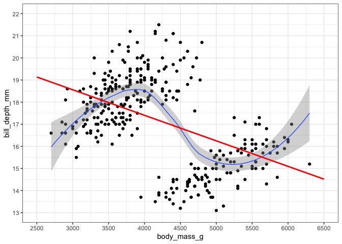
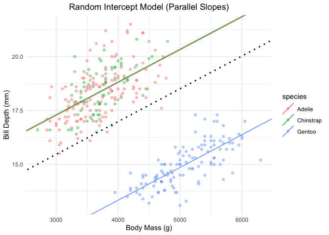
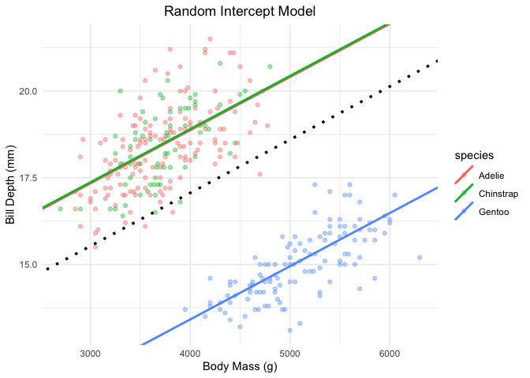
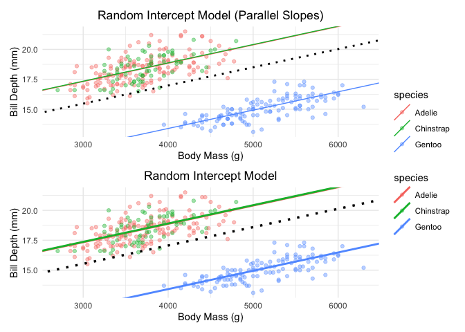
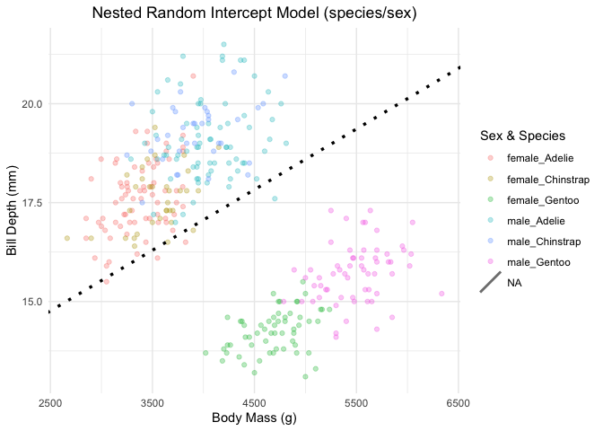
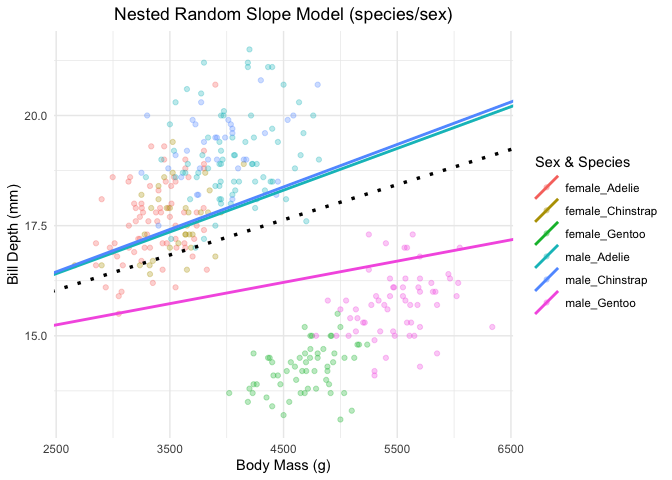
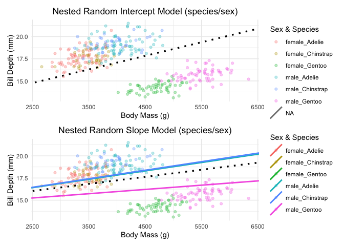

# penguins_lmm
Reuben Njue

``` r
pacman::p_load(
  conflicted, plotrix, tidyverse, wrappedtools,
  coin, ggsignif, patchwork, ggbeeswarm,
  flextable, broom, palmerpenguins, rlist, here, car, nlme, lme4, multcomp, foreign,
  DescTools, # ez, 
  lme4, merTools, easystats, ggpubr
)
conflicts_prefer(dplyr::summarize,
                 palmerpenguins::penguins,
                 dplyr::filter,
                 dplyr::select,
                 modelbased::standardize)
set_flextable_defaults(big.mark = " ",
                       font.size = 7,
                       theme_fun = theme_zebra,
                       padding.bottom = 1,
                       padding.top = 1,
                       padding.left = 3,
                       padding.right = 4
)
theme_set(theme_bw())
```

``` r
# Clean the data
rawdata <- penguins |>
  drop_na(bill_depth_mm, body_mass_g, species, sex) |>
  mutate(
    species = factor(species),
    sex = factor(sex),
    # Create an explicit nested grouping ID (e.g., Adelie_female, Adelie_male)
    Group_ID = factor(paste(species, sex, sep = "_")) 
  )
```

``` r
##graphical exploration
p0 <- ggplot(rawdata, aes(body_mass_g, bill_depth_mm)) +
  geom_point() +
   scale_y_continuous(breaks = seq(13, 22, 1), limits = c(13, 22)) +
   scale_x_continuous(breaks = seq(2500, 6500, 500), limits = c(2500, 6500)) +
   geom_smooth(linewidth = .5) +
  geom_smooth(method = lm, se = F, color = "red", fullrange = TRUE)
p0
```



\# Linear mixed model

nlme

``` r
lme_out <- nlme::lme(bill_depth_mm ~ body_mass_g,
  data = rawdata,
  random = ~ 1 | species
) # RIntercept
lme_out
```

    Linear mixed-effects model fit by REML
      Data: rawdata 
      Log-restricted-likelihood: -445.7192
      Fixed: bill_depth_mm ~ body_mass_g 
    (Intercept) body_mass_g 
    10.90483908  0.00152009 

    Random effects:
     Formula: ~1 | species
            (Intercept)  Residual
    StdDev:    3.160565 0.8779478

    Number of Observations: 333
    Number of Groups: 3 

``` r
Anova(lme_out)
```

    Analysis of Deviance Table (Type II tests)

    Response: bill_depth_mm
                 Chisq Df Pr(>Chisq)    
    body_mass_g 210.34  1  < 2.2e-16 ***
    ---
    Signif. codes:  0 '***' 0.001 '**' 0.01 '*' 0.05 '.' 0.1 ' ' 1

lme4

``` r
lmer_out <- lme4::lmer(bill_depth_mm ~ body_mass_g + (1 | species),
  data = rawdata
)

lmer_out
```

    Linear mixed model fit by REML ['lmerMod']
    Formula: bill_depth_mm ~ body_mass_g + (1 | species)
       Data: rawdata
    REML criterion at convergence: 891.4385
    Random effects:
     Groups   Name        Std.Dev.
     species  (Intercept) 3.1606  
     Residual             0.8779  
    Number of obs: 333, groups:  species, 3
    Fixed Effects:
    (Intercept)  body_mass_g  
       10.90484      0.00152  

``` r
Anova(lmer_out)
```

    Analysis of Deviance Table (Type II Wald chisquare tests)

    Response: bill_depth_mm
                 Chisq Df Pr(>Chisq)    
    body_mass_g 210.34  1  < 2.2e-16 ***
    ---
    Signif. codes:  0 '***' 0.001 '**' 0.01 '*' 0.05 '.' 0.1 ' ' 1

### Visualization the models

``` r
(lmer_out_param <- model_parameters(lmer_out, group_level = TRUE))
```

    # Fixed Effects

    Parameter   | Coefficient |       SE |        95% CI | t(329) |      p
    ----------------------------------------------------------------------
    (Intercept) |       10.90 |     1.88 | [7.21, 14.60] |   5.81 | < .001
    body mass g |    1.52e-03 | 1.05e-04 | [0.00,  0.00] |  14.50 | < .001

    # Random Effects: species

    Parameter               | Coefficient |   SE |         95% CI
    -------------------------------------------------------------
    (Intercept) [Adelie]    |        1.81 | 0.07 | [ 1.67,  1.95]
    (Intercept) [Chinstrap] |        1.84 | 0.11 | [ 1.63,  2.05]
    (Intercept) [Gentoo]    |       -3.65 | 0.08 | [-3.80, -3.49]

``` r
intercept_all <- lmer_out_param$Coefficient[1]
slope_mass <- lmer_out_param$Coefficient[2]

#plotting 
plotdata <- tibble(
  species = lmer_out_param$Level[-(1:2)],
  intercept = lmer_out_param$Coefficient[-(1:2)] +
    intercept_all
)
plotdata
```

    # A tibble: 3 × 2
      species   intercept
      <chr>         <dbl>
    1 Adelie        12.7 
    2 Chinstrap     12.7 
    3 Gentoo         7.26

``` r
p1 <- ggplot(rawdata, aes(x = body_mass_g, y = bill_depth_mm, color = species)) +
  geom_point(alpha = 0.4) +
  # Parallel custom trendlines for each species
  geom_abline(data = plotdata, aes(color = species,
                                   intercept = intercept,
                                   slope = slope_mass), linewidth = .5
  ) +
  # Global underlying population baseline trend
  geom_abline(intercept = intercept_all, 
              slope = slope_mass,
              color = "black",
              linetype = 3,
              linewidth = 1
  ) +
  theme_minimal() +
  theme(plot.title = element_text(hjust = 0.5)) +
  labs(
    title = "Random Intercept Model (Parallel Slopes)",
    x = "Body Mass (g)", y = "Bill Depth (mm)"
  )
p1
```



Random slope model  

``` r
lmer_out <- lme4::lmer(
  bill_depth_mm ~ body_mass_g +
    (1 + body_mass_g | species),
  data = rawdata,
  REML = FALSE
)
lmer_out
```

    Linear mixed model fit by maximum likelihood  ['lmerMod']
    Formula: bill_depth_mm ~ body_mass_g + (1 + body_mass_g | species)
       Data: rawdata
          AIC       BIC    logLik -2*log(L)  df.resid 
     889.7423  912.5911 -438.8711  877.7423       327 
    Random effects:
     Groups   Name        Std.Dev.  Corr 
     species  (Intercept) 1.501e+00      
              body_mass_g 9.136e-05 1.00 
     Residual             8.791e-01      
    Number of obs: 333, groups:  species, 3
    Fixed Effects:
    (Intercept)  body_mass_g  
      10.930370     0.001533  
    optimizer (nloptwrap) convergence code: 0 (OK) ; 0 optimizer warnings; 1 lme4 warnings 

``` r
Anova(lmer_out)
```

    Analysis of Deviance Table (Type II Wald chisquare tests)

    Response: bill_depth_mm
                 Chisq Df Pr(>Chisq)    
    body_mass_g 169.24  1  < 2.2e-16 ***
    ---
    Signif. codes:  0 '***' 0.001 '**' 0.01 '*' 0.05 '.' 0.1 ' ' 1

Visualization of fixed and random effects

``` r
(lmer_out_param2 <- model_parameters(lmer_out, group_level = T))
```

    # Fixed Effects

    Parameter   | Coefficient |       SE |        95% CI | t(327) |      p
    ----------------------------------------------------------------------
    (Intercept) |       10.93 |     0.97 | [9.02, 12.84] |  11.24 | < .001
    body mass g |    1.53e-03 | 1.18e-04 | [0.00,  0.00] |  13.01 | < .001

    # Random Effects: species

    Parameter               | Coefficient |       SE |         95% CI
    -----------------------------------------------------------------
    (Intercept) [Adelie]    |        1.41 |     0.06 | [ 1.30,  1.53]
    (Intercept) [Chinstrap] |        1.44 |     0.09 | [ 1.27,  1.61]
    (Intercept) [Gentoo]    |       -2.85 |     0.06 | [-2.97, -2.73]
    body_mass_g [Adelie]    |    8.60e-05 | 3.61e-06 | [ 0.00,  0.00]
    body_mass_g [Chinstrap] |    8.75e-05 | 5.28e-06 | [ 0.00,  0.00]
    body_mass_g [Gentoo]    |   -1.73e-04 | 3.74e-06 | [ 0.00,  0.00]

``` r
intercept_all <- lmer_out_param2$Coefficient[1]
slope_mass <- lmer_out_param2$Coefficient[2]

# Pull the fixed population effects explicitly by their parameter names
intercept_all <- lmer_out_param2 |> 
  filter(Parameter == "(Intercept)" & Effects == "fixed") |>
  pull(Coefficient)

slope_mass <- lmer_out_param2 |> 
  filter(Parameter == "body_mass_g" & Effects == "fixed") |>
  pull(Coefficient)

# Pull the random effect adjustments for each species
interceptdata <- lmer_out_param |>
  filter(Effects == "random") |>
  select(Level, Coefficient) |>
  rename(species = Level) |>
  mutate(intercept = Coefficient + intercept_all)
interceptdata
```

    # Fixed Effects

    species   | Coefficient | intercept
    -----------------------------------
    Adelie    |        1.81 |     12.74
    Chinstrap |        1.84 |     12.77
    Gentoo    |       -3.65 |      7.28

``` r
#--- Plotting ---
p2 <- rawdata |>
  ggplot(aes(x = body_mass_g, y = bill_depth_mm, color = species)) +
  geom_beeswarm(alpha = 0.4) +
  geom_abline(data = interceptdata, aes(color = species,
                                        intercept = intercept,
                                        slope = slope_mass),
              linewidth = 1
              ) +
  geom_abline(intercept = intercept_all,
              slope = slope_mass,
              color = "black",
              linetype = 3,
              linewidth = 1.2
              ) +
  labs(title = "Random Intercept Model", x = "Body Mass (g)", y = "Bill Depth (mm)") +
  theme_minimal() +
  theme(plot.title = element_text(hjust = 0.5))

print(p2)
```



``` r
p1/p2 + plot_layout(guides = "collect")
```



``` r
# SECTION A: RANDOM INTERCEPT MODEL

# Fit Random Intercept Model (Fixed slope for body mass, random intercept per group)
lmer_intercept <- lme4::lmer(
  bill_depth_mm ~ body_mass_g + (1 | species / sex), 
  data = rawdata
)

lmer_intercept
```

    Linear mixed model fit by REML ['lmerMod']
    Formula: bill_depth_mm ~ body_mass_g + (1 | species/sex)
       Data: rawdata
    REML criterion at convergence: 840.8551
    Random effects:
     Groups      Name        Std.Dev.
     sex:species (Intercept) 0.7384  
     species     (Intercept) 2.5371  
     Residual                0.8008  
    Number of obs: 333, groups:  sex:species, 6; species, 3
    Fixed Effects:
    (Intercept)  body_mass_g  
      1.395e+01    7.912e-04  

``` r
Anova(lmer_intercept)
```

    Analysis of Deviance Table (Type II Wald chisquare tests)

    Response: bill_depth_mm
                 Chisq Df Pr(>Chisq)    
    body_mass_g 31.388  1  2.113e-08 ***
    ---
    Signif. codes:  0 '***' 0.001 '**' 0.01 '*' 0.05 '.' 0.1 ' ' 1

``` r
# Extract Model Parameters
intercept_param <- model_parameters(lmer_intercept, group_level = TRUE)

# Parse fixed effects coefficients
fixed_intercept <- intercept_param$Coefficient[1]
fixed_slope     <- intercept_param$Coefficient[2]

# Hand-coded index slicing for the 6 nested groups:
# In the output table, rows 6 through 11 represent the interaction sub-levels (sex:species)
plotdata_ri <- tibble(
  Group_ID  = lmer_out_param$Level[6:11],
  intercept = lmer_out_param$Coefficient[6:11] + intercept_all
) |> 
  # Convert the colon divider (e.g. "female:Adelie") to an underscore for matching rawdata
  mutate(Group_ID = str_replace(Group_ID, ":", "_"))

# Create a matching grouping column in rawdata for color grouping
rawdata_plot <- rawdata |> 
  mutate(Group_ID = paste(sex, species, sep = "_"))

# Plotting the parallel random lines
p_ri <- rawdata_plot |>
  ggplot(aes(x = body_mass_g, y = bill_depth_mm, color = Group_ID)) +
  geom_beeswarm(alpha = 0.3, dodge.width = 0.2) +
  geom_abline(
    data = plotdata_ri,
    aes(color = Group_ID, intercept = intercept, slope = slope_mass),
    linewidth = 1
  ) +
  geom_abline(
    intercept = intercept_all, slope = slope_mass, 
    color = "black", linetype = 3, linewidth = 1.2
  ) +
  labs(
    title = "Nested Random Intercept Model (species/sex)",
    x = "Body Mass (g)", y = "Bill Depth (mm)", color = "Sex & Species"
  ) +
  theme_minimal() +
  theme(plot.title = element_text(hjust = 0.5))

print(p_ri)
```



``` r
# ==============================================================================
# SECTION B: RANDOM SLOPE MODEL
# ==============================================================================

#--- lme4 approach ---
lmer_out2 <- lme4::lmer(
  bill_depth_mm ~ body_mass_g + (1 + body_mass_g | species/sex), 
  data = rawdata, REML = FALSE
)
lmer_out2
```

    Linear mixed model fit by maximum likelihood  ['lmerMod']
    Formula: bill_depth_mm ~ body_mass_g + (1 + body_mass_g | species/sex)
       Data: rawdata
          AIC       BIC    logLik -2*log(L)  df.resid 
     845.9930  880.2663 -413.9965  827.9930       324 
    Random effects:
     Groups      Name        Std.Dev.  Corr  
     sex:species (Intercept) 2.1567374       
                 body_mass_g 0.0003057 -0.98 
     species     (Intercept) 0.7669463       
                 body_mass_g 0.0002217 1.00  
     Residual                0.7959808       
    Number of obs: 333, groups:  sex:species, 6; species, 3
    Fixed Effects:
    (Intercept)  body_mass_g  
      1.404e+01    7.983e-04  
    optimizer (nloptwrap) convergence code: 0 (OK) ; 0 optimizer warnings; 1 lme4 warnings 

``` r
Anova(lmer_out2)
```

    Analysis of Deviance Table (Type II Wald chisquare tests)

    Response: bill_depth_mm
                 Chisq Df Pr(>Chisq)    
    body_mass_g 12.249  1  0.0004656 ***
    ---
    Signif. codes:  0 '***' 0.001 '**' 0.01 '*' 0.05 '.' 0.1 ' ' 1

``` r
#--- nlme approach ---
lme_out2 <- nlme::lme(
  bill_depth_mm ~ body_mass_g, data = rawdata, 
  random = list(species = ~ 1 + body_mass_g, sex = ~ 1 + body_mass_g),
  control = lmeControl(opt = "optim")
)
lme_out2
```

    Linear mixed-effects model fit by REML
      Data: rawdata 
      Log-restricted-likelihood: -420.2622
      Fixed: bill_depth_mm ~ body_mass_g 
     (Intercept)  body_mass_g 
    1.399967e+01 7.917832e-04 

    Random effects:
     Formula: ~1 + body_mass_g | species
     Structure: General positive-definite, Log-Cholesky parametrization
                StdDev       Corr  
    (Intercept) 2.0352363707 (Intr)
    body_mass_g 0.0001161397 0.906 

     Formula: ~1 + body_mass_g | sex %in% species
     Structure: General positive-definite, Log-Cholesky parametrization
                StdDev       Corr  
    (Intercept) 7.408836e-01 (Intr)
    body_mass_g 5.953803e-06 -0.023
    Residual    8.004220e-01       

    Number of Observations: 333
    Number of Groups: 
             species sex %in% species 
                   3                6 

``` r
Anova(lme_out2)
```

    Analysis of Deviance Table (Type II tests)

    Response: bill_depth_mm
                 Chisq Df Pr(>Chisq)    
    body_mass_g 25.618  1  4.162e-07 ***
    ---
    Signif. codes:  0 '***' 0.001 '**' 0.01 '*' 0.05 '.' 0.1 ' ' 1

``` r
# Extract parameters
(lmer_out_param2 <- model_parameters(lmer_out2, group_level = TRUE))
```

    # Fixed Effects

    Parameter   | Coefficient |       SE |         95% CI | t(324) |      p
    -----------------------------------------------------------------------
    (Intercept) |       14.04 |     1.15 | [11.78, 16.31] |  12.20 | < .001
    body mass g |    7.98e-04 | 2.28e-04 | [ 0.00,  0.00] |   3.50 | < .001

    # Random Effects: sex:species

    Parameter                      | Coefficient |       SE |         95% CI
    ------------------------------------------------------------------------
    (Intercept) [female:Adelie]    |       -0.39 |     0.81 | [-1.97,  1.20]
    (Intercept) [female:Chinstrap] |       -0.79 |     1.01 | [-2.77,  1.19]
    (Intercept) [female:Gentoo]    |       -2.29 |     1.07 | [-4.39, -0.18]
    (Intercept) [male:Adelie]      |        1.70 |     0.96 | [-0.19,  3.58]
    (Intercept) [male:Chinstrap]   |        1.71 |     1.13 | [-0.50,  3.92]
    (Intercept) [male:Gentoo]      |        0.06 |     1.31 | [-2.51,  2.63]
    body_mass_g [female:Adelie]    |    7.50e-05 | 1.41e-04 | [ 0.00,  0.00]
    body_mass_g [female:Chinstrap] |    1.05e-04 | 1.66e-04 | [ 0.00,  0.00]
    body_mass_g [female:Gentoo]    |    2.85e-04 | 1.79e-04 | [ 0.00,  0.00]
    body_mass_g [male:Adelie]      |   -2.51e-04 | 1.53e-04 | [ 0.00,  0.00]
    body_mass_g [male:Chinstrap]   |   -2.24e-04 | 1.76e-04 | [ 0.00,  0.00]
    body_mass_g [male:Gentoo]      |    1.02e-05 | 2.00e-04 | [ 0.00,  0.00]

    # Random Effects: species

    Parameter               | Coefficient |       SE |         95% CI
    -----------------------------------------------------------------
    (Intercept) [Adelie]    |        0.52 |     0.21 | [ 0.10,  0.94]
    (Intercept) [Chinstrap] |        0.57 |     0.25 | [ 0.09,  1.06]
    (Intercept) [Gentoo]    |       -1.09 |     0.16 | [-1.40, -0.78]
    body_mass_g [Adelie]    |    1.50e-04 | 6.18e-05 | [ 0.00,  0.00]
    body_mass_g [Chinstrap] |    1.66e-04 | 7.21e-05 | [ 0.00,  0.00]
    body_mass_g [Gentoo]    |   -3.16e-04 | 4.54e-05 | [ 0.00,  0.00]

``` r
# Global baseline population parameters
intercept_all2 <- lmer_out_param2$Coefficient[1]
slope_mass2    <- lmer_out_param2$Coefficient[2]

# Hand-coded slice positions for the nested 'sex:species' interaction groups:
# Rows 9 to 14 contain the random intercept variations for the 6 sub-groups.
# Rows 15 to 20 contain the random slope variations for the 6 sub-groups.
plotdata_rs <- tibble(
  Group_ID  = lmer_out_param2$Level[9:14],
  intercept = lmer_out_param2$Coefficient[9:14] + intercept_all2,
  slope     = lmer_out_param2$Coefficient[15:20] + slope_mass2
) |> 
  mutate(Group_ID = str_replace(Group_ID, ":", "_"))

# Plotting the varying lines (slopes and intercepts both differ by group)
p_rs <- rawdata_plot |>
  ggplot(aes(x = body_mass_g, y = bill_depth_mm, color = Group_ID)) +
  geom_beeswarm(alpha = 0.3, dodge.width = 0.2) +
  geom_abline(
    data = plotdata_rs,
    aes(color = Group_ID, intercept = intercept, slope = slope),
    linewidth = 1
  ) +
  geom_abline(
    intercept = intercept_all2, slope = slope_mass2, 
    color = "black", linetype = 3, linewidth = 1.2
  ) +
  labs(
    title = "Nested Random Slope Model (species/sex)",
    x = "Body Mass (g)", y = "Bill Depth (mm)", color = "Sex & Species"
  ) +
  theme_minimal() +
  theme(plot.title = element_text(hjust = 0.5))

print(p_rs)
```



``` r
# Combine the two visualization steps together into a vertical dashboard layout
p_ri / p_rs + plot_layout(guides = "collect")
```


