# Predicting the Sex of Palmer Penguins Using GLMs
Reuben Njue under Dr. Andreas Supervision

``` r
pacman::p_load(conflicted,tidyverse,wrappedtools,broom,car,
               palmerpenguins,
               rlist, flextable,
               patchwork, ggbeeswarm, ggsignif, 
               rpart, rpart.plot, pROC)
conflicts_prefer(dplyr::filter, 
                 dplyr::select,
                 palmerpenguins::penguins)
set_flextable_defaults(big.mark = " ", 
                       font.size = 9, 
                       theme_fun = theme_vanilla,
                       padding.bottom = 1, 
                       padding.top = 3,
                       padding.left = 3,
                       padding.right = 4,
                       font.family = "sans"
)
theme_set(theme_bw())
theme_update(
  plot.title=element_text(family="sans"),
  plot.caption=element_text(family="sans"),
  axis.title=element_text(family="sans"),
  axis.text=element_text(family="sans",face = "bold"),
  strip.text=element_text(family="sans"))
```

``` r
rawdata <- penguins |>
  drop_na() |> 
  mutate(year=factor(year),body_weight_hg=body_mass_g/100,
                  body_weight_kg=body_mass_g/1000,
                  species=fct_rev(species))
```

# *GLM*

``` r
ggplot(rawdata, aes(species, fill = sex))+
  geom_bar(position = "fill")
```

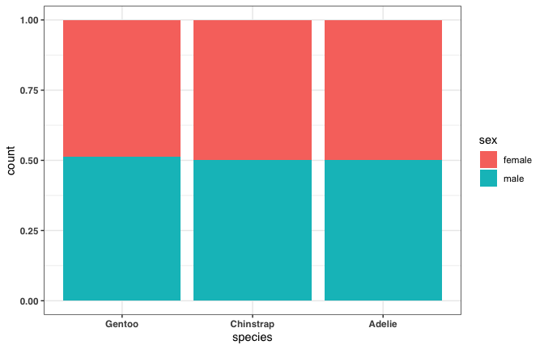

``` r
ggplot(rawdata,aes(body_weight_kg,fill=fct_rev(sex)))+
  geom_histogram() + #position="dodge")+
  facet_grid(rows = vars(species),
             margins = TRUE)+
  scale_x_continuous(breaks=seq(0,10,.5))
```

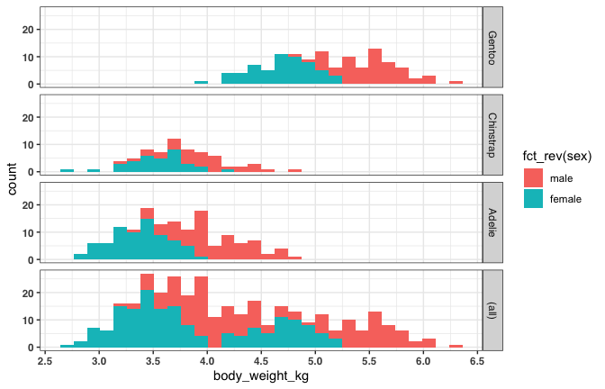

``` r
cat("<br>\n\n")
```

    <br>

``` r
ggplot(rawdata,aes(body_weight_kg,fill=fct_rev(sex)))+
  geom_histogram(position="fill")+
  scale_y_continuous(labels=scales::percent)+
  scale_x_continuous(breaks=seq(0,10,.5))+
  facet_grid(rows = vars(species),
             margins = TRUE)
```

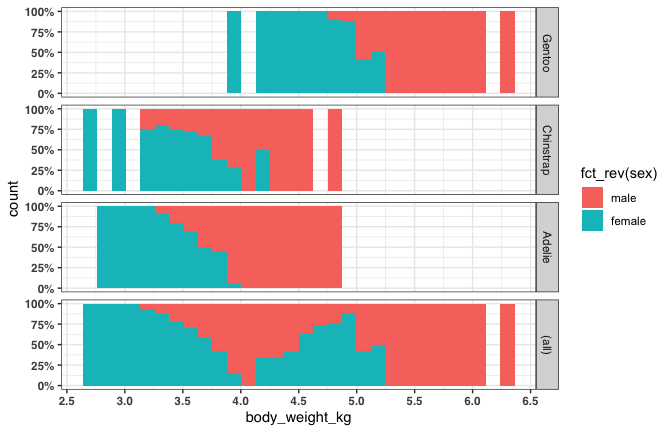

``` r
cat("<br>\n\n")
```

    <br>

``` r
ggplot(rawdata,aes(flipper_length_mm,fill=fct_rev(sex)))+
  geom_histogram(position="fill")+
  scale_y_continuous(labels=scales::percent)+
  scale_x_continuous(breaks=seq(0,10,.5))+
  facet_grid(rows = vars(species),
             margins = TRUE)
```

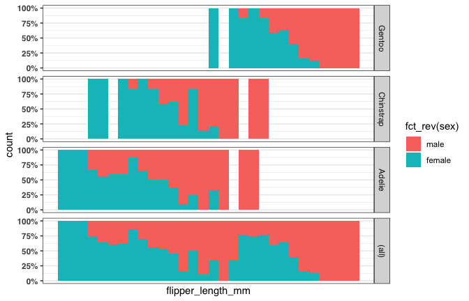

``` r
cat("<br>\n\n")
```

    <br>

``` r
ggplot(rawdata,aes(bill_depth_mm,fill=fct_rev(sex)))+
  geom_histogram(position="fill")+
  scale_y_continuous(labels=scales::percent)+
  facet_grid(rows = vars(species), margins = TRUE)
```

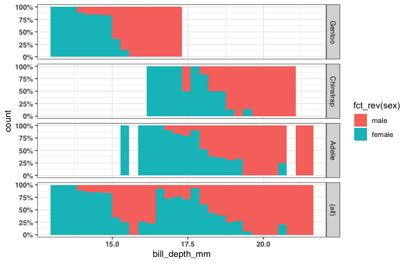

``` r
cat("<br>\n\n")
```

    <br>



``` r
SensSpecComparison <- tibble(modelformula = NA_character_,
                             Sensitivity = NA_real_,
                             Specificity = NA_real_,
                             AIC = NA_character_,
                             .rows = 0)
```

``` r
pred_vars <- ColSeeker(namepattern = c("bill","fl","_hg"))
glmformula <- paste('sex',
                    paste(pred_vars$names,
                          collapse="+"),
                    sep="~")
logreg_out<-glm(glmformula |> as.formula(),
                family=binomial(), data=rawdata)
logreg_out |> 
  tidy() |> 
  mutate(p.value=formatP(p.value,5)) |> 
  flextable() |> 
  set_table_properties(width = 1,layout = 'autofit')
```


``` r
cat('&nbsp;\n\n')
```

    &nbsp;

``` r
Anova_out <- Anova(logreg_out,type = 2) |>
    broom::tidy() |>
    mutate(p.value=formatP(p.value,ndigits = 5))
Anova_out |> 
  flextable() |> 
  set_table_properties(width = 1,layout = 'autofit')
```


``` r
cat('&nbsp;\n\n')
```

    &nbsp;

``` r
tidy_out <- tidy(logreg_out)
ORs <- exp(logreg_out$coefficients)
CIs <- exp(confint(logreg_out))
```

``` r
OR_plotdata <- tibble(
  Predictor=names(ORs)[-1] |> 
    str_replace_all(
      c("species"="","island"="",#"_"=" ",
        "(.+)_(.+)_(.+)"="\\1\\2 [\\3]")) |> 
    fct_inorder(),
  OR=ORs[-1],
  CI_low=CIs[-1,1],
  CI_high=CIs[-1,2],
  p=tidy_out$p.value[-1],
  Significance=markSign(p),
  Label=paste(Predictor,Significance) |> 
    fct_inorder()) |> 
  rowwise() |> 
  mutate(plot_or=paste(roundR(OR),"\n(",
                       roundR(CI_low),
                       "/",roundR(CI_high),")")) |> 
  ungroup()
baseplot <- ggplot(OR_plotdata,
                   aes(x = Label,y=OR))+
  geom_pointrange(aes(ymin=CI_low,
                      ymax=CI_high))+
  coord_flip()+
  geom_hline(yintercept = 1,
             linewidth=.2,linetype=2)
# baseplot
baseplot+
  geom_label(aes(label=plot_or), vjust=1.5,color='red',
             size = 2.5)+
  scale_y_log10(
    breaks=logrange_12357,
    minor_breaks=logrange_123456789,
    guide = guide_axis(n.dodge=2),
    labels=prettyNum,
    expand = expansion(mult = .1))+
  scale_x_discrete(expand = expansion(mult = c(.5,.2)))+
  # geom_text(aes(label=Significance),
  #           vjust=1.5,color='red')+
  labs(caption = paste(glmformula,'\nOddsRatios shown on log-scale'))+
  xlab(NULL)
```

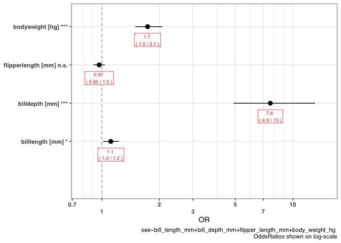

``` r
rawdata$pGLM_ana <- predict(logreg_out,
                        type = 'response')
#pROC
roc_out_ana <- roc(
  response=rawdata$sex,
  predictor=rawdata$pGLM_ana
)
youden <- pROC::coords(roc_out_ana,x='best',best.method='youden')
youden
```

      threshold specificity sensitivity
    1 0.4509296   0.8909091   0.9345238

``` r
youden2 <- pROC::coords(roc_out_ana,x='best',best.method='top')
youden2
```

      threshold specificity sensitivity
    1 0.4509296   0.8909091   0.9345238

``` r
SensSpecComparison <- 
  add_row(
    SensSpecComparison,
    modelformula = str_replace_all(
      glmformula,
      pattern = "\\+",
      replacement = "+\n"),
    Sensitivity = youden$sensitivity,
    Specificity = youden$specificity,
    AIC = summary(logreg_out)$aic |> 
      roundR(5))
ggroc(roc_out_ana,legacy.axes = T)+ 
  geom_abline(slope = 1,intercept = 0)+ 
  geom_point(x=1-youden$specificity,
             y=youden$sensitivity, color='red', size=2 ) 
```

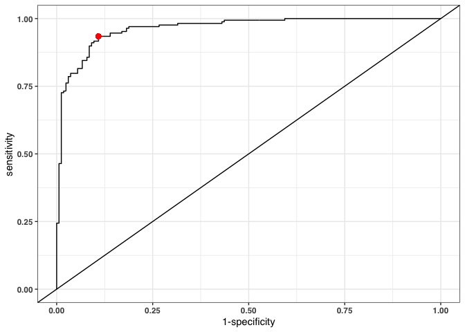

``` r
rawdata <- 
  mutate(rawdata,
         sex_predicted= 
           case_when(
             pGLM_ana<youden$threshold ~ "female",
             pGLM_ana>=youden$threshold ~ "male"))
table(rawdata$sex, rawdata$sex_predicted)
```

            
             female male
      female    147   18
      male       11  157

``` r
rawdata |> 
  group_by(sex,sex_predicted) |> 
  count()
```

    # A tibble: 4 × 3
    # Groups:   sex, sex_predicted [4]
      sex    sex_predicted     n
      <fct>  <chr>         <int>
    1 female female          147
    2 female male             18
    3 male   female           11
    4 male   male            157

``` r
rawdata |> 
  mutate(`prediction quality`=
           case_when(sex=="male" &
                       pGLM_ana<youden$threshold ~ 
                       "false negative",
                     sex=="female" & 
                       pGLM_ana>=youden$threshold 
                     ~ "false positive", 
                     .default = 'correct' )) |>
  ggplot(aes(sex,pGLM_ana))+
  geom_boxplot(outlier.alpha = 0)+
  scale_y_continuous(breaks=seq(0,1,.1))+
  geom_beeswarm(alpha=.25, cex = .75,
                aes(color=`prediction quality`))+ 
  scale_color_manual(values=c("seagreen","firebrick","magenta"))+ 
  geom_hline(yintercept = c(youden$threshold,
                            .5),
             color='red',
             linetype=2:3)
```

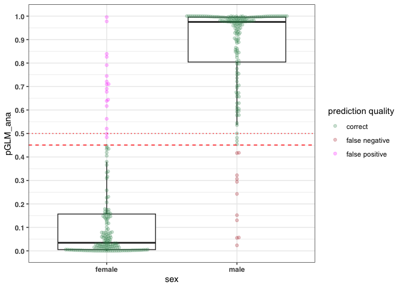

``` r
pred_vars <- ColSeeker(namepattern = c("bill","_hg"))
glmformula <- paste('sex',
                    paste(pred_vars$names,
                          collapse="+"),
                    sep="~")
logreg_red_out<-glm(glmformula |> as.formula(),
                family=binomial(), data=rawdata)
logreg_red_out |> 
  tidy() |> 
  mutate(p.value=formatP(p.value,5)) |> 
  flextable() |> 
  set_table_properties(width = 1,layout = 'autofit')
```


``` r
cat('&nbsp;\n\n')
```

    &nbsp;

``` r
Anova_red_out <- Anova(logreg_red_out,type = 2) |>
    broom::tidy() |>
    mutate(p.value=formatP(p.value,ndigits = 5))
Anova_red_out |> 
  flextable() |> 
  set_table_properties(width = 1,layout = 'autofit')
```


``` r
cat('&nbsp;\n\n')
```

    &nbsp;

``` r
tidy_red_out <- tidy(logreg_red_out)
ORs <- exp(logreg_red_out$coefficients)
CIs <- exp(confint(logreg_red_out))
```

``` r
OR_plotdata <- tibble(
  Predictor=names(ORs)[-1] |> 
    str_replace_all(
      c("species"="","island"="",#"_"=" ",
        "(.+)_(.+)_(.+)"="\\1\\2 [\\3]")) |> 
    fct_inorder(),
  OR=ORs[-1],
  CI_low=CIs[-1,1],
  CI_high=CIs[-1,2],
  p=tidy_red_out$p.value[-1],
  Significance=markSign(p),
  Label=paste(Predictor,Significance) |> 
    fct_inorder()) |> 
  rowwise() |> 
  mutate(plot_or=paste(roundR(OR),"\n(",
                       roundR(CI_low),
                       "/",roundR(CI_high),")")) |> 
  ungroup()
baseplot <- ggplot(OR_plotdata,
                   aes(x = Label,y=OR))+
  geom_pointrange(aes(ymin=CI_low,
                      ymax=CI_high))+
  coord_flip()+
  geom_hline(yintercept = 1,
             linewidth=.2,linetype=2)
# baseplot
baseplot+
  geom_label(aes(label=plot_or), vjust=1.5,color='red',
             size = 2.5)+
  scale_y_log10(
    breaks=logrange_12357,
    minor_breaks=logrange_123456789,
    guide = guide_axis(n.dodge=2),
    labels=prettyNum,
    expand = expansion(mult = .1))+
  scale_x_discrete(expand = expansion(mult = c(.5,.2)))+
  # geom_text(aes(label=Significance),
  #           vjust=1.5,color='red')+
  labs(caption = paste(glmformula,'\nOddsRatios shown on log-scale'))+
  xlab(NULL)
```

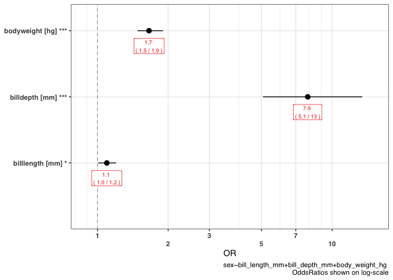

``` r
rawdata$pGLM_ana_red <- predict(logreg_red_out,
                        type = 'response')
#pROC
roc_out_red_ana <- roc(
  response=rawdata$sex,
  predictor=rawdata$pGLM_ana_red
)
youden <- pROC::coords(roc_out_red_ana,x='best',best.method='youden')
youden
```

      threshold specificity sensitivity
    1 0.5552993   0.9151515   0.8988095

``` r
SensSpecComparison <- 
  add_row(
    SensSpecComparison,
    modelformula = str_replace_all(
      glmformula,
      pattern = "\\+",
      replacement = "+\n"),
    Sensitivity = youden$sensitivity,
    Specificity = youden$specificity,
    AIC = summary(logreg_red_out)$aic |> 
      roundR(5))
ggroc(roc_out_red_ana,legacy.axes = T)+ 
  geom_abline(slope = 1,intercept = 0)+ 
  geom_point(x=1-youden$specificity,
             y=youden$sensitivity, color='red', size=2 ) 
```

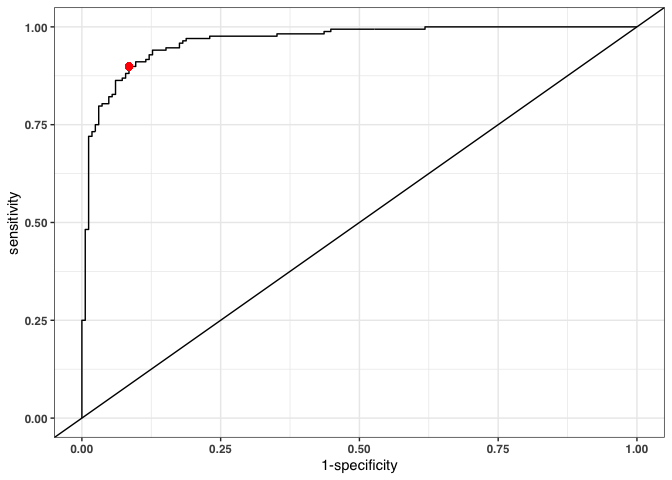

``` r
rawdata <- 
  mutate(rawdata,
         sex_predicted= 
           case_when(
             pGLM_ana_red<youden$threshold ~ "female",
             pGLM_ana_red>=youden$threshold ~ "male"))
table(rawdata$sex, rawdata$sex_predicted)
```

            
             female male
      female    151   14
      male       17  151

``` r
rawdata |> 
  group_by(sex,sex_predicted) |> 
  count()
```

    # A tibble: 4 × 3
    # Groups:   sex, sex_predicted [4]
      sex    sex_predicted     n
      <fct>  <chr>         <int>
    1 female female          151
    2 female male             14
    3 male   female           17
    4 male   male            151

``` r
rawdata |> 
  mutate(`prediction quality`=
           case_when(sex=="male" &
                       pGLM_ana_red<youden$threshold ~ 
                       "false negative",
                     sex=="female" & 
                       pGLM_ana_red>=youden$threshold 
                     ~ "false positive", 
                     .default = 'correct' )) |>
  ggplot(aes(sex,pGLM_ana_red))+
  geom_boxplot(outlier.alpha = 0)+
  scale_y_continuous(breaks=seq(0,1,.1))+
  geom_beeswarm(alpha=.25, cex = .75,
                aes(color=`prediction quality`))+ 
  scale_color_manual(values=c("seagreen","firebrick","magenta"))+ 
  geom_hline(yintercept = c(youden$threshold,
                            .5),
             color='red',
             linetype=2:3)
```

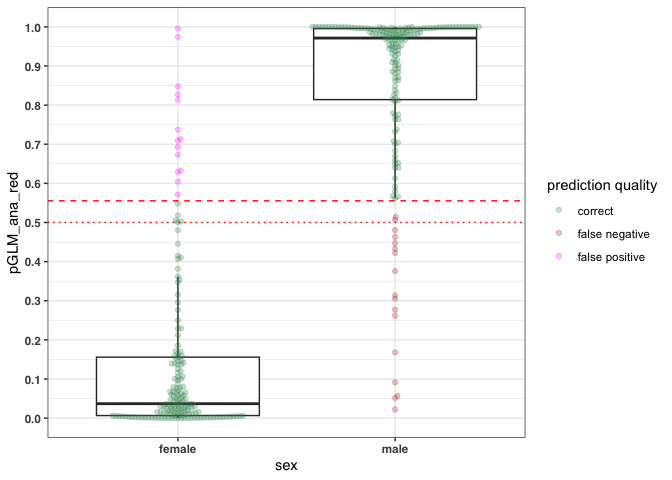

``` r
glmformula <- "sex~species*body_weight_hg + flipper_length_mm+bill_depth_mm+bill_length_mm"
logreg_i_out <- glm(as.formula(glmformula),
                    family = binomial(), data=rawdata)
tidy_out <- tidy(logreg_i_out) 

tidy_out|> 
  mutate(p.value = formatP(p.value,5,mark = TRUE)) |> 
  flextable() |> 
  set_table_properties(width = 1,layout = 'autofit')
```


``` r
cat('&nbsp;\n\n')
```

    &nbsp;

``` r
logreg_i_out|>
  Anova(type = 3) |>
  tidy() |> 
  mutate(p.value = formatP(p.value,5)) |> 
  flextable() |> 
  set_table_properties(width = 1,layout = 'autofit')
```

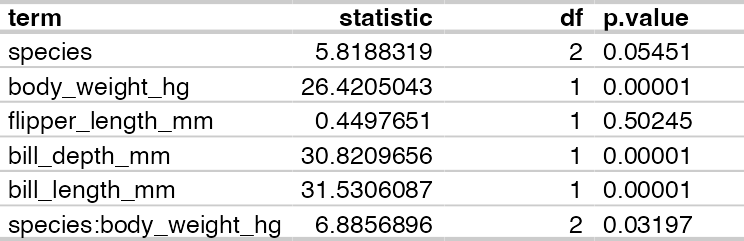

``` r
cat('&nbsp;\n\n')
```

    &nbsp;

``` r
anova(logreg_out, logreg_i_out)
```

    Analysis of Deviance Table

    Model 1: sex ~ bill_length_mm + bill_depth_mm + flipper_length_mm + body_weight_hg
    Model 2: sex ~ species * body_weight_hg + flipper_length_mm + bill_depth_mm + 
        bill_length_mm
      Resid. Df Resid. Dev Df Deviance  Pr(>Chi)    
    1       328     159.00                          
    2       324     120.22  4    38.78 7.733e-08 ***
    ---
    Signif. codes:  0 '***' 0.001 '**' 0.01 '*' 0.05 '.' 0.1 ' ' 1

``` r
ORs <- exp(logreg_i_out$coefficients)
CIs <- exp(confint(logreg_i_out))

OR_plotdata <- tibble(
  Predictor=names(ORs)[-1] |> 
    str_replace_all(
      c("species"="","island"="",#"_"=" ",
        "(.+)_(.+)_(.+)"="\\1\\2 [\\3]")) |> 
    fct_inorder(),
  OR=ORs[-1],
  CI_low=CIs[-1,1],
  CI_high=CIs[-1,2],
  p=tidy_out$p.value[-1],
  Significance=markSign(p),
  Label=paste(Predictor,Significance) |> 
    fct_inorder()) |> 
  rowwise() |> 
  mutate(plot_or=paste(roundR(OR),"(",
                       roundR(CI_low),
                       "/",roundR(CI_high),")")) |> 
  ungroup()
baseplot <- ggplot(OR_plotdata,
                   aes(x = Label,y=OR))+
  geom_pointrange(aes(ymin=CI_low,
                      ymax=CI_high))+
  coord_flip()+
  geom_hline(yintercept = 1,
             linewidth=.2,linetype=2)
# baseplot
baseplot+
  geom_label(aes(label=plot_or), 
             vjust=1.5,color='red',
             size = 2.5)+
  scale_y_log10(
    breaks=logrange_1,
    minor_breaks=logrange_123456789,
    guide = guide_axis(n.dodge=5),
    labels=prettyNum)+
  # geom_text(aes(label=Significance),
  #           vjust=1.5,color='red')+
  labs(caption = paste(glmformula,'\nOddsRatios shown on log-scale'))+
  xlab(NULL)
```

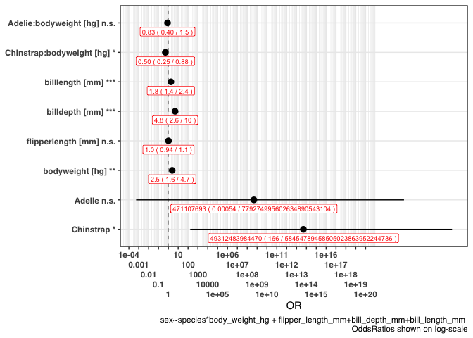

``` r
rawdata$pGLM_i <- predict(logreg_i_out,
                        type = 'response')


#pROC
roc_out_i <- roc(
  response=rawdata$sex,
  predictor=rawdata$pGLM_i
)
youden <- pROC::coords(roc_out_i,x='best',best.method='youden')
youden
```

      threshold specificity sensitivity
    1 0.5985156   0.9515152   0.9107143

``` r
SensSpecComparison <- 
  add_row(
    SensSpecComparison,
    modelformula = str_replace_all(
      glmformula,
      pattern = "([+*])",
      replacement = "\\1\n"),
    Sensitivity = youden$sensitivity,
    Specificity = youden$specificity,
    AIC = summary(logreg_i_out)$aic |> 
      roundR(5))
SensSpecComparison |> 
  flextable() |> 
  set_table_properties(width = 1,layout = 'autofit')
```


``` r
pred_vars <- ColSeeker(namepattern = c("sp","bill","fl","_hg"))
glmformula <- paste('sex',
                    paste(pred_vars$names,
                          collapse="+"),
                    sep="~")
logreg_a_out<-glm(glmformula |> as.formula(),
                family=binomial(), data=rawdata)
logreg_a_out |> 
  tidy() |> 
  mutate(p.value = formatP(p.value,5)) |> 
  flextable() |> 
  set_table_properties(width = 1,layout = 'autofit')
```


``` r
cat('&nbsp;\n\n')
```

    &nbsp;

``` r
Anova_out <- Anova(logreg_a_out,type = 2) |>
    broom::tidy() |>
    mutate(p.value=formatP(p.value,ndigits = 5))
Anova_out |> 
  flextable() |> 
  set_table_properties(width = 1,layout = 'autofit')
```

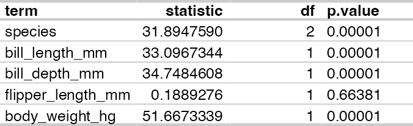

``` r
cat('&nbsp;\n\n')
```

    &nbsp;

``` r
tidy_out <- tidy(logreg_a_out)
ORs <- exp(logreg_a_out$coefficients)
CIs <- exp(confint(logreg_a_out))

OR_plotdata <- tibble(
  Predictor=names(ORs)[-1] |> 
    str_replace_all(
      c("species"="","island"="",#"_"=" ",
        "(.+)_(.+)_(.+)"="\\1\\2 [\\3]")) |> 
    fct_inorder(),
  OR=ORs[-1],
  CI_low=CIs[-1,1],
  CI_high=CIs[-1,2],
  p=tidy_out$p.value[-1],
  Significance=markSign(p),
  Label=paste(Predictor,Significance) |> 
    fct_inorder()) |> 
  rowwise() |> 
  mutate(plot_or=paste(roundR(OR),"(",
                       roundR(CI_low),
                       "/",roundR(CI_high),")")) |> 
  ungroup()
baseplot <- ggplot(OR_plotdata,
                   aes(x = Label,y=OR))+
  geom_pointrange(aes(ymin=CI_low,
                      ymax=CI_high))+
  coord_flip()+
  geom_hline(yintercept = 1,
             linewidth=.2,linetype=2)
# baseplot
baseplot+
  geom_label(aes(label=plot_or), vjust=1.5,
             color='red', size = 2.5)+
  scale_y_log10(
    breaks=logrange_15,
    minor_breaks=logrange_123456789,
    guide = guide_axis(n.dodge=2),
    labels=prettyNum)+
  # geom_text(aes(label=Significance),
  #           vjust=1.5,color='red')+
  labs(caption = paste(glmformula,'\nOddsRatios shown on log-scale'))+
  xlab(NULL)
```

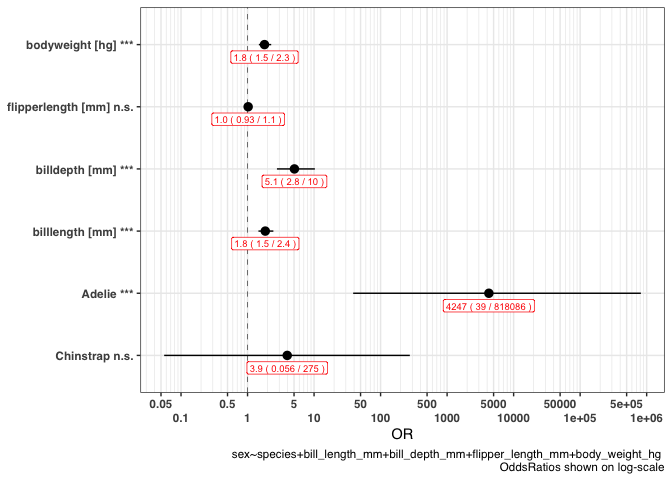

``` r
rawdata$pGLM_a <- predict(logreg_a_out,
                        type = 'response')


#pROC
roc_out_a <- roc(
  response=rawdata$sex,
  predictor=rawdata$pGLM_a
)
youden <- pROC::coords(roc_out_a,x='best',best.method='youden')
youden
```

      threshold specificity sensitivity
    1 0.6146528   0.9575758   0.9047619

``` r
SensSpecComparison <- 
  add_row(
    SensSpecComparison,
    modelformula = str_replace_all(
      glmformula,
      pattern = "\\+",
      replacement = "+\n"),
    Sensitivity = youden$sensitivity,
    Specificity = youden$specificity,
    AIC = summary(logreg_a_out)$aic |> 
      roundR(5))
ggroc(roc_out_a,legacy.axes = T)+ 
  geom_abline(slope = 1,intercept = 0)+ 
  geom_point(x=1-youden$specificity,
             y=youden$sensitivity, color='red', size=2 ) 
```

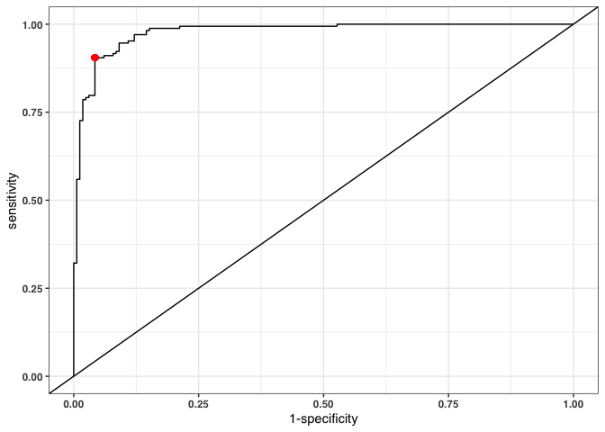

``` r
rawdata <- 
  mutate(rawdata,
         sex_predicted= 
           case_when(
             pGLM_a<youden$threshold ~ "female",
             pGLM_i>=youden$threshold ~ "male"))
table(rawdata$sex, rawdata$sex_predicted)
```

            
             female male
      female    158    6
      male       16  150

``` r
rawdata |> 
  group_by(sex,sex_predicted) |> 
  count()
```

    # A tibble: 6 × 3
    # Groups:   sex, sex_predicted [6]
      sex    sex_predicted     n
      <fct>  <chr>         <int>
    1 female female          158
    2 female male              6
    3 female <NA>              1
    4 male   female           16
    5 male   male            150
    6 male   <NA>              2

``` r
rawdata |> 
  mutate(`prediction quality`=
           case_when(sex=="male" &
                       pGLM_a<youden$threshold ~ 
                       "false negative",
                     sex=="female" & 
                       pGLM_a>=youden$threshold 
                     ~ "false positive", 
                     .default = 'correct' )) |>
  ggplot(aes(sex,pGLM_a))+
  geom_boxplot(outlier.alpha = 0)+
  scale_y_continuous(breaks=seq(0,1,.1))+
  geom_beeswarm(alpha=.25, cex = .75,
                aes(color=`prediction quality`))+ 
  scale_color_manual(values=c("seagreen","firebrick","magenta"))+ 
  geom_hline(yintercept = c(youden$threshold,
                            .5),
             color='red',
             linetype=2:3)
```

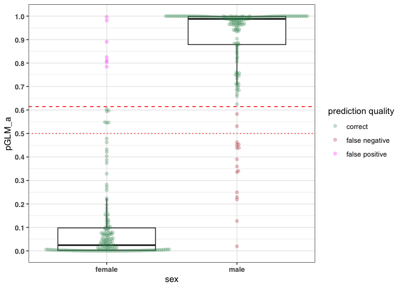

``` r
SensSpecComparison |> 
  flextable() |> 
  set_table_properties(width = .7,layout = 'autofit')
```

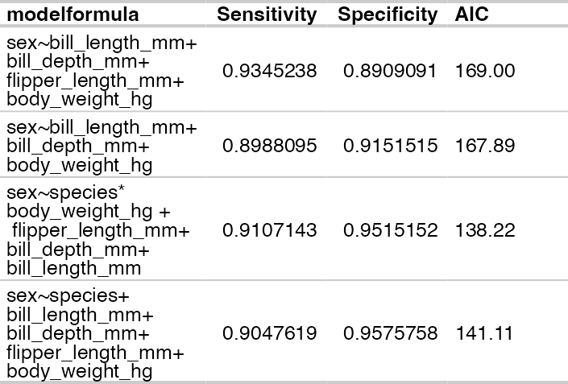

``` r
ggroc(list(anatomy = roc_out_ana, 
           anatomy_reduced = roc_out_red_ana,
           additive = roc_out_a, 
           interaction = roc_out_i))
```

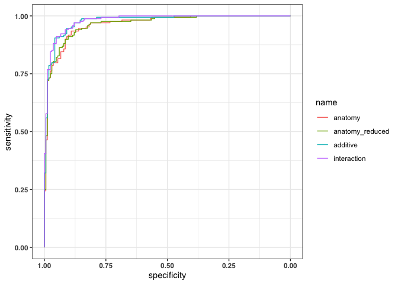

## *loop for univariable / bivariable analyses*

``` r
modellist <- list()
Anovalist <- list()
roclist <- list()
Youdenlist <- list()
resulttable <- tibble(modelformula = NA_character_,
                      OR4cont.predictor = NA_character_,
                      pAnova = NA_character_,
                      Sensitivity = NA_character_,
                      Specificity = NA_character_,
                      AIC = NA_character_,
                      .rows = 0)
pred_vars <- ColSeeker(namepattern = c("bill", "flipper","hg"))
pred_vars$names
```

    [1] "bill_length_mm"    "bill_depth_mm"     "flipper_length_mm"
    [4] "body_weight_hg"   

``` r
for(var_i in pred_vars$names){
  for(species_effect in c("","+", "*")){
    if(species_effect!="") {
    glmformula <- paste0("sex~",var_i, species_effect,"species")
    } else {
    glmformula <- paste0("sex~",var_i)
    }
    logreg_out <- glm(glmformula, data = rawdata, 
                      family = binomial())
    ORs <- exp(logreg_out$coefficients)
    CIs <- exp(confint(logreg_out))
    modellist <- list.append(modellist,
                             c(ORs[2],
                               CIs[2,]))
    names(modellist)[length(modellist)] <- glmformula
    AIC_out <- summary(logreg_out)$aic |> roundR(5)
    Anova_out <- Anova(logreg_out) |> tidy()
    Anovalist <- list.append(Anovalist,Anova_out)
    names(Anovalist)[length(Anovalist)] <- glmformula
    
    rawdata$pGLM_temp <- predict(logreg_out,
                                 type = 'response')
    
    
#pROC
roc_out <- roc(
  response=rawdata$sex,
  predictor=rawdata$pGLM_temp
)
youden <- pROC::coords(roc_out,x='best',best.method='youden')
roclist <- list.append(roclist, roc_out)
names(roclist)[length(roclist)] <- glmformula
youden
Youdenlist <- list.append(Youdenlist, youden)
names(Youdenlist)[length(Youdenlist)] <- glmformula
SensSpecComparison <- add_row(SensSpecComparison,
                              modelformula = str_replace_all(glmformula,
                                                     pattern = "([+*])",
                                                     replacement = "\\1\n"),
                              Sensitivity = youden$sensitivity,
                              Specificity = youden$specificity,
                              AIC = AIC_out)

resulttable <- add_row(resulttable,
                       modelformula =str_replace_all(glmformula,
                                                     pattern = "([+*])",
                                                     replacement = "\\1\n"),
                       OR4cont.predictor = paste0(roundR(ORs[2],4)," [",
                                  paste(roundR(CIs[2,],4), collapse = " / "),
                                  "]"),
                       pAnova = formatP(Anova_out$p.value[1],
                                        mark = T),
                       Sensitivity = roundR(youden$sensitivity,3),
                       Specificity = roundR(youden$specificity,3),
                       AIC = AIC_out)

plot_tmp <- 
  rawdata |> 
  mutate(`prediction quality`=
           case_when(sex=="male" &
                       pGLM_temp<youden$threshold ~ 
                       "false negative",
                     sex=="female" & 
                       pGLM_temp>=youden$threshold 
                     ~ "false positive", 
                     .default = 'correct' )) |>
  ggplot(aes(sex,pGLM_temp))+
  geom_boxplot(outlier.alpha = 0)+
  scale_y_continuous(breaks=seq(0,1,.1))+
  geom_beeswarm(alpha=.25, cex = .75,
                aes(color=`prediction quality`))+ 
  scale_color_manual(values=c("seagreen","firebrick","magenta"))+ 
  geom_hline(yintercept = c(youden$threshold,
                            .5),
             color='red',
             linetype=2:3)+
  ggtitle(glmformula)
print(plot_tmp)
  }
}
```

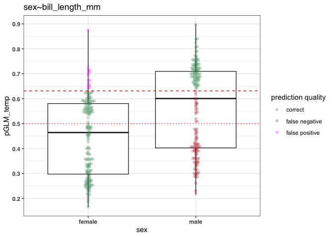

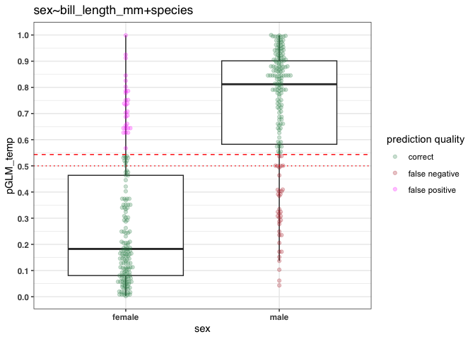

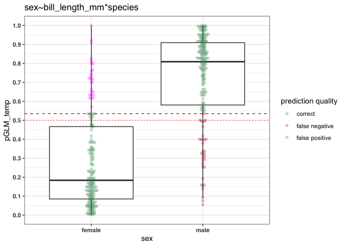

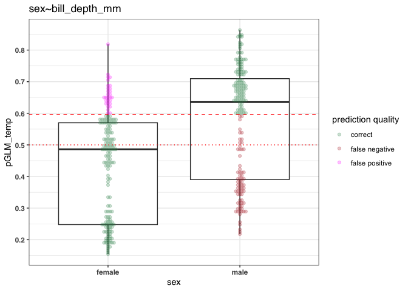

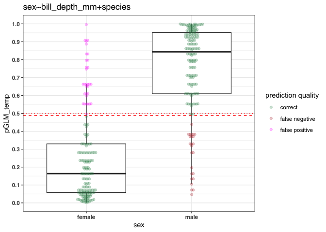

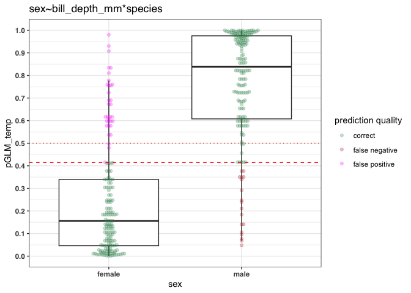

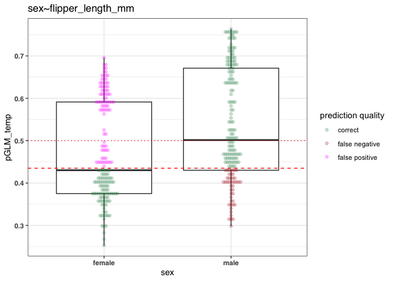

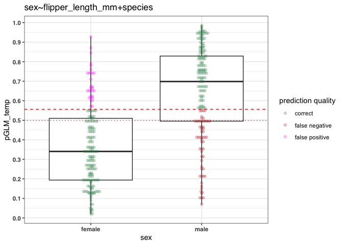

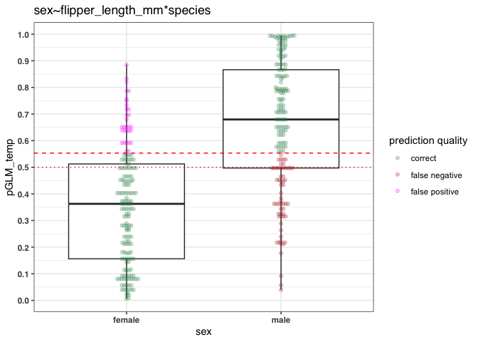

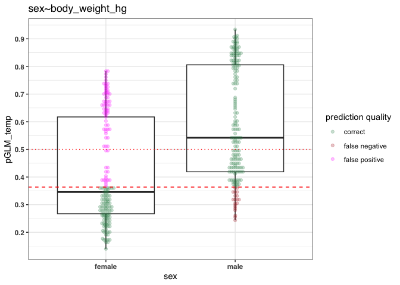

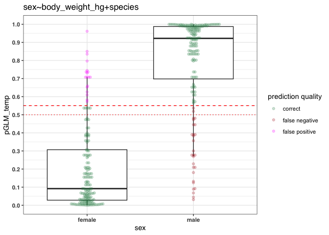

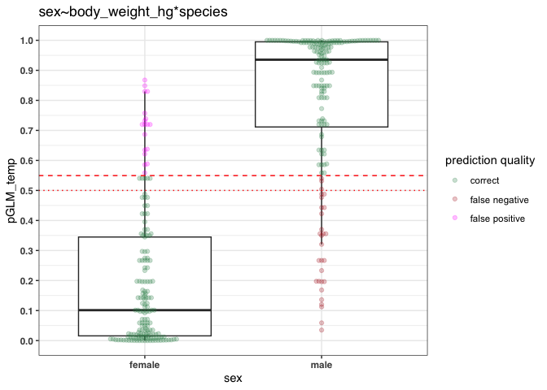

``` r
SensSpecComparison |> flextable()
```

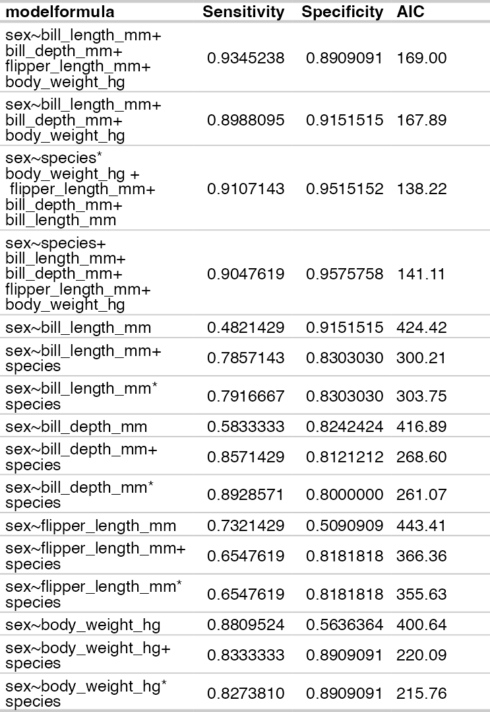

``` r
resulttable |>  
  # filter(str_detect(modelformula, 
  #                   "spec",
  #                   negate = TRUE)) |> 
  flextable() |> 
  set_table_properties(width = 1,layout = 'autofit')
```

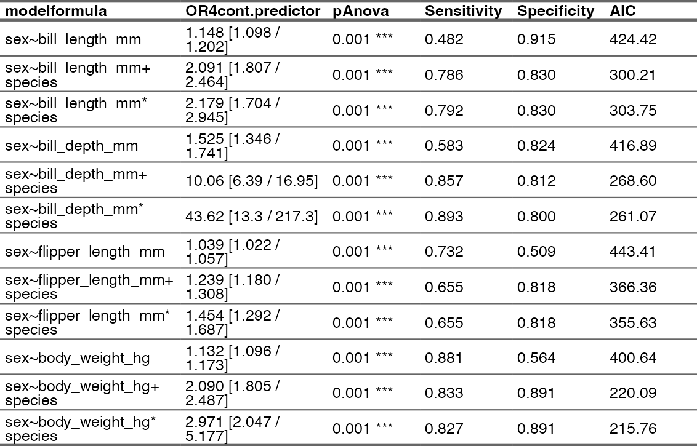

``` r
ggroc(roclist)
```

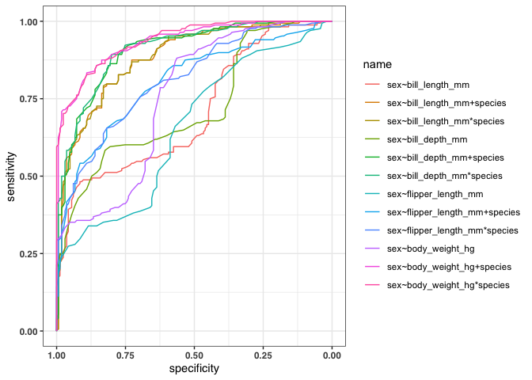

``` r
ggroc(list.match(roclist,"species"))
```

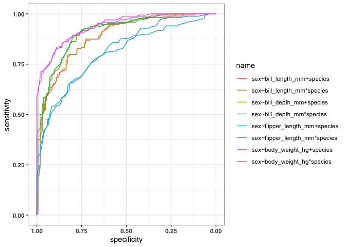

``` r
ggroc(list.match(roclist,"species",
                 invert = TRUE))
```

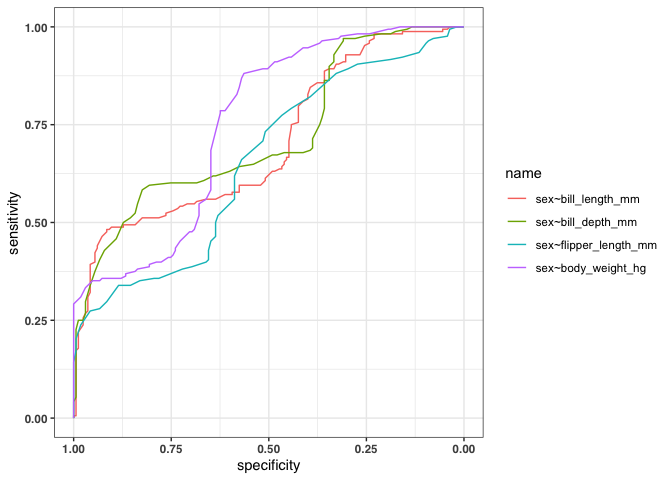

``` r
ggroc(list.match(roclist, "\\*"))
```

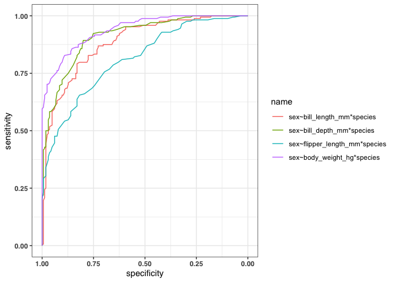

``` r
ggroc(list.match(roclist,"\\+species"))
```

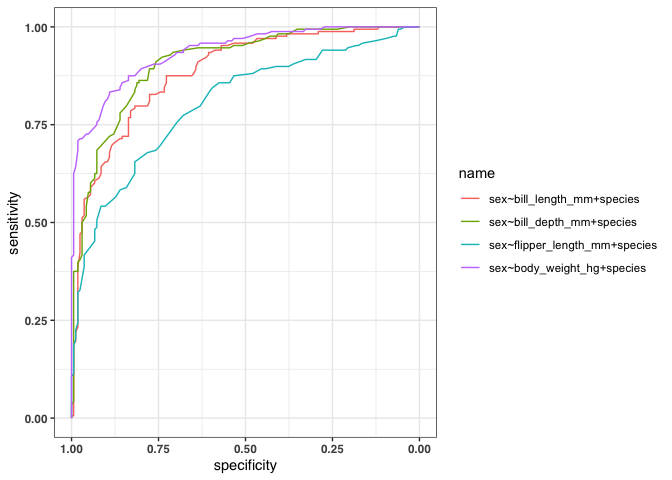
