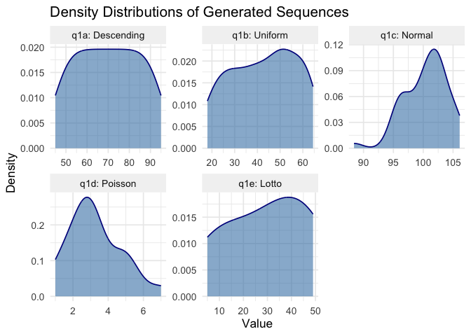
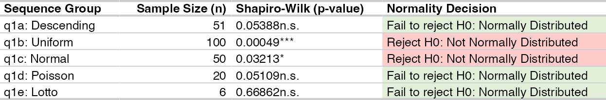
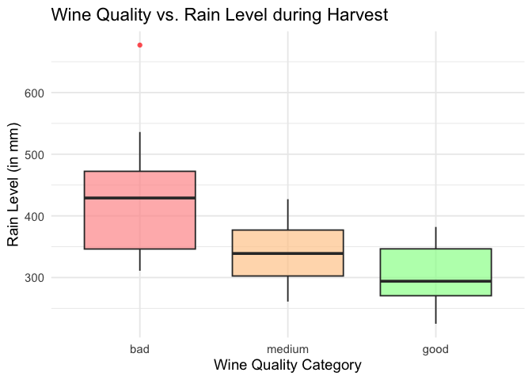
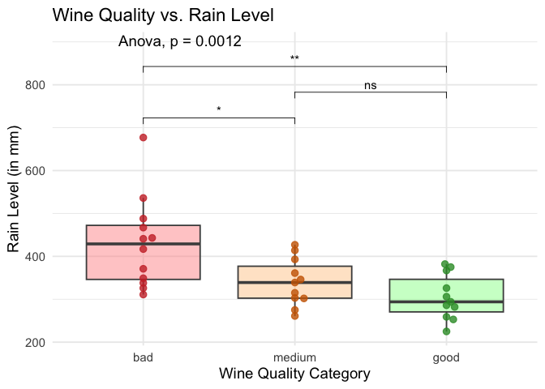
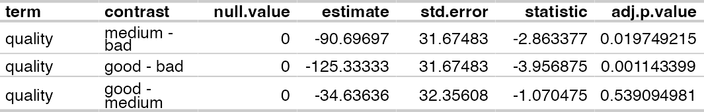
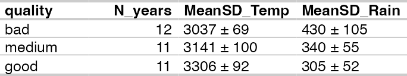

# Exam Statistics 2026_1
Reuben Njue

``` r
#any packages needed? put them here!
pacman::p_load(conflicted, tidyverse, wrappedtools, flextable, dplyr, ggplot2, ggpubr, ggbeeswarm, multcomp, broom, stats)
```

``` r
set_flextable_defaults(big.mark = " ", 
                       font.size = 9, 
                       theme_fun = theme_vanilla,
                       padding.bottom = 1, 
                       padding.top = 3,
                       padding.left = 3,
                       padding.right = 4,
                       font.family = "sans",
                       background.color = "#FFFFFF",       # Forces a crisp white background
                       text.color = "#222222",             # Forces dark charcoal text 
                       border.color = "#CCCCCC"            # Gives clear light gray grid borders
)

theme_set(theme_bw())
theme_update(
  plot.title=element_text(family="sans"),
  plot.caption=element_text(family="sans"),
  axis.title=element_text(family="sans"),
  axis.text=element_text(family="sans",face = "bold"),
  strip.text=element_text(family="sans"))
```

Please give your answers underneath the question, referencing question
numbers.

Please format text answers as comments or put them in text parts.

# Q1: Please generate the following sequences of numbers: (5 pts)

## Q1a: Integers between 95 and 45 in descending order, including borders

``` r
(q1a <- 95:45)
```

     [1] 95 94 93 92 91 90 89 88 87 86 85 84 83 82 81 80 79 78 77 76 75 74 73 72 71
    [26] 70 69 68 67 66 65 64 63 62 61 60 59 58 57 56 55 54 53 52 51 50 49 48 47 46
    [51] 45

``` r
#or
q1a <- seq(95,45, -1)
print(q1a)
```

     [1] 95 94 93 92 91 90 89 88 87 86 85 84 83 82 81 80 79 78 77 76 75 74 73 72 71
    [26] 70 69 68 67 66 65 64 63 62 61 60 59 58 57 56 55 54 53 52 51 50 49 48 47 46
    [51] 45

## Q1b: 100 random numbers from a uniform distribution with minimum=18 and maximum=65

``` r
q1b <- runif(n = 100, min = 18, max = 65)
sample(18:65, 100, replace = TRUE)
```

      [1] 45 60 21 52 56 58 35 52 59 64 37 48 33 27 22 27 59 34 59 27 65 33 64 29 45
     [26] 55 47 62 18 53 45 48 57 50 27 32 55 28 19 46 18 56 24 30 22 62 34 34 53 35
     [51] 30 61 23 42 41 41 57 29 51 19 45 51 42 20 25 58 63 36 22 47 49 46 44 63 37
     [76] 29 48 40 21 23 50 58 50 19 63 33 37 24 52 39 23 33 34 24 53 59 62 26 47 50

``` r
print(q1b)
```

      [1] 30.71821 31.17843 47.63013 25.28630 21.43756 21.90067 23.36981 36.21362
      [9] 46.69942 26.45118 54.15720 36.73099 56.90787 63.07117 29.36851 31.81983
     [17] 53.61071 29.56453 22.13674 38.46340 42.17120 25.21565 29.07760 33.91494
     [25] 35.16533 30.58341 23.14549 49.96441 24.12707 42.66094 46.49037 34.92141
     [33] 56.10454 57.96804 50.15116 61.22403 39.90904 63.30196 55.49782 57.92256
     [41] 50.40087 48.40457 46.71877 47.82512 33.09880 34.37261 22.31580 64.74248
     [49] 34.11139 43.61198 50.92629 35.27210 60.06487 38.51874 62.99421 27.68844
     [57] 57.85420 47.10500 46.62053 32.74914 18.90902 25.47143 55.55167 47.63204
     [65] 30.32752 23.37052 46.49433 45.17498 45.28221 22.04908 33.58334 25.68558
     [73] 39.64290 21.38528 51.50380 44.04571 34.41394 44.83146 41.82490 55.44627
     [81] 35.06309 26.81284 49.87721 54.13130 44.56345 49.11468 49.06181 41.43610
     [89] 56.14368 22.94417 46.35957 40.77710 24.25720 33.48426 51.69050 45.69336
     [97] 47.59305 54.02482 53.51328 59.93798

## Q1c: 50 random numbers from a Normal distribution with mean=100 and SD=15

``` r
set.seed(42)
q1c <- rnorm(n = 50, mean = 100, sd = sqrt(15))
print(q1c)
```

     [1] 105.30970  97.81293 101.40639 102.45107 101.56572  99.58898 105.85410
     [8]  99.63339 107.81732  99.75711 105.05374 108.85614  94.62097  98.92026
    [15]  99.48365 102.46303  98.89909  89.71159  90.54811 105.11278  98.81239
    [22]  93.10102  99.33417 104.70441 107.34005  98.33280  99.00360  93.17130
    [29] 101.78195  97.52131 101.76395 102.72982 104.00894  97.64164 101.95568
    [36]  93.35005  96.96180  96.70445  90.64981 100.13990 100.79783  98.60163
    [43] 102.93635  97.18548  94.70067 101.67630  96.85749 105.59298  98.32902
    [50] 102.53931

## Q1d: 20 random numbers from a Poisson distribution with lambda=3

``` r
q1d <- rpois(n= 20, lambda = 3)
print(q1d)
```

     [1] 3 2 2 2 6 6 4 4 3 0 3 5 4 3 3 3 0 2 3 5

## Q1e: 6 Lotto numbers (unique, uniform distribution) between 1 and 49 (“6 aus 49”).

``` r
q1e <- sample(x = 1:49, size = 6, replace = FALSE)
print(q1e)
```

    [1] 19 32 16 29 17 44

## Q2: Test all the various numbers you generated in Q1 against the Normal distribution: Plot distributions and create a table structure with the p-values and your interpretation (3 pts)

``` r
set.seed(42)
#data. Not necessary to recrete. 
q1a <- 45:95
q1b <- runif(n = 100, min = 18, max = 65)
q1c <- rnorm(n = 50, mean = 100, sd = sqrt(15))
q1d <- rpois(n= 20, lambda = 3)
q1e <- sample(x = 1:49, size = 6, replace = FALSE)

#Shapiro-Wilk for Normality Tests
shp_q1a <- shapiro.test(q1a)
shp_q1b <- shapiro.test(q1b)
shp_q1c <- shapiro.test(q1c)
shp_q1d <- shapiro.test(q1d)
shp_q1e <- shapiro.test(q1e)


#PLOTTING 

#Histogram
# Q1a
par(mfrow = c(2, 5), mar = c(4, 4, 3, 1))
hist(q1a, main="Q1a: Descending", xlab="Value", col="lightblue", prob=TRUE)
lines(density(q1a), col="red", lwd=2)
# Q1b
hist(q1b, main="Q1b: Uniform", xlab="Value", col="lightgreen", prob=TRUE)
lines(density(q1b), col="red", lwd=2)
# Q1c
hist(q1c, main="Q1c: Normal", xlab="Value", col="lightpink", prob=TRUE)
lines(density(q1c), col="red", lwd=2)
# Q1d
hist(q1d, main="Q1d: Poisson", xlab="Value", col="lightyellow", prob=TRUE)
lines(density(q1d), col="red", lwd=2)
# Q1e
hist(q1e, main="Q1e: Lotto", xlab="Value", col="wheat", prob=TRUE)
lines(density(q1e), col="red", lwd=2)

# Q-Q Plot 
qqnorm(q1a, main="Q1a Q-Q Plot"); qqline(q1a, col="blue")
qqnorm(q1b, main="Q1b Q-Q Plot"); qqline(q1b, col="blue")
qqnorm(q1c, main="Q1c Q-Q Plot"); qqline(q1c, col="blue")
qqnorm(q1d, main="Q1d Q-Q Plot"); qqline(q1d, col="blue")
qqnorm(q1e, main="Q1e Q-Q Plot"); qqline(q1e, col="blue")
```


``` r
par(mfrow = c(1, 1))


#ALTERNATIVE
set.seed(42)
data_list <- list(
  `q1a: Descending` = 95:45,
  `q1b: Uniform`    = runif(n = 100, min = 18, max = 65),
  `q1c: Normal`     = rnorm(n = 50, mean = 100, sd = sqrt(15)),
  `q1d: Poisson`    = rpois(n= 20, lambda = 3),
  `q1e: Lotto`      = sample(x = 1:49, size = 6, replace = FALSE)
)
df_long <- enframe(
  data_list, 
  name = "Sequence",
  value = "Value") |>
  unnest(Value)

gg_plot <- ggplot(df_long, aes(x = Value)) +
  geom_density(fill = "steelblue", alpha = 0.6, color = "darkblue") +
  facet_wrap(~ Sequence, scales = "free", ncol = 3) +
  theme_minimal(base_size = 13) +
  labs(
    title = "Density Distributions of Generated Sequences",
    x = "Value", 
    y = "Density"
  ) +
  theme(strip.background = element_rect(fill = "gray95", color = NA))
print(gg_plot)
```



``` r
table_output <- df_long |>
  group_by(Sequence) |>
  summarise(
    Sample_Size = n(),
    p_value = shapiro.test(Value)$p.value
  ) |> 
  mutate(
    Interpretation = if_else(
      p_value < 0.05,
      "Reject H0: Not Normally Distributed",
      "Fail to reject H0: Normally Distributed"
    ),
    p_value_display = paste0(
      formatC(p_value, digits = 5, format = "f"),
      case_when(
        p_value < 0.001 ~ "***",
        p_value < 0.01  ~ "**",
        p_value < 0.05  ~ "*",
        TRUE ~ "n.s."
      )
    )
  ) |>
  dplyr::select(
    Sequence,
    Sample_Size,
    p_value = p_value_display,
    Interpretation
  ) |>
  flextable() |>                     # 1. Initialize flextable
  theme_vanilla() |>                  # 2. Apply theme FIRST so it doesn't wipe changes
  set_header_labels(                 # 3. Change header labels
    Sequence = "Sequence Group",
    Sample_Size = "Sample Size (n)",
    p_value = "Shapiro-Wilk (p-value)",
    Interpretation = "Normality Decision"
  ) |>
  bg(i = ~ p_value < 0.05, j = "Interpretation", bg = "#FFCCCC") |>   # 5. Apply colors
  bg(i = ~ p_value >= 0.05, j = "Interpretation", bg = "#E2F0D9") |> 
  autofit() # 6. Apply dimensions last
  knitr::knit_print(table_output) 
```



``` r
#print(table_output)
#AB your seed resulted in a non-normal sample from rnorm(), in such a case choose a different seed!
```

# Q3: Please explain the following terms in your own words (rather than just copy/pasting from wikipedia/chatbots) (12 pts)

## Q3a: standard deviation

a measure of how the actual individual data diviate from group mean
.e.i. the measuring the spreading of my values in a dataset around the
group mean.

it is a measure of variability of actual measurement (data) within a
group. meaning if I take the measurement of weight in a certain group
and the mean is 70kg with SD of + or - 1.5, my subjects are of almost
equal weight. if SD is + or - 16, it means the weight of my subject is
quite varying.

## Q3b: standard error of the mean

SEM measure how accurate the mean of the group is. The small the sample
the larger the SEM and the larger the sample the small the SEM. Meaning
large sample size mirror the true nature of the population. in other
word, true population mean.

## Q3c: confidence interval

It is a range of values that contains the true population parameter.
e.g. 95% CI means assuming a normal distribution of my data, the true
population mean should be found with this net.

## Q3d: statistical power

Statistical power is the probability that my study will produce the
expected effect if indeed that effect exist. In other word, it give
ability to avoid false negative. It measures likelihood of the study to
reject H0 when H0 is false. conventionally set at 0.80(80%).

## Q3e: working hypothesis (with example)

This is the outcome to expect from my study. E.g. knockout (KO) of gene
A reduces development of disease X in KO-mice compared to
control/wildtype mice (wt)

## Q3f: Null hypothesis (with example for Q3e)

This is what to measure in the study. Always assume there is no effect.
E.g. Knockout of gene A does not have effect on the development of
disease X, thus development of disease X is the same in KO as it is in
wildtype (Wt)

# Q4: Please name the class / function for test statistics in the following cases: (4 pts)

## Q4a: Comparison of mean values for 2 groups for a Gaussian measure; what descriptive statistic would be suitable together with the test?

test: student’s t-test

function_xy(): t.test()

description: mean() or meansd() and sd()

## Q4b: Comparison of central tendencies for ordinal data between two groups; what descriptive statistic would be suitable together with the test?

test: Wilcoxon rank-sum test / Mann-Whitney U test

function_xy(): `wilcox.test()`

description: Median: `median()` and interquartile range (IQR): `IQR()`

# Q5: Please import and analyze the dataset bordeaux.xlsx (6 pts)

Info on dataset:

- year: year of harvest

- temperature: sum of daily average temperatures (in Celsius degrees)

- sun: duration of insolation (in hours)

- heat: number of super-hot days

- rain: rain level (in millimeters)

- quality: wine quality: a factor with levels bad, good, and medium

## Q5a: Program the import into a variable and save (“pick” / address) the first 5 rows from columns rain and quality in a *separate* variable. Analyses with all rows!

``` r
rawdata <- readxl::read_xlsx("bordeaux.xlsx")
str(rawdata)
```

    tibble [34 × 6] (S3: tbl_df/tbl/data.frame)
     $ year       : num [1:34] 1924 1925 1926 1927 1928 ...
     $ temperature: num [1:34] 3064 3000 3155 3085 3245 ...
     $ sun        : num [1:34] 1201 1053 1133 970 1258 ...
     $ heat       : num [1:34] 10 11 19 4 36 35 13 12 14 29 ...
     $ rain       : num [1:34] 361 338 393 467 294 225 417 488 677 427 ...
     $ quality    : chr [1:34] "medium" "bad" "medium" "bad" ...

``` r
#First 5 rows from columns rain and quality 
rain_qlty <- rawdata[1:5, c ("rain", "quality")]
rain_qlty
```

    # A tibble: 5 × 2
       rain quality
      <dbl> <chr>  
    1   361 medium 
    2   338 bad    
    3   393 medium 
    4   467 bad    
    5   294 good   

``` r
#converting quality to Factor for Q5c
rawdata$quality <- factor(rawdata$quality, levels = c("bad", "medium", "good"))
```

## Q5b: Create a box plot for rain level, grouped by quality, using ggplot. Try to use a reasonable order of quality levels

``` r
ggplot_1 = ggplot(rawdata, aes(x = quality, y = rain, fill = quality)) +
  geom_boxplot(alpha = 0.7, outlier.color = "red", outlier.shape = 16) +
  scale_fill_manual(values = c("#FF9999", "#FFCC99", "#99FF99")) +
  theme_minimal(base_size = 14) +
  labs(
    title = "Wine Quality vs. Rain Level during Harvest",
    x = "Wine Quality Category",
    y = "Rain Level (in mm)"
  ) +
  theme(legend.position = "none")
print(ggplot_1)
```



``` r
#EVEN BETER 
my_comparisons <- list( 
  c("bad", "medium"), 
  c("medium", "good"), 
  c("bad", "good") 
)

ggplot_2 = ggplot(rawdata, aes(x = quality, y = rain, fill = quality)) +
  geom_boxplot(alpha = 0.5, outlier.shape = NA, color = "grey30") +
  geom_beeswarm(aes(color = quality), cex =2, size = 2.5, alpha = 0.8, priority = "density") +
  scale_fill_manual(values = c("#FF9999", "#FFCC99", "#99FF99")) +
  scale_color_manual(values = c("#CC3333", "#CC6600", "#339933")) +
  stat_compare_means(
    comparisons = my_comparisons, 
    method = "t.test",       
    label = "p.signif",       
    label.y = c(700, 760, 820) 
  ) +
  
  stat_compare_means(method = "anova", label.y = 890) + 
  theme_minimal(base_size = 14) +
  labs(
    title = "Wine Quality vs. Rain Level",
    x = "Wine Quality Category",
    y = "Rain Level (in mm)"
  ) +
  theme(legend.position = "none")
print(ggplot_2)
```



## Q5c: Test, if (and which specifically) group differences you observe in Q5b could be a chance outcome, formulate the appropriate Null hypothesis. (Keep in mind that ‘*dependent variable*’ does not imply *causality*).

H0​: μ bad​ = μ medium​ = μ good​. The mean rain levels are the same for
wines of bad, medium and good quality. Any observed group differences is
entirely due to random chance.

``` r
anova_model <- lm(rain ~ quality, data = rawdata)
anova_out <- anova(anova_model)
print(anova_out)
```

    Analysis of Variance Table

    Response: rain
              Df Sum Sq Mean Sq F value   Pr(>F)   
    quality    2  97191   48596  8.4396 0.001185 **
    Residuals 31 178499    5758                    
    ---
    Signif. codes:  0 '***' 0.001 '**' 0.01 '*' 0.05 '.' 0.1 ' ' 1

``` r
anova_out$`Pr(>F)`
```

    [1] 0.001185298          NA

``` r
# post-hoc: Tukey
glht_out <- summary(glht(
  model = anova_model,
  linfct = mcp(quality = "Tukey")))

summary(glht_out)
```


         Simultaneous Tests for General Linear Hypotheses

    Multiple Comparisons of Means: Tukey Contrasts


    Fit: lm(formula = rain ~ quality, data = rawdata)

    Linear Hypotheses:
                       Estimate Std. Error t value Pr(>|t|)   
    medium - bad == 0    -90.70      31.67  -2.863  0.01985 * 
    good - bad == 0     -125.33      31.67  -3.957  0.00117 **
    good - medium == 0   -34.64      32.36  -1.070  0.53914   
    ---
    Signif. codes:  0 '***' 0.001 '**' 0.01 '*' 0.05 '.' 0.1 ' ' 1
    (Adjusted p values reported -- single-step method)

``` r
tidy(glht_out) |>
  flextable() |>
  theme_vanilla()
```



\#Results from anaylsis

The global ANOVA give a p.value = 0.001185. Thus we reject the Null
hypothesis.

pairwise comparisons test: Tukey test show:

medium vs. bad p.adj.value = 0.0198 is significant thus bad quality
years gives more rain than medium quality years

good vs. bad p.adj.value = 0.0012 is significant thus bad guality year
gives more rainfall on average than good quality years.

good vs. medium p.adj.value = 0.5391 which mean no statistical
significant difference.  
Causality: This rain level correlation with poor wine quality does not
prove direct causality rather, there could be other associated factors
that accompany rainy weather.

## Q5d: Create a report table with descriptive statistics for temperature and rain for the levels of quality.

``` r
desc_stat <- rawdata |>
  group_by(quality) |>
  summarise(
    N_years = n(),
    MeanSD_Temp = meansd(temperature),
    MeanSD_Rain = meansd(rain)
  )
desc_stat |> 
  flextable() |> 
  theme_vanilla()
```



## Q5e: Export that table into a text file with a ‘;’ as separator

``` r
write.table(
  x = desc_stat, 
  file = "rawdata_quality_summary.txt", 
  sep = ";", 
  row.names = FALSE, 
  quote = FALSE
)
```

# Q6: Create a matrix named ‘participants’ with 3 columns and 20 rows. (2 pts)

- Fill column 1 with the words “Participant 1” to “Participant 20”

- Put your first name in row 2 column 2 and your family name in row 2
  column 3

``` r
participants <- matrix(data = NA, nrow = 20, ncol = 3, byrow = FALSE)
participants[, 1] <- paste("Participant", 1:20)
participants[2, 2] <- "Reuben Mukundi"
participants[2, 3] <- "Njue"
print(participants)
```

          [,1]             [,2]             [,3]  
     [1,] "Participant 1"  NA               NA    
     [2,] "Participant 2"  "Reuben Mukundi" "Njue"
     [3,] "Participant 3"  NA               NA    
     [4,] "Participant 4"  NA               NA    
     [5,] "Participant 5"  NA               NA    
     [6,] "Participant 6"  NA               NA    
     [7,] "Participant 7"  NA               NA    
     [8,] "Participant 8"  NA               NA    
     [9,] "Participant 9"  NA               NA    
    [10,] "Participant 10" NA               NA    
    [11,] "Participant 11" NA               NA    
    [12,] "Participant 12" NA               NA    
    [13,] "Participant 13" NA               NA    
    [14,] "Participant 14" NA               NA    
    [15,] "Participant 15" NA               NA    
    [16,] "Participant 16" NA               NA    
    [17,] "Participant 17" NA               NA    
    [18,] "Participant 18" NA               NA    
    [19,] "Participant 19" NA               NA    
    [20,] "Participant 20" NA               NA    

# Q7: Program a loop that runs along the rows of matrix from Q6 and that prints the run number and the first name; if there is no name, state “missing”. (2 pts)

``` r
for (i in 1:nrow(participants)) {
  first_name <- participants[i, 2]
  if (first_name == "" || is.na(first_name)) {
    display_name <- "missing"
  } else {
    display_name <- first_name
  }
  cat("Run number:", i, "-> First Name:", display_name, "\n")
}
```

    Run number: 1 -> First Name: missing 
    Run number: 2 -> First Name: Reuben Mukundi 
    Run number: 3 -> First Name: missing 
    Run number: 4 -> First Name: missing 
    Run number: 5 -> First Name: missing 
    Run number: 6 -> First Name: missing 
    Run number: 7 -> First Name: missing 
    Run number: 8 -> First Name: missing 
    Run number: 9 -> First Name: missing 
    Run number: 10 -> First Name: missing 
    Run number: 11 -> First Name: missing 
    Run number: 12 -> First Name: missing 
    Run number: 13 -> First Name: missing 
    Run number: 14 -> First Name: missing 
    Run number: 15 -> First Name: missing 
    Run number: 16 -> First Name: missing 
    Run number: 17 -> First Name: missing 
    Run number: 18 -> First Name: missing 
    Run number: 19 -> First Name: missing 
    Run number: 20 -> First Name: missing 

# 

***Good luck!***

# 33/34 pts / 1
