# Descriptive penguins
Njue

``` r
pacman::p_load(
  conflicted, plotrix, tidyverse, wrappedtools,
  coin, ggsignif, patchwork, ggbeeswarm,
  flextable, broom, palmerpenguins, rlist, here, Hmisc, car, nlme, lme4, multcomp, foreign,
  DescTools, # ez, 
  lme4, merTools, easystats, ggpubr
)
conflicts_prefer(dplyr::summarize,
                 palmerpenguins::penguins,
                 dplyr::filter,
                 dplyr::select,
                 modelbased::standardize)
set_flextable_defaults(big.mark = " ", 
                       font.size = 9, 
                       theme_fun = theme_vanilla,
                       padding.bottom = 1, 
                       padding.top = 3,
                       padding.left = 3,
                       padding.right = 4,
                       font.family = "sans",
                       background.color = "#FFFFFF",       # Forces a crisp white background
                       text.color = "#222222",             # Forces dark charcoal text 
                       border.color = "#CCCCCC"            # Gives clear light gray grid borders
)

theme_set(theme_bw())
theme_update(
  plot.title=element_text(family="sans"),
  plot.caption=element_text(family="sans"),
  axis.title=element_text(family="sans"),
  axis.text=element_text(family="sans",face = "bold"),
  strip.text=element_text(family="sans"))
```



\#create new page

\#Exercise

Analyze the penguins data using summarize, functions can be any of
mean/sd/median/meansd/median_quart. Result tables should be pivoted if
reasonable.

Describe species and sex with appropriate statistics as well.

1 function / 1 variable / no groups

2 functions / 1 variable / no groups

2 functions / 1 variable / subgroup species

1 function / 4 variables / no groups

1 function / 4 variables / subgroup species

2 functions / 4 variables / no subgroups

2 functions / 4 variables / subgroup species

``` r
penguins |>
  flextable() |>
  set_table_properties(width= 1, layout ="autofit")
```

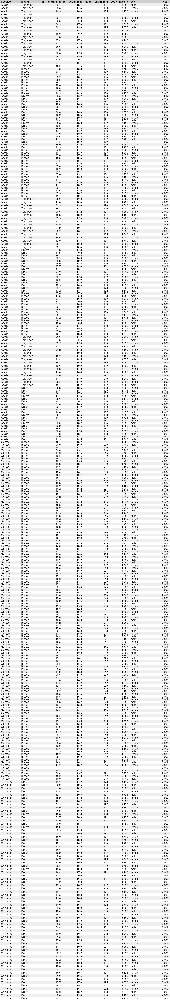

Plots summary

``` r
#Good to plot the data first 
penguins |>
  filter(!is.na(sex)) |>
  ggplot(aes(species, body_mass_g))+
  geom_beeswarm(alpha = .1, cex = 1.2)+
  stat_summary(fun.data = mean_cl_normal)+
  ylab("Body Weight\n(mean\u00b195% CI)")
```

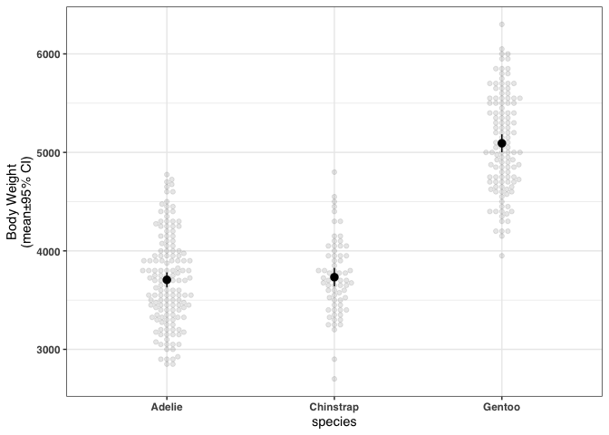

``` r
cat("<br>\n\n")
```

    <br>

``` r
#OR
penguins |>
  filter(!is.na(sex)) |>
  ggplot(aes(species, body_mass_g))+
  #geom_beeswarm(alpha=.1, cex = 1.2)+
  stat_summary(fun.data = mean_cl_normal)+
  ylab("Body Weight\n(mean\u00b195% CI)")
```

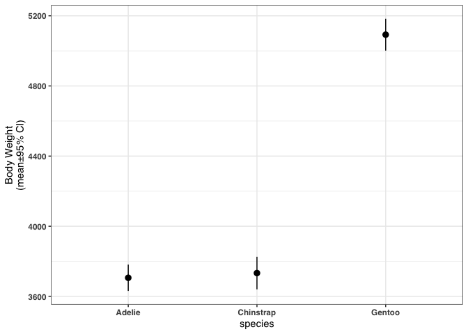

Describe species and sex with appropriate statistics as well

``` r
# Distribution of Species and Sex
penguins |>
  filter(!is.na(sex)) |>
  # Count all three categories
  count(species, island, sex) |>
  # Group by species and island to calculate sex proportions within those groups
  group_by(species, island) |>
  mutate(prop = n / sum(n)) |>
  # Create the string label
  mutate(label = paste0(n, " (", round(prop * 100, 1), "%)")) |> 
  select(-n, -prop) |>
  # Pivot sex to columns
  pivot_wider(names_from = sex, values_from = label) |> 
  # Optional: fill NAs with "0 (0%)" if a certain sex isn't present in a group
  replace_na(list(female = "0 (0%)", male = "0 (0%)"))|>
  flextable()|>
  set_table_properties(width= 1, layout ="autofit")
```


``` r
cat("<br>\n\n")
```

    <br>

``` r
#OR
penguins |>
  filter(!is.na(sex)) |> 
  count(species, island, sex)|>
  group_by(species, island) |>
  mutate(prop = n / sum(n)) |> 
  mutate(label = paste0(n, " (", round(prop * 100, 1), "%)")) |>
  select(species, island, sex, label) |> 
  pivot_wider(names_from = sex, values_from = label)|>
  flextable()|>
  set_table_properties(width= .5, layout ="autofit")
```

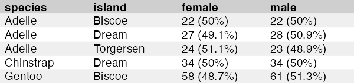

1 function / 1 variable / no groups

``` r
penguins |>
  summarize(meanSD_body_mass_g = meansd(body_mass_g, add_n = T, roundDig = 2)) |>
  flextable()
```

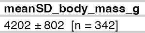

2 functions / 1 variable / subgroup species

``` r
penguins |>
  filter(!is.na(sex)) |>
  group_by(species, sex) |>
  summarize(across(
    where(is.numeric) & !year, 
    list(Mean_SD = meansd, Median_IQR = median_quart)
  ), .groups = "drop") |>
  # Pivot so that each measure is a row
  pivot_longer(
    cols = contains("_"), 
    names_to = c("Measure", ".value"), 
    names_pattern = "(.*)_(Mean_SD|Median_IQR)"
  )|>
flextable()|>
  set_table_properties(width= 1, layout ="autofit")
```

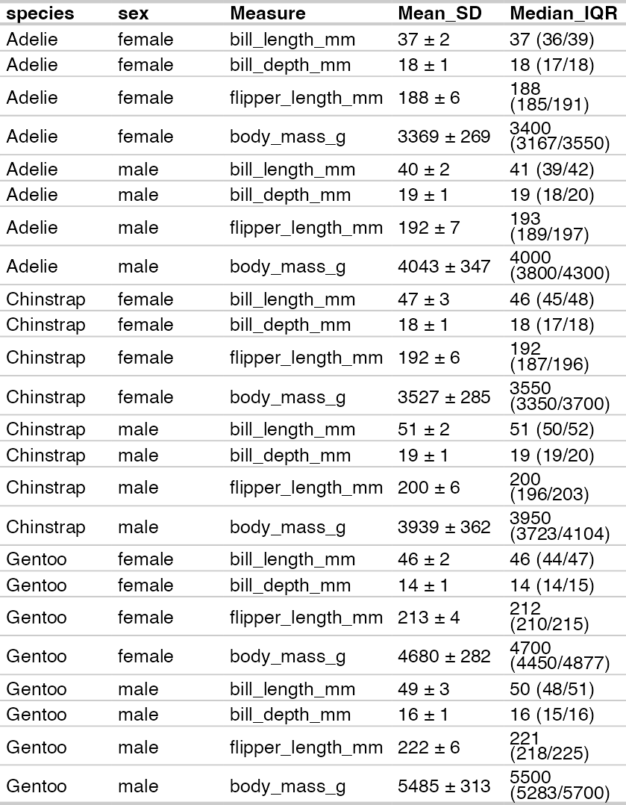

``` r
cat("<br>\n\n") #create page break
```

    <br>

``` r
penguins |>
  filter(!is.na(sex)) |>
  group_by(species, sex) |>
  summarize(across(
    where(is.numeric) & !year, 
    list(Mean_SD = meansd, Median_IQR = median_quart)
  ), .groups = "drop") |>
  # First, pivot everything long so we can reorganize
  pivot_longer(
    cols = -c(species, sex), 
    names_to = c("Measure", "Stat"), 
    names_pattern = "(.*)_(Mean_SD|Median_IQR)"
  ) |>
  # Now, pivot wider to move Species and Sex to the top
  # We combine Species, Sex, and Stat into the new column names
  pivot_wider(
    names_from = c(species, sex, Stat), 
    values_from = value,
    names_sep = " | " # Adds a separator for readability in the header
  )|>
flextable()|>
  set_table_properties(width= .5, layout ="autofit")
```

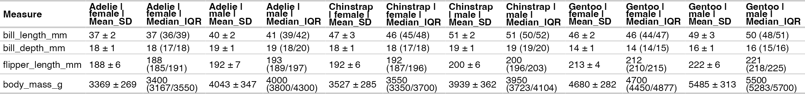

2 functions / 1 variable / subgroup species

``` r
penguins |> 
  group_by(species) |> 
  summarize(body_mass_mean_g = mean(body_mass_g, na.rm = TRUE), sd = sd(body_mass_g, na.rm = TRUE)) |>
flextable()|>
  set_table_properties(width= 1, layout ="autofit")
```

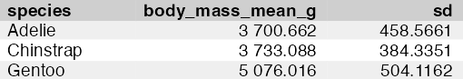

``` r
cat("\\newpage\n\n") #create page break
```

    \newpage

1 function / 4 variables / no groups

``` r
penguins |>
  summarize(across(where(is.numeric) & !year, ~mean(.x, na.rm = TRUE))) |>
  pivot_longer(cols = everything(),
               names_to = "Variable", 
               values_to = "Mean Value")|>
flextable()|>
  set_table_properties(width= 1, layout ="autofit")
```

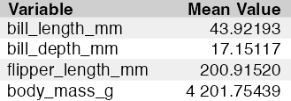

``` r
cat("\\newpage\n\n") #create page break
```

    \newpage

1 function / 4 variables / subgroup species (Pivoted for readability)

``` r
penguins |>
  group_by(species) |>
  summarize(across(where(is.numeric) & !year, ~median_quart(.x))) |>
  pivot_longer(cols = -species, names_to = "variable", values_to = "median_IQR")|>
flextable()|>
  set_table_properties(width= 1, layout ="autofit")
```

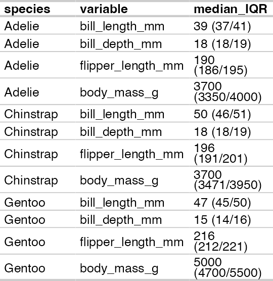

``` r
cat("\\newpage\n\n") #create page break
```

    \newpage

2 functions / 4 variables / no subgroups

``` r
penguins |>
  summarize(across(where(is.numeric) & !year,
                   list(avg = ~mean(.x, na.rm = TRUE), stdev = ~sd(.x, na.rm = TRUE)))) |>
  pivot_longer(cols = everything(), 
               names_to = c("variable", ".value"), 
               names_sep = "_") |> # Regex to split column names
flextable()|>
  set_table_properties(width= 1, layout ="autofit")
```

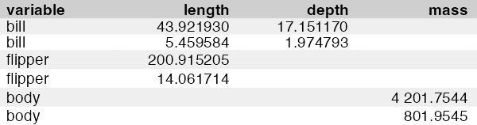

``` r
cat("\\newpage\n\n") #create page break
```

    \newpage

``` r
penguins |>
  group_by(species) |>
  summarize(across(where(is.numeric) & !year, 
                   list(mean_sd = meansd, 
                        med_IQR = median_quart))) |>
  pivot_longer(cols = -species, 
               names_to = c("variable", ".value"), 
               names_pattern = "(.*)_(mean_sd|med_IQR)") |>
  
flextable()|>
  set_table_properties(width= 1, layout ="autofit")
```

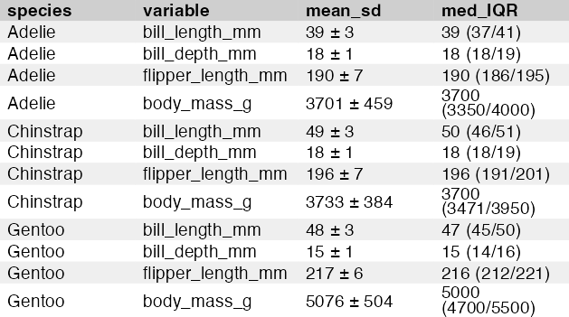

## Exercise

Compare the 4 measurements in the penguin data between the sex as well
as between 2 species (e.g Adelie vs. Gentoo). Treat the measures first
as gaussian, then as ordinal.

Use the basic functions first for at least one phenotype before trying
out compare2numvars().

Look at the categorical data year, island, species and sex and run some
tests on their independence.

## Good to break down the analysis into three parts:

1.  parametric testing (Gaussian),
2.  non-parametric testing (Ordinal), and
3.  independence testing for categorical variables.

# Gaussian Comparison (Parametric)

\#Solution

``` r
rawdata <- penguins |>
  drop_na() |>
  mutate(year = factor(year))
Adelies <- rawdata |>
  filter(species == "Adelie")
gauss_vars <- ColSeeker(Adelies, "_")
ord_vars <- ColSeeker(Adelies, "_")
fact_vars <- ColSeeker(rawdata, varclass = "factor")
```

\#Solution Gaussian

``` r
summary_plot <- Adelies |>
  ggplot(aes(sex, body_mass_g)) +
  geom_beeswarm(alpha = .2, shape = 21, cex = 2,
                aes(fill = sex), color = "black") +
  stat_summary(fun.data = mean_cl_normal,
               color = "black") +
  ylab("mean body mass (g)\n\u00b1 95% CI") #+
#guides(fill=guide_legen(override.aes = list(alpha = 1)))

dens_plot <- Adelies |>
  ggplot(aes(body_mass_g, fill=sex)) +
  geom_density(alpha=.2) #+
#guides(fill=guide_legen(override.aes = list(alpha = 1)))

dens_plot+summary_plot +
  plot_layout(ncol = 1, guides = "collect")
```

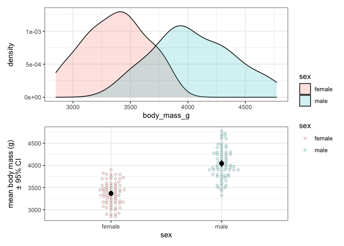

``` r
cat("&nbsp;\n\n")
```

    &nbsp;

``` r
#cat("\\newpage\n\n")
cat("Table from var-test\n\n")
```

    Table from var-test

``` r
var.test(body_mass_g~sex, data=Adelies) |>
  tidy() |>
  flextable() |>
  set_table_properties(width=1, layout="autofit")
```

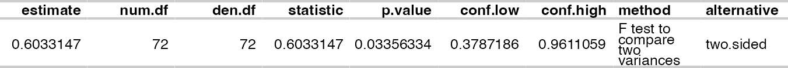

``` r
cat("&nbsp;\n\n")
```

    &nbsp;

``` r
t.test(body_mass_g~sex, data=Adelies,
  var.equal=var.test(body_mass_g~sex,
                     data = Adelies)$p.value>=.05) |>
  tidy() |>
  select(statistic, p.value, starts_with("c"), method) |>
  mutate(p.value = formatP(p.value, ndigits = 4, mark = TRUE),
        statistic = roundR(statistic, level = 4),
        across(starts_with("c"), roundR)) |>
  flextable() |>
  set_table_properties(width=1, layout="autofit")
```

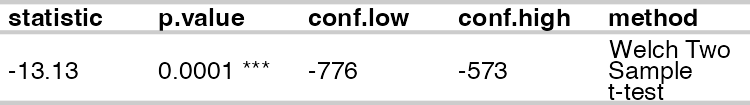

``` r
cat("&nbsp;\n\n")
```

    &nbsp;

``` r
t_out <- t_var_test(body_mass_g~sex, data = Adelies)
summary_plot <-
  summary_plot +
  geom_signif(comparisons=list(c(1,2)),
              annotations = paste("p",
                                  formatP(t_out$p.value,
                                          pretext=T,
                                          mark=T)))+
  scale_y_continuous("Mean body mass (g)\n\u00b1 95% CI",
                     expand = expansion(mult=c(.05, .15)))+
  guides(fill="none")
dens_plot+summary_plot +
  plot_layout(ncol = 1, guides = "collect")
```

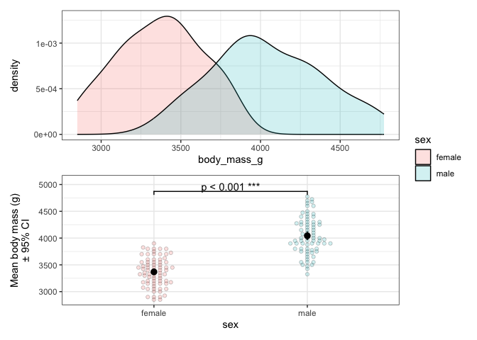

``` r
cat("&nbsp;\n\n")
```

    &nbsp;

comparison of 2 species \#solution Gaussian

``` r
rawdata |>
  #filter(species !="Chinstrap") |>
  filter_out(species == "Chinstrap") |>
  mutate(species = fct_drop(species)) |>
  compare2numvars(dep_vars = gauss_vars$names,
                  indep_var = "species",
                  round_desc = 3,
                  gaussian = TRUE,
                  singleline = FALSE) |>
  flextable() |>
  bg(~p!="", bg="lightgrey") |>
  set_table_properties(width = 1, layout = "autofit")
```

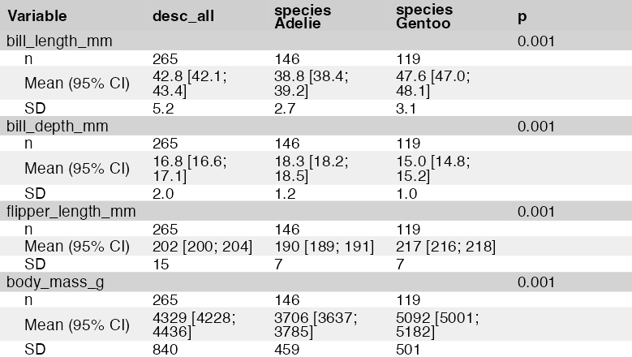

``` r
cat("&nbsp;\n\n")
```

    &nbsp;

\#Solution : Ordinal

``` r
ord_results <- compare2numvars(Adelies,
                               ord_vars$names,
                               "sex", gaussian = FALSE, n=T)
ord_results |>
  flextable() |>
  set_table_properties(width = 1)
```

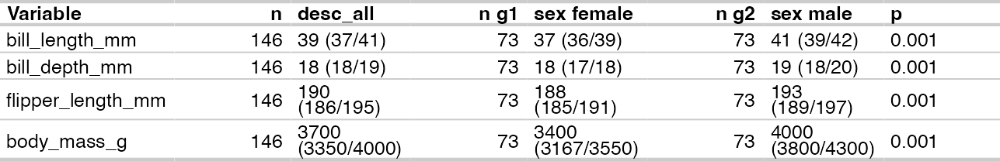

``` r
cat("<br>\n\n")
```

    <br>

\#Solution : Ordinal

``` r
for(row_i in seq_along(ord_results$Variable)){
  plot_temp <- Adelies |>
    ggplot(aes(sex, .data[[ord_results$Variable[row_i] |>
                             as.character()]]))+
    geom_boxplot(outlier.alpha = 0)+
    geom_beeswarm(alpha=.1)+
    geom_signif(
      comparisons = list(c(1, 2)),
      annotations = paste("p",
                          formatP(ord_results$p[row_i],
                                  pretext = TRUE,
                                  mark=TRUE)))+
    scale_y_continuous(
      ord_results$Variable[row_i],
      expand=expansion(mult=c(.05, .1)))
  print(plot_temp)
  cat("<br>\n\n")
}
```

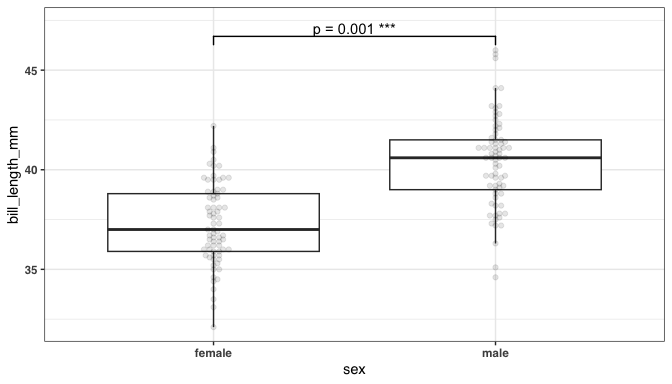

    <br>

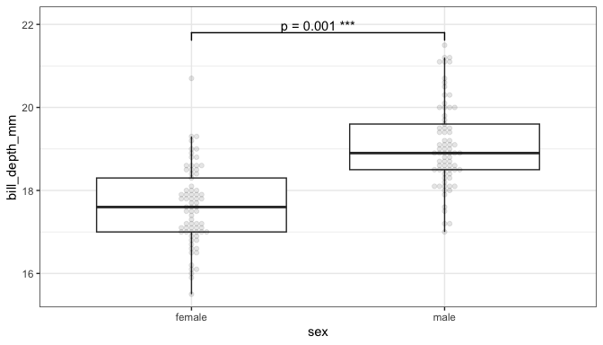

    <br>

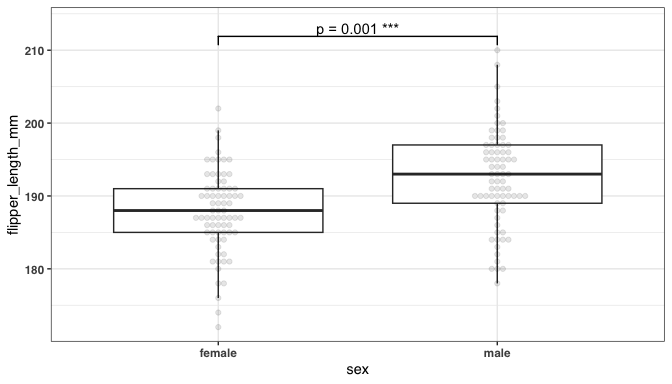

    <br>

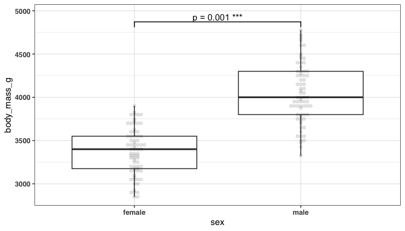

    <br>

\#my solution

``` r
# Filtering for the two species of interest
penguins_sub <- penguins |> 
  filter(species %in% c("Adelie", "Gentoo"), !is.na(sex))

# Create the plot
ggplot(penguins_sub, aes(x = species, y = body_mass_g)) +
  geom_beeswarm(size = 2, alpha = 0.5) +
  stat_summary(
    color = "red", size = 1.2, alpha = .7,
    fun.data = "mean_se", fun.args = list(mult = 2)
  ) +
  ylab("Body Mass (mean \u00B1 2*SEM)")
```

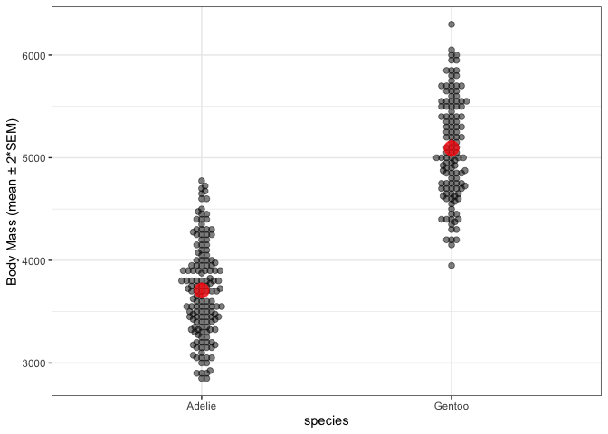

``` r
#Test
# Method A: Indexing
t.test(
  x = penguins_sub$body_mass_g[which(penguins_sub$species == "Adelie")],
  y = penguins_sub$body_mass_g[which(penguins_sub$species == "Gentoo")]
)
```


        Welch Two Sample t-test

    data:  penguins_sub$body_mass_g[which(penguins_sub$species == "Adelie")] and penguins_sub$body_mass_g[which(penguins_sub$species == "Gentoo")]
    t = -23.254, df = 242.14, p-value < 2.2e-16
    alternative hypothesis: true difference in means is not equal to 0
    95 percent confidence interval:
     -1503.702 -1268.843
    sample estimates:
    mean of x mean of y 
     3706.164  5092.437 

``` r
#Method B:
tOut <- t.test(body_mass_g ~ species, data = penguins_sub)
tOut$p.value # Extract just the p-value
```

    [1] 1.22317e-63

``` r
# Method C: Equal variances assumption? (F-test)
vartestOut <- var.test(body_mass_g ~ species, data = penguins_sub)
vartestOut
```


        F test to compare two variances

    data:  body_mass_g by species
    F = 0.83638, num df = 145, denom df = 118, p-value = 0.3051
    alternative hypothesis: true ratio of variances is not equal to 1
    95 percent confidence interval:
     0.5904118 1.1775172
    sample estimates:
    ratio of variances 
             0.8363839 

``` r
#BELOW ARE SIMPLE
# Basic t-test: Sex (within the subset)
t.test(body_mass_g ~ sex, data = penguins_sub)
```


        Welch Two Sample t-test

    data:  body_mass_g by sex
    t = -8.128, df = 260.93, p-value = 1.765e-14
    alternative hypothesis: true difference in means between group female and group male is not equal to 0
    95 percent confidence interval:
     -932.1815 -568.5990
    sample estimates:
    mean in group female   mean in group male 
                3949.237             4699.627 

``` r
# One-tailed t-test (Testing if males are strictly GREATER than females)
t.test(body_mass_g ~ sex, data = penguins, alternative = "greater")
```


        Welch Two Sample t-test

    data:  body_mass_g by sex
    t = -8.5545, df = 323.9, p-value = 1
    alternative hypothesis: true difference in means between group female and group male is greater than 0
    95 percent confidence interval:
     -815.1941       Inf
    sample estimates:
    mean in group female   mean in group male 
                3862.273             4545.685 

``` r
# Basic t-test: Species (Adelie vs Gentoo)
t.test(body_mass_g ~ species, data = penguins_sub)
```


        Welch Two Sample t-test

    data:  body_mass_g by species
    t = -23.254, df = 242.14, p-value < 2.2e-16
    alternative hypothesis: true difference in means between group Adelie and group Gentoo is not equal to 0
    95 percent confidence interval:
     -1503.702 -1268.843
    sample estimates:
    mean in group Adelie mean in group Gentoo 
                3706.164             5092.437 

``` r
# One-tailed t-test (Testing if Adelie mass is strictly LESS than Gentoo)
t.test(body_mass_g ~ species, data = penguins_sub, alternative = "less")
```


        Welch Two Sample t-test

    data:  body_mass_g by species
    t = -23.254, df = 242.14, p-value < 2.2e-16
    alternative hypothesis: true difference in means between group Adelie and group Gentoo is less than 0
    95 percent confidence interval:
          -Inf -1287.839
    sample estimates:
    mean in group Adelie mean in group Gentoo 
                3706.164             5092.437 

# Ordinal Comparison (Non-Parametric)

``` r
# Applying across all 4 measurements
measures <- c("bill_length_mm", 
              "bill_depth_mm", 
              "flipper_length_mm", 
              "body_mass_g")

compare2numvars(
  data = penguins_sub, 
  dep_vars = measures, 
  indep_var = "species", 
  gaussian = TRUE,
  mark = TRUE
) |>
  flextable() 
```

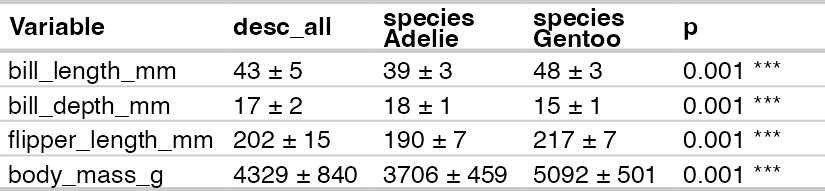

# Categorical Data: Independence Tests

To test if categorical variables like island and species are
independent, use the Chi-squared test (χ2). If cell counts are very
small (\<5), Fisher’s Exact Test is more appropriate.

# Species vs. Island

To see if certain species are restricted to specific islands.

``` r
# Contingency Table
island_species_table <- table(penguins$species, penguins$island)
print(island_species_table)
```

               
                Biscoe Dream Torgersen
      Adelie        44    56        52
      Chinstrap      0    68         0
      Gentoo       124     0         0

``` r
# Chi-squared Test
chisq.test(island_species_table) 
```


        Pearson's Chi-squared test

    data:  island_species_table
    X-squared = 299.55, df = 4, p-value < 2.2e-16

# Sex vs. Species

To test if the ratio of male to female penguins differs significantly
across species.

``` r
sex_species_table <- table(penguins$species, penguins$sex)
print(sex_species_table)
```

               
                female male
      Adelie        73   73
      Chinstrap     34   34
      Gentoo        58   61

``` r
# Chi-squared Test
chisq.test(sex_species_table)
```


        Pearson's Chi-squared test

    data:  sex_species_table
    X-squared = 0.048607, df = 2, p-value = 0.976

# Year vs. Species

To tests if the distribution of species collected changed significantly
over the three years of the study.

``` r
year_species_table <- table(penguins$species, penguins$year)
print(year_species_table)
```

               
                2007 2008 2009
      Adelie      50   50   52
      Chinstrap   26   18   24
      Gentoo      34   46   44

``` r
# Chi-squared Test
chisq.test(year_species_table)
```


        Pearson's Chi-squared test

    data:  year_species_table
    X-squared = 3.2156, df = 4, p-value = 0.5224

\#Solution categorical variables \## single variable

``` r
ggplot(Adelies, aes(sex, fill=island))+
  geom_bar()+
  geom_text(stat="count",
            aes(label=after_stat(count)),
            position = position_stack(vjust = .5))
```

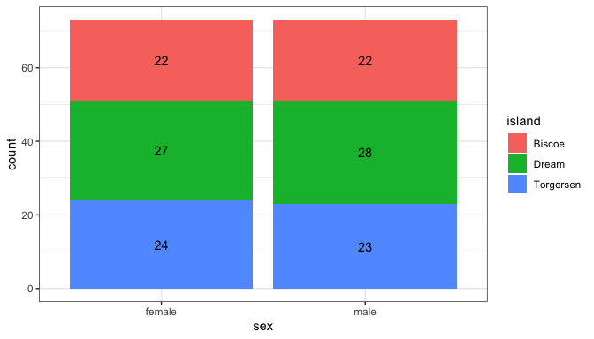

``` r
cat("&nbsp;\n\n")
```

    &nbsp;

``` r
freq_plot <-
  ggplot(Adelies, aes(sex, fill = island))+
  geom_bar(position = "fill")+
  geom_text(stat = "count",
            aes(label = scales::percent(after_stat(count / sum(count))),
                y = after_stat(count / sum(count))),
            position = position_fill(vjust = 0.5))+
  scale_y_continuous("Frequencies",
                     labels = scales::percent)
freq_plot
```

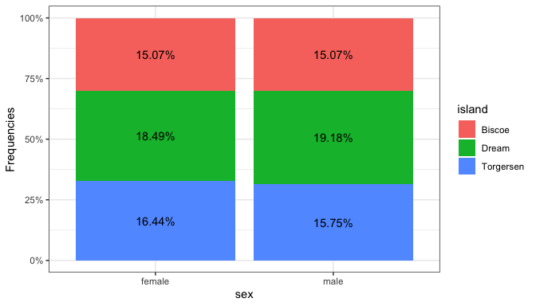

``` r
cat("&nbsp;\n\n")
```

    &nbsp;

``` r
ggplot(Adelies, aes(island, fill = sex))+
  geom_bar()+
  geom_text(stat = "count", aes(label = after_stat(count)),
            position = position_stack(vjust = .5))
```

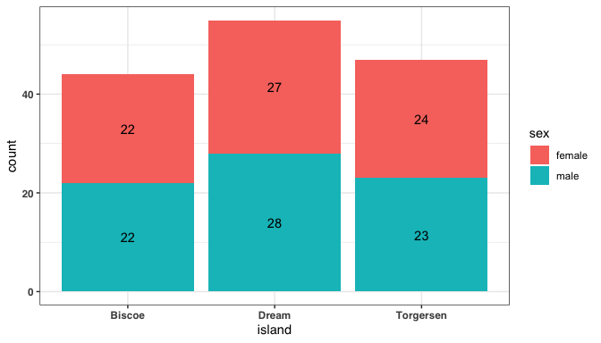

``` r
cat("&nbsp;\n\n")
```

    &nbsp;

``` r
chisq.test(Adelies$island, Adelies$sex) |>
  tidy() |>
  select(-method) |>
  mutate(p.value = formatP(p.value, ndigits = 3, mark = TRUE)) |>
  flextable() |>
  set_table_properties(width = .6, layout = "autofit")
```


``` r
cat("&nbsp;\n\n")
```

    &nbsp;

``` r
(fisher_out_sex <-
    fisher.test(Adelies$island, Adelies$sex))
```


        Fisher's Exact Test for Count Data

    data:  Adelies$island and Adelies$sex
    p-value = 1
    alternative hypothesis: two.sided

``` r
cat("&nbsp;\n\n")
```

    &nbsp;

``` r
(fisher_out_sex <-
    fisher.test(Adelies$island,
                Adelies$sex,
                simulate.p.value = TRUE,
                B = 10^5))
```


        Fisher's Exact Test for Count Data with simulated p-value (based on
        1e+05 replicates)

    data:  Adelies$island and Adelies$sex
    p-value = 1
    alternative hypothesis: two.sided

``` r
cat("&nbsp;\n\n")
```

    &nbsp;

``` r
ggplot(Adelies, aes(sex, fill = island))+
  geom_bar(position = "fill")+
  geom_text(stat = "count",
            aes(label = scales::percent(after_stat(count / sum(count))),
                y = after_stat(count / sum(count))),
            position = position_fill(vjust = 0.5))+
  geom_signif(
    aes(y=1.05),
    comparisons = list(c(1, 2)),
    annotations = paste("p",
                        formatP(fisher_out_sex$p.value,
                                pretext = TRUE,
                                mark = TRUE)))+
  scale_y_continuous("Frequencies",
                     labels = scales::percent,
                     breaks = seq(0,1,.2),
                     expand = expansion(mult=c(0,.15)))
```

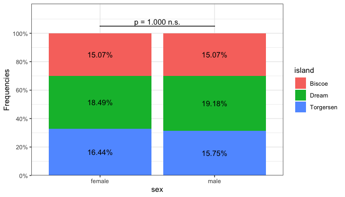

``` r
cat("&nbsp;\n\n")
```

    &nbsp;

``` r
compare2qualvars(data = Adelies,
                dep_vars = c("island", "year"),
                indep_var = "sex") |>
  flextable() |>
  bg(~p!=" ", bg="lightgrey") |>
  set_table_properties(width = 1, layout = "autofit")
```

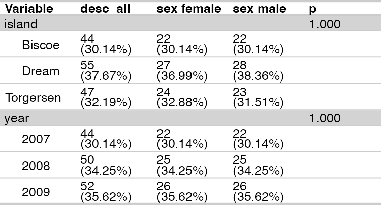

``` r
  cat("&nbsp;\n\n")
```

    &nbsp;

``` r
compare_n_qualvars(data = rawdata,
                dep_vars = c("island", "sex", "species"),
                indep_var = "year") |>
  flextable() |>
  bg(~p!=" ", bg="lightgrey") |>
  set_table_properties(width = 1, layout = "autofit")
```

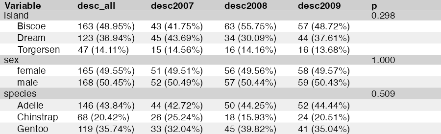

``` r
  cat("&nbsp;\n\n")
```

    &nbsp;

## Exercise

In the penguin data, model relationship between

- DV flipper length and IV body weight

- DV bill depth and IV body weight

- DV flipper length and IV species

- DV flipper length and IV species and sex

- DV bill depth and IV species and sex

- DV flipper length and IV species and sex and body weight

When appropriate, do post-hoc analyses as well.

Vizualize results indicating significances.

``` r
pacman::p_load(
  conflicted, wrappedtools, car, nlme, broom, flextable,
  multcomp, tidyverse, foreign, DescTools, # ez,
  ggbeeswarm,
  lme4, nlme, merTools,
  easystats, patchwork, here
) # conflicted,
# rayshader,av)
# pacman::p_unload(DescTools, foreign)
# conflict_scout()
conflicts_prefer(
  dplyr::select,
  dplyr::filter,
  modelbased::standardize
)
base_dir <- here::here()
```

``` r
# Clean the data
rawdata2 <- penguins |>
  drop_na() |>
  mutate(species_F = factor(species),
         sex_F = factor(sex))

Adelies <- rawdata2 |>
  filter(species == "Adelie")
Gentoo <- rawdata2 |>
  filter(species == "Gentoo")
Chinstrap <- rawdata2 |>
  filter(species == "Chinstrap")
```

Model 1: DV Flipper Length & IV Body Weight (Continuous vs. Continuous)

with all species included

``` r
#graphical exploration with all species included 
ggplot(rawdata2, aes(body_mass_g, flipper_length_mm)) +
  geom_point() +
  scale_y_continuous(breaks = seq(170, 240, 10), limits = c(170, 240)) +
  scale_x_continuous(breaks = seq(2500, 6500, 500), limits = c(2500, 6500)) +
  geom_smooth(linewidth = 2) +
  geom_smooth(method = lm, se = F, color = "red", fullrange = FALSE)
```

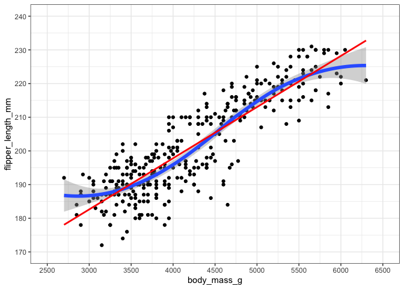

``` r
# Here we have Simpson's Paradox
# the linear (red) relation show negative correlation while data clustering tell otherwise as shown by loes(blue). This is due to species effect which should be considered for such analysis
#model
(rawdata2_lm <- lm(flipper_length_mm ~ body_mass_g, data = rawdata2))
```


    Call:
    lm(formula = flipper_length_mm ~ body_mass_g, data = rawdata2)

    Coefficients:
    (Intercept)  body_mass_g  
       137.0396       0.0152  

``` r
rawdata2_lm$coefficients
```

     (Intercept)  body_mass_g 
    137.03962089   0.01519526 

``` r
(anova_out <- anova(rawdata2_lm))
```

    Analysis of Variance Table

    Response: flipper_length_mm
                 Df Sum Sq Mean Sq F value    Pr(>F)    
    body_mass_g   1  49703   49703  1060.3 < 2.2e-16 ***
    Residuals   331  15516      47                      
    ---
    Signif. codes:  0 '***' 0.001 '**' 0.01 '*' 0.05 '.' 0.1 ' ' 1

``` r
anova_out$`Pr(>F)` #|> na.omit()
```

    [1] 3.132836e-105            NA

``` r
tidy(anova_out)
```

    # A tibble: 2 × 6
      term           df  sumsq  meansq statistic    p.value
      <chr>       <int>  <dbl>   <dbl>     <dbl>      <dbl>
    1 body_mass_g     1 49703. 49703.      1060.  3.13e-105
    2 Residuals     331 15516.    46.9       NA  NA        

``` r
summary(rawdata2_lm)
```


    Call:
    lm(formula = flipper_length_mm ~ body_mass_g, data = rawdata2)

    Residuals:
        Min      1Q  Median      3Q     Max 
    -23.698  -4.983   1.056   5.101  13.933 

    Coefficients:
                 Estimate Std. Error t value Pr(>|t|)    
    (Intercept) 1.370e+02  1.999e+00   68.56   <2e-16 ***
    body_mass_g 1.520e-02  4.667e-04   32.56   <2e-16 ***
    ---
    Signif. codes:  0 '***' 0.001 '**' 0.01 '*' 0.05 '.' 0.1 ' ' 1

    Residual standard error: 6.847 on 331 degrees of freedom
    Multiple R-squared:  0.7621,    Adjusted R-squared:  0.7614 
    F-statistic:  1060 on 1 and 331 DF,  p-value: < 2.2e-16

Adjusting the above model

``` r
# #Calculate the adjusted variable (Residuals + Mean Baseline)
# rawdata3 <- rawdata2 |> 
#   mutate(
#     flipperAdj = rawdata2_lm$residuals + mean(flipper_length_mm, na.rm = TRUE)
#   )
# 
# # Summarizing the raw vs adjusted data distributions
# rawdata3 |> 
#   group_by(species) |> 
#   summarise(
#     Raw_Mean = mean(flipper_length_mm, na.rm = TRUE),
#     Raw_SD   = sd(flipper_length_mm, na.rm = TRUE),
#     Adj_Mean = mean(flipperAdj, na.rm = TRUE),
#     Adj_SD   = sd(flipperAdj, na.rm = TRUE)
#   )
# 
# # 4. Step D: Visualize and model your main categorical IV (species) 
# # using the newly balanced, body-weight-adjusted flipper length
# ggplot(rawdata2, aes(x = species, y = flipperAdj, fill = species)) +
#   geom_boxplot(alpha = 0.5) +
#   labs(title = "Species Differences: Adjusted for Body Mass)",
#        y = "Adjusted Flipper Length (mm)")
# 
# lm(flipperAdj ~ species, data = rawdata2) |> tidy()
```

checking the model

``` r
# x11() #interactive only!
#quartz() #for mac
# from package performance
check_model(rawdata2_lm)
```


``` r
# dev.off()
```

with species exclusion/filtering

``` r
#graphical exploration by species 
#Adelies
ggplot(Adelies, aes(body_mass_g, flipper_length_mm)) +
  geom_point() +
  scale_y_continuous(breaks = seq(170, 220, 10), limits = c(170, 220)) +
  scale_x_continuous(breaks = seq(2500, 5000, 500), limits = c(2500, 5000)) +
  geom_smooth(linewidth = 2) +
  geom_smooth(method = lm, se = F, color = "red", fullrange = FALSE)
```

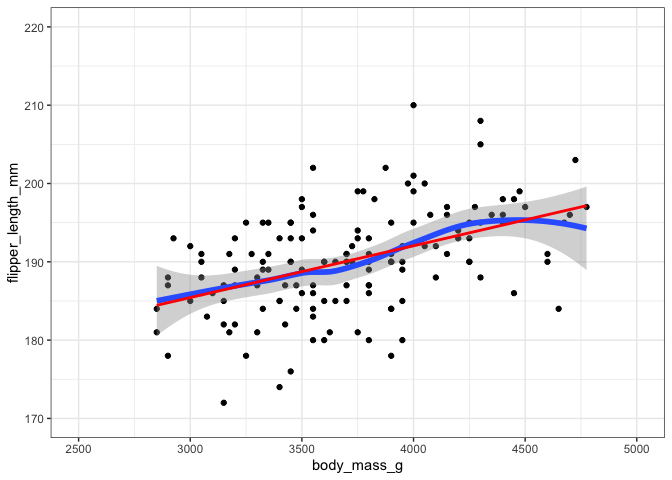

``` r
#model 
(Adelies_lm <- lm(flipper_length_mm ~ body_mass_g, data = Adelies))
```


    Call:
    lm(formula = flipper_length_mm ~ body_mass_g, data = Adelies)

    Coefficients:
    (Intercept)  body_mass_g  
      165.60324      0.00661  

``` r
Adelies_lm$coefficients
```

     (Intercept)  body_mass_g 
    1.656032e+02 6.610473e-03 

``` r
(anova_out <- anova(Adelies_lm))
```

    Analysis of Variance Table

    Response: flipper_length_mm
                 Df Sum Sq Mean Sq F value    Pr(>F)    
    body_mass_g   1 1332.7 1332.72  39.694 3.402e-09 ***
    Residuals   144 4834.7   33.57                      
    ---
    Signif. codes:  0 '***' 0.001 '**' 0.01 '*' 0.05 '.' 0.1 ' ' 1

``` r
anova_out$`Pr(>F)` #|> na.omit()
```

    [1] 3.401644e-09           NA

``` r
tidy(anova_out)
```

    # A tibble: 2 × 6
      term           df sumsq meansq statistic  p.value
      <chr>       <int> <dbl>  <dbl>     <dbl>    <dbl>
    1 body_mass_g     1 1333. 1333.       39.7  3.40e-9
    2 Residuals     144 4835.   33.6      NA   NA      

``` r
summary(Adelies_lm)
```


    Call:
    lm(formula = flipper_length_mm ~ body_mass_g, data = Adelies)

    Residuals:
        Min      1Q  Median      3Q     Max 
    -14.426  -3.669   0.239   3.422  17.955 

    Coefficients:
                 Estimate Std. Error t value Pr(>|t|)    
    (Intercept) 1.656e+02  3.918e+00   42.27  < 2e-16 ***
    body_mass_g 6.610e-03  1.049e-03    6.30  3.4e-09 ***
    ---
    Signif. codes:  0 '***' 0.001 '**' 0.01 '*' 0.05 '.' 0.1 ' ' 1

    Residual standard error: 5.794 on 144 degrees of freedom
    Multiple R-squared:  0.2161,    Adjusted R-squared:  0.2106 
    F-statistic: 39.69 on 1 and 144 DF,  p-value: 3.402e-09

``` r
#Gentoo
ggplot(Gentoo, aes(body_mass_g, flipper_length_mm)) +
  geom_point() +
  scale_y_continuous(breaks = seq(200, 235, 5), limits = c(200, 235)) +
  scale_x_continuous(breaks = seq(3500, 6500, 500), limits = c(3500, 6500)) +
  geom_smooth(linewidth = 2) +
  geom_smooth(method = lm, se = F, color = "red", fullrange = FALSE)
```

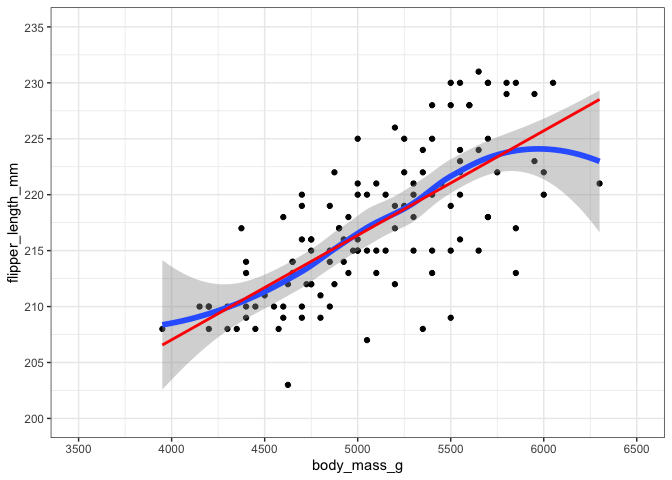

``` r
#model 
(Gentoo_lm <- lm(flipper_length_mm ~ body_mass_g, data = Gentoo))
```


    Call:
    lm(formula = flipper_length_mm ~ body_mass_g, data = Gentoo)

    Coefficients:
    (Intercept)  body_mass_g  
      1.697e+02    9.341e-03  

``` r
Gentoo_lm$coefficients
```

     (Intercept)  body_mass_g 
    1.696672e+02 9.340926e-03 

``` r
(anova_out <- anova(Gentoo_lm))
```

    Analysis of Variance Table

    Response: flipper_length_mm
                 Df Sum Sq Mean Sq F value    Pr(>F)    
    body_mass_g   1 2589.2 2589.18  119.82 < 2.2e-16 ***
    Residuals   117 2528.2   21.61                      
    ---
    Signif. codes:  0 '***' 0.001 '**' 0.01 '*' 0.05 '.' 0.1 ' ' 1

``` r
anova_out$`Pr(>F)` #|> na.omit()
```

    [1] 1.249398e-19           NA

``` r
tidy(anova_out)
```

    # A tibble: 2 × 6
      term           df sumsq meansq statistic   p.value
      <chr>       <int> <dbl>  <dbl>     <dbl>     <dbl>
    1 body_mass_g     1 2589. 2589.       120.  1.25e-19
    2 Residuals     117 2528.   21.6       NA  NA       

``` r
summary(Gentoo_lm)
```


    Call:
    lm(formula = flipper_length_mm ~ body_mass_g, data = Gentoo)

    Residuals:
         Min       1Q   Median       3Q      Max 
    -12.0423  -2.7042   0.0293   3.1969   8.9577 

    Coefficients:
                 Estimate Std. Error t value Pr(>|t|)    
    (Intercept) 1.697e+02  4.366e+00   38.86   <2e-16 ***
    body_mass_g 9.341e-03  8.533e-04   10.95   <2e-16 ***
    ---
    Signif. codes:  0 '***' 0.001 '**' 0.01 '*' 0.05 '.' 0.1 ' ' 1

    Residual standard error: 4.649 on 117 degrees of freedom
    Multiple R-squared:  0.506, Adjusted R-squared:  0.5017 
    F-statistic: 119.8 on 1 and 117 DF,  p-value: < 2.2e-16

``` r
#Chinstrap
ggplot(Chinstrap, aes(body_mass_g, flipper_length_mm)) +
  geom_point() +
  scale_y_continuous(breaks = seq(170, 220, 10), limits = c(170, 220)) +
  scale_x_continuous(breaks = seq(2500, 5000, 500), limits = c(2500, 5000)) +
  geom_smooth(linewidth = 2) +
  geom_smooth(method = lm, se = F, color = "red", fullrange = TRUE)
```

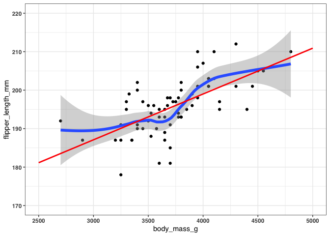

``` r
#model 
(Chinstrap_lm <- lm(flipper_length_mm ~ body_mass_g, data = Chinstrap))
```


    Call:
    lm(formula = flipper_length_mm ~ body_mass_g, data = Chinstrap)

    Coefficients:
    (Intercept)  body_mass_g  
      151.38087      0.01191  

``` r
Chinstrap_lm$coefficients
```

     (Intercept)  body_mass_g 
    151.38087357   0.01190506 

``` r
(anova_out <- anova(Chinstrap_lm))
```

    Analysis of Variance Table

    Response: flipper_length_mm
                Df Sum Sq Mean Sq F value    Pr(>F)    
    body_mass_g  1 1402.7 1402.68  46.168 3.748e-09 ***
    Residuals   66 2005.2   30.38                      
    ---
    Signif. codes:  0 '***' 0.001 '**' 0.01 '*' 0.05 '.' 0.1 ' ' 1

``` r
anova_out$`Pr(>F)` #|> na.omit()
```

    [1] 3.74813e-09          NA

``` r
tidy(anova_out)
```

    # A tibble: 2 × 6
      term           df sumsq meansq statistic  p.value
      <chr>       <int> <dbl>  <dbl>     <dbl>    <dbl>
    1 body_mass_g     1 1403. 1403.       46.2  3.75e-9
    2 Residuals      66 2005.   30.4      NA   NA      

``` r
summary(Chinstrap_lm)
```


    Call:
    lm(formula = flipper_length_mm ~ body_mass_g, data = Chinstrap)

    Residuals:
         Min       1Q   Median       3Q      Max 
    -14.4296  -3.3315   0.4097   2.8889  11.5941 

    Coefficients:
                 Estimate Std. Error t value Pr(>|t|)    
    (Intercept) 1.514e+02  6.575e+00  23.024  < 2e-16 ***
    body_mass_g 1.191e-02  1.752e-03   6.795 3.75e-09 ***
    ---
    Signif. codes:  0 '***' 0.001 '**' 0.01 '*' 0.05 '.' 0.1 ' ' 1

    Residual standard error: 5.512 on 66 degrees of freedom
    Multiple R-squared:  0.4116,    Adjusted R-squared:  0.4027 
    F-statistic: 46.17 on 1 and 66 DF,  p-value: 3.748e-09

checking the model

``` r
# x11() #interactive only!
#quartz() #for mac
# from package performance
check_model(Adelies_lm)
```


``` r
check_model(Gentoo_lm)
```


``` r
check_model(Chinstrap_lm)
```


``` r
# dev.off()
```

Model 2: DV Bill Depth & IV Body Weight (Continuous vs. Continuous)

``` r
##graphical exploration
ggplot(rawdata2, aes(body_mass_g, bill_depth_mm)) +
  geom_point() +
  scale_y_continuous(breaks = seq(13, 22, 1), limits = c(13, 22)) +
  scale_x_continuous(breaks = seq(2500, 6500, 500), limits = c(2500, 6500)) +
  geom_smooth(linewidth = 2) +
  geom_smooth(method = lm, se = F, color = "red", fullrange = TRUE)
```

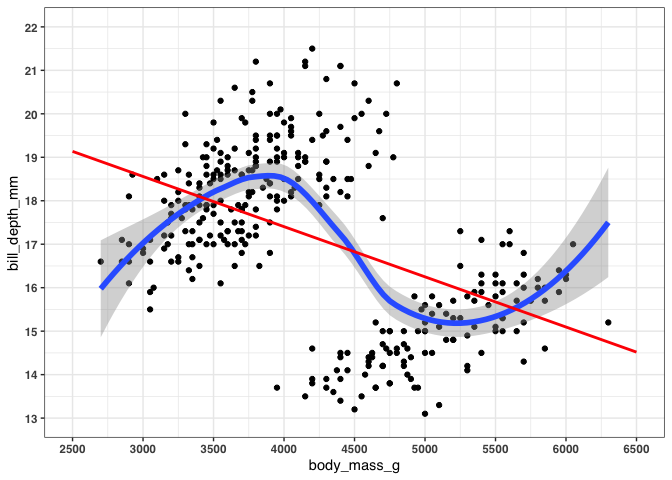

``` r
#Everything looks ambigious and shows alread negative linear relation due to double clustering (due to species effect) as shown by linear regression line :: SIMPSON PARADOX it is!!!! solvable by later models like glm 
#this is misleading since clustering shows otherwise (loes line)
#I need to account for species effect, thus filter by and model by species 
# Model
m2 <- lm(bill_depth_mm ~ body_mass_g, data = rawdata2)
m2$coefficients
```

     (Intercept)  body_mass_g 
    22.021328809 -0.001154361 

``` r
(anova_out <- anova(m2))
```

    Analysis of Variance Table

    Response: bill_depth_mm
                 Df  Sum Sq Mean Sq F value    Pr(>F)    
    body_mass_g   1  286.84 286.844  94.887 < 2.2e-16 ***
    Residuals   331 1000.61   3.023                      
    ---
    Signif. codes:  0 '***' 0.001 '**' 0.01 '*' 0.05 '.' 0.1 ' ' 1

``` r
anova_out$`Pr(>F)` |> na.omit()
```

    [1] 7.02416e-20
    attr(,"na.action")
    [1] 2
    attr(,"class")
    [1] "omit"

``` r
tidy(anova_out)
```

    # A tibble: 2 × 6
      term           df sumsq meansq statistic   p.value
      <chr>       <int> <dbl>  <dbl>     <dbl>     <dbl>
    1 body_mass_g     1  287. 287.        94.9  7.02e-20
    2 Residuals     331 1001.   3.02      NA   NA       

``` r
summary(m2)
```


    Call:
    lm(formula = bill_depth_mm ~ body_mass_g, data = rawdata2)

    Residuals:
        Min      1Q  Median      3Q     Max 
    -3.7616 -1.2495  0.0035  1.2156  4.3270 

    Coefficients:
                  Estimate Std. Error t value Pr(>|t|)    
    (Intercept) 22.0213288  0.5075816  43.385   <2e-16 ***
    body_mass_g -0.0011544  0.0001185  -9.741   <2e-16 ***
    ---
    Signif. codes:  0 '***' 0.001 '**' 0.01 '*' 0.05 '.' 0.1 ' ' 1

    Residual standard error: 1.739 on 331 degrees of freedom
    Multiple R-squared:  0.2228,    Adjusted R-squared:  0.2205 
    F-statistic: 94.89 on 1 and 331 DF,  p-value: < 2.2e-16

``` r
#modeling by species
#Adelies
ggplot(Adelies, aes(body_mass_g, bill_depth_mm)) +
  geom_point() +
  scale_y_continuous(breaks = seq(15, 22, 1), limits = c(15, 22)) +
  scale_x_continuous(breaks = seq(2500, 5000, 500), limits = c(2500, 5000)) +
  geom_smooth(linewidth = 2) +
  geom_smooth(method = lm, se = F, color = "red", fullrange = TRUE)
```

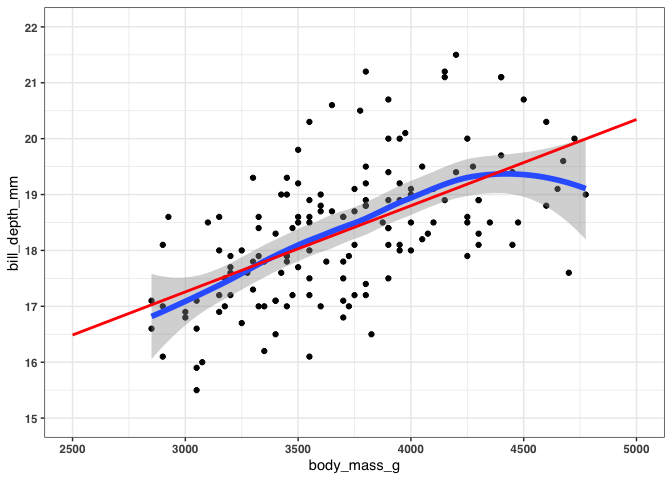

``` r
# Model
Adelies_lm2 <- lm(bill_depth_mm ~ body_mass_g, data = Adelies)
Adelies_lm2$coefficients
```

     (Intercept)  body_mass_g 
    12.630624560  0.001542467 

``` r
(anova_out <- anova(Adelies_lm2))
```

    Analysis of Variance Table

    Response: bill_depth_mm
                 Df  Sum Sq Mean Sq F value    Pr(>F)    
    body_mass_g   1  72.561  72.561  73.057 1.665e-14 ***
    Residuals   144 143.022   0.993                      
    ---
    Signif. codes:  0 '***' 0.001 '**' 0.01 '*' 0.05 '.' 0.1 ' ' 1

``` r
anova_out$`Pr(>F)` |> na.omit()
```

    [1] 1.665366e-14
    attr(,"na.action")
    [1] 2
    attr(,"class")
    [1] "omit"

``` r
tidy(anova_out)
```

    # A tibble: 2 × 6
      term           df sumsq meansq statistic   p.value
      <chr>       <int> <dbl>  <dbl>     <dbl>     <dbl>
    1 body_mass_g     1  72.6 72.6        73.1  1.67e-14
    2 Residuals     144 143.   0.993      NA   NA       

``` r
summary(Adelies_lm2)
```


    Call:
    lm(formula = bill_depth_mm ~ body_mass_g, data = Adelies)

    Residuals:
        Min      1Q  Median      3Q     Max 
    -2.2802 -0.7183 -0.0884  0.5572  2.7080 

    Coefficients:
                 Estimate Std. Error t value Pr(>|t|)    
    (Intercept) 1.263e+01  6.739e-01  18.743  < 2e-16 ***
    body_mass_g 1.543e-03  1.805e-04   8.547 1.67e-14 ***
    ---
    Signif. codes:  0 '***' 0.001 '**' 0.01 '*' 0.05 '.' 0.1 ' ' 1

    Residual standard error: 0.9966 on 144 degrees of freedom
    Multiple R-squared:  0.3366,    Adjusted R-squared:  0.332 
    F-statistic: 73.06 on 1 and 144 DF,  p-value: 1.665e-14

``` r
ggplot(Gentoo, aes(body_mass_g, bill_depth_mm)) +
  geom_point() +
  scale_y_continuous(breaks = seq(12, 19, 1), limits = c(12, 19)) +
  scale_x_continuous(breaks = seq(3500, 6500, 500), limits = c(3500, 6500)) +
  geom_smooth(linewidth = 2) +
  geom_smooth(method = lm, se = F, color = "red", fullrange = FALSE)
```

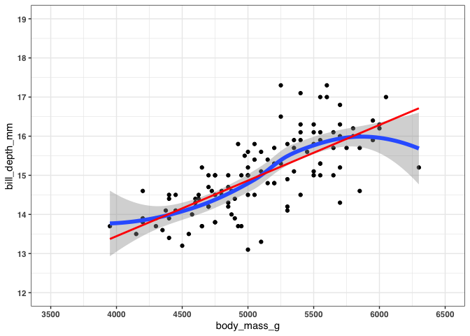

``` r
# Model
Gentoo_lm2 <- lm(bill_depth_mm ~ body_mass_g, data = Gentoo)
Gentoo_lm2$coefficients
```

    (Intercept) body_mass_g 
    7.757781768 0.001421492 

``` r
(anova_out <- anova(Gentoo_lm2))
```

    Analysis of Variance Table

    Response: bill_depth_mm
                 Df Sum Sq Mean Sq F value    Pr(>F)    
    body_mass_g   1 59.961  59.961  128.12 < 2.2e-16 ***
    Residuals   117 54.757   0.468                      
    ---
    Signif. codes:  0 '***' 0.001 '**' 0.01 '*' 0.05 '.' 0.1 ' ' 1

``` r
anova_out$`Pr(>F)` |> na.omit()
```

    [1] 1.639865e-20
    attr(,"na.action")
    [1] 2
    attr(,"class")
    [1] "omit"

``` r
tidy(anova_out)
```

    # A tibble: 2 × 6
      term           df sumsq meansq statistic   p.value
      <chr>       <int> <dbl>  <dbl>     <dbl>     <dbl>
    1 body_mass_g     1  60.0 60.0        128.  1.64e-20
    2 Residuals     117  54.8  0.468       NA  NA       

``` r
summary(Gentoo_lm2)
```


    Call:
    lm(formula = bill_depth_mm ~ body_mass_g, data = Gentoo)

    Residuals:
        Min      1Q  Median      3Q     Max 
    -1.7652 -0.3508  0.0298  0.4281  2.0794 

    Coefficients:
                 Estimate Std. Error t value Pr(>|t|)    
    (Intercept) 7.7577818  0.6425999   12.07   <2e-16 ***
    body_mass_g 0.0014215  0.0001256   11.32   <2e-16 ***
    ---
    Signif. codes:  0 '***' 0.001 '**' 0.01 '*' 0.05 '.' 0.1 ' ' 1

    Residual standard error: 0.6841 on 117 degrees of freedom
    Multiple R-squared:  0.5227,    Adjusted R-squared:  0.5186 
    F-statistic: 128.1 on 1 and 117 DF,  p-value: < 2.2e-16

``` r
#Chinstrap
ggplot(Chinstrap, aes(body_mass_g, bill_depth_mm)) +
  geom_point() +
  scale_y_continuous(breaks = seq(15, 22, 1), limits = c(15, 22)) +
  scale_x_continuous(breaks = seq(2500, 5000, 500), limits = c(2500, 5000)) +
  geom_smooth(linewidth = 2) +
  geom_smooth(method = lm, se = F, color = "red", fullrange = FALSE)
```

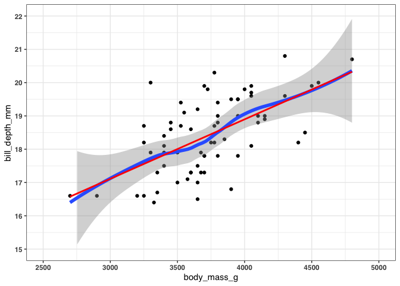

``` r
# Model
Chinstrap_lm2 <- lm(bill_depth_mm ~ body_mass_g, data = Chinstrap)
Chinstrap_lm2$coefficients
```

     (Intercept)  body_mass_g 
    11.754051183  0.001785797 

``` r
(anova_out <- anova(Chinstrap_lm2))
```

    Analysis of Variance Table

    Response: bill_depth_mm
                Df Sum Sq Mean Sq F value    Pr(>F)    
    body_mass_g  1 31.562 31.5616  38.005 4.795e-08 ***
    Residuals   66 54.810  0.8304                      
    ---
    Signif. codes:  0 '***' 0.001 '**' 0.01 '*' 0.05 '.' 0.1 ' ' 1

``` r
anova_out$`Pr(>F)` |> na.omit()
```

    [1] 4.794503e-08
    attr(,"na.action")
    [1] 2
    attr(,"class")
    [1] "omit"

``` r
tidy(anova_out)
```

    # A tibble: 2 × 6
      term           df sumsq meansq statistic       p.value
      <chr>       <int> <dbl>  <dbl>     <dbl>         <dbl>
    1 body_mass_g     1  31.6 31.6        38.0  0.0000000479
    2 Residuals      66  54.8  0.830      NA   NA           

``` r
summary(Chinstrap_lm2)
```


    Call:
    lm(formula = bill_depth_mm ~ body_mass_g, data = Chinstrap)

    Residuals:
         Min       1Q   Median       3Q      Max 
    -1.91866 -0.79631  0.04927  0.68673  2.35282 

    Coefficients:
                 Estimate Std. Error t value Pr(>|t|)    
    (Intercept) 1.175e+01  1.087e+00  10.813 2.98e-16 ***
    body_mass_g 1.786e-03  2.897e-04   6.165 4.79e-08 ***
    ---
    Signif. codes:  0 '***' 0.001 '**' 0.01 '*' 0.05 '.' 0.1 ' ' 1

    Residual standard error: 0.9113 on 66 degrees of freedom
    Multiple R-squared:  0.3654,    Adjusted R-squared:  0.3558 
    F-statistic: 38.01 on 1 and 66 DF,  p-value: 4.795e-08

checking model

``` r
# x11() #interactive only!
#quartz() #for mac
# from package performance
check_model(m2)
```


``` r
check_model(Adelies_lm2)
```


``` r
check_model(Gentoo_lm2)
```


``` r
check_model(Chinstrap_lm2)
```


``` r
# dev.off()
```

Model 3: DV Flipper Length & IV Species (Continuous vs. Categorical \> 2
groups)  

``` r
##graphical exploration
ggplot(rawdata2, aes(x = species, y = flipper_length_mm, fill = species)) +
  geom_boxplot(alpha = 0.5, outlier.shape = NA) +
  geom_beeswarm(alpha = 0.3) +
  labs(title = "Flipper Length by Species", y = "Flipper Length (mm)") +
  theme(legend.position = "none")
```

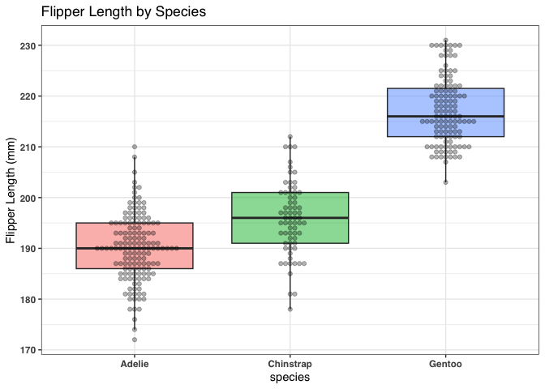

``` r
# Model
(rawdata2_lm3 <- lm(flipper_length_mm ~ species, data = rawdata2))
```


    Call:
    lm(formula = flipper_length_mm ~ species, data = rawdata2)

    Coefficients:
         (Intercept)  speciesChinstrap     speciesGentoo  
             190.103             5.721            27.133  

``` r
#tidy(rawdata2_lm3) 
(t<-anova(rawdata2_lm3)) # Displays the ANOVA table
```

    Analysis of Variance Table

    Response: flipper_length_mm
               Df Sum Sq Mean Sq F value    Pr(>F)    
    species     2  50526 25262.9  567.41 < 2.2e-16 ***
    Residuals 330  14693    44.5                      
    ---
    Signif. codes:  0 '***' 0.001 '**' 0.01 '*' 0.05 '.' 0.1 ' ' 1

``` r
t$`Pr(>F)`
```

    [1] 1.587418e-107            NA

``` r
tidy(t)
```

    # A tibble: 2 × 6
      term         df  sumsq  meansq statistic    p.value
      <chr>     <int>  <dbl>   <dbl>     <dbl>      <dbl>
    1 species       2 50526. 25263.       567.  1.59e-107
    2 Residuals   330 14693.    44.5       NA  NA        

``` r
# Post-Hoc: Pairwise Comparisons
#All pairwise group combinations (Unadjusted/Nominal p-values)
pt_out <- pairwise.t.test(
  x = rawdata2$flipper_length_mm,
  g = rawdata2$species,
  p.adjust.method = "none"
)
pt_out
```


        Pairwise comparisons using t tests with pooled SD 

    data:  rawdata2$flipper_length_mm and rawdata2$species 

              Adelie  Chinstrap
    Chinstrap 1.3e-08 -        
    Gentoo    < 2e-16 < 2e-16  

    P value adjustment method: none 

``` r
#Pairwise t-test with FDR (False Discovery Rate) adjustment
pairwise.t.test(
  x = rawdata2$flipper_length_mm, 
  g = rawdata2$species,
  p.adjust.method = "fdr"
)
```


        Pairwise comparisons using t tests with pooled SD 

    data:  rawdata2$flipper_length_mm and rawdata2$species 

              Adelie  Chinstrap
    Chinstrap 1.3e-08 -        
    Gentoo    < 2e-16 < 2e-16  

    P value adjustment method: fdr 

``` r
#Pairwise t-test with Bonferroni adjustment (Most conservative)
pairwise.t.test(
  x = rawdata2$flipper_length_mm, 
  g = rawdata2$species,
  p.adjust.method = "bonferroni"
)
```


        Pairwise comparisons using t tests with pooled SD 

    data:  rawdata2$flipper_length_mm and rawdata2$species 

              Adelie  Chinstrap
    Chinstrap 3.8e-08 -        
    Gentoo    < 2e-16 < 2e-16  

    P value adjustment method: bonferroni 

``` r
posthoc <-
  summary(glht(model = rawdata2_lm3,
               linfct = mcp(species = "Tukey")))

rawdata2 |>
  ggplot(aes(species, flipper_length_mm))+
  geom_beeswarm(alpha = .2)+
  stat_summary(color="darkblue",
                fun.data = mean_cl_normal)+
  geom_signif(comparisons = list(c(1,2), c(1,3), c(2,3)),
              annotations =
                paste("p",posthoc$test$pvalues |>
                        formatP(3,pretext = T, mark = T)),
              y_position = c(240, 250, 240),
              extend_line = -.005)+
  scale_y_continuous(
    name = "flipper length\nmean\u00b1 95% CI",
    expand = expansion(mult = .1))
```

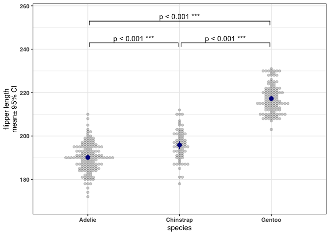

``` r
#Just another way of plotting and showing statistics
# Using the stat_compare_means from ggpubr package. 
my_comparisons <- list( 
  c("Adelie", "Chinstrap"), 
  c("Chinstrap", "Gentoo"), 
  c("Adelie", "Gentoo") 
)

ggplot(rawdata2, aes(x = species, y = flipper_length_mm)) +
  geom_boxplot(outlier.alpha = 0) +
  geom_beeswarm(alpha = 0.4, aes(color = species)) +
  # Bumped limits to 255 to make room for the stacking brackets
  scale_y_continuous(breaks = seq(170, 250, 10), limits = c(170, 255)) +
  # This adds the pairwise comparison brackets automatically!
  stat_compare_means(comparisons = my_comparisons, method = "t.test", label = "p.signif") +
  labs(title = "Pairwise Significance Comparisons", 
       x = "Species", y = "Flipper Length (mm)")
```

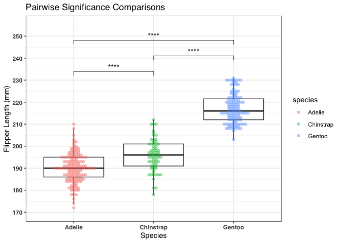

checking the model

``` r
# x11() #interactive only!
#quartz() #for mac
# from package performance
check_model(rawdata2_lm3)
```


``` r
# dev.off()
```

Model 4: DV Flipper Length & IV Species + Sex (Two-Way ANOVA)

``` r
#graphical exploration
ggplot(rawdata2, aes(x = species, y = flipper_length_mm, fill = sex)) +
  geom_boxplot(alpha = 0.6, position = position_dodge(0.8)) +
  labs(title = "Flipper Length by Species and Sex", y = "Flipper Length (mm)")
```

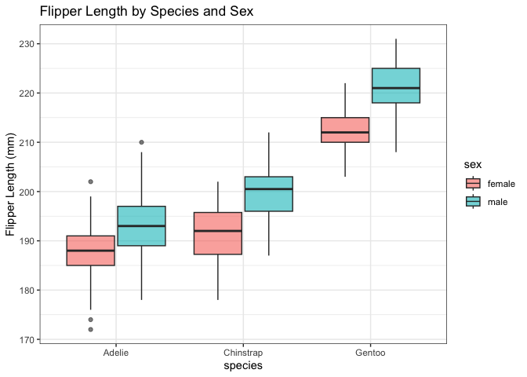

``` r
# Model (with interaction)
rawdata2_interct <- lm(flipper_length_mm ~ species * sex, data = rawdata2)
Anova(rawdata2_interct, type = 3)
```

    Anova Table (Type III tests)

    Response: flipper_length_mm
                 Sum Sq  Df    F value    Pr(>F)    
    (Intercept) 2574475   1 80497.6819 < 2.2e-16 ***
    species       21416   2   334.8078 < 2.2e-16 ***
    sex             778   1    24.3221 1.299e-06 ***
    species:sex     329   2     5.1442  0.006314 ** 
    Residuals     10458 327                         
    ---
    Signif. codes:  0 '***' 0.001 '**' 0.01 '*' 0.05 '.' 0.1 ' ' 1

``` r
# Model (with additive); though there is interaction above
rawdata2_addtv <- lm(flipper_length_mm ~ species + sex, data = rawdata2)
pr_out <- Anova(rawdata2_addtv, type = 2)
pr_out
```

    Anova Table (Type II tests)

    Response: flipper_length_mm
              Sum Sq  Df F value    Pr(>F)    
    species    50185   2  765.30 < 2.2e-16 ***
    sex         3906   1  119.12 < 2.2e-16 ***
    Residuals  10787 329                      
    ---
    Signif. codes:  0 '***' 0.001 '**' 0.01 '*' 0.05 '.' 0.1 ' ' 1

``` r
pr_out$`Pr(>F)` #|> na.omit()
```

    [1] 1.815459e-124  7.109600e-24            NA

``` r
tidy(pr_out)
```

    # A tibble: 3 × 5
      term       sumsq    df statistic    p.value
      <chr>      <dbl> <dbl>     <dbl>      <dbl>
    1 species   50185.     2      765.  1.82e-124
    2 sex        3906.     1      119.  7.11e- 24
    3 Residuals 10787.   329       NA  NA        

``` r
#Post-Hoc: pairwise comparisons for species (adjusted for sex)
species_tukey <-
  summary(glht(
    model = rawdata2_addtv,
    linfct = mcp(species = "Tukey")
  )) 
species_tukey
```


         Simultaneous Tests for General Linear Hypotheses

    Multiple Comparisons of Means: Tukey Contrasts


    Fit: lm(formula = flipper_length_mm ~ species + sex, data = rawdata2)

    Linear Hypotheses:
                            Estimate Std. Error t value Pr(>|t|)    
    Chinstrap - Adelie == 0   5.7208     0.8407   6.805   <1e-10 ***
    Gentoo - Adelie == 0     27.0462     0.7072  38.243   <1e-10 ***
    Gentoo - Chinstrap == 0  21.3254     0.8705  24.498   <1e-10 ***
    ---
    Signif. codes:  0 '***' 0.001 '**' 0.01 '*' 0.05 '.' 0.1 ' ' 1
    (Adjusted p values reported -- single-step method)

``` r
species_tukey$test$pvalues
```

    [1] 7.662637e-11 0.000000e+00 0.000000e+00
    attr(,"error")
    [1] 3.462412e-11

``` r
tidy(species_tukey) |>
  select(-null.value)
```

    # A tibble: 3 × 6
      term    contrast           estimate std.error statistic adj.p.value
      <chr>   <chr>                 <dbl>     <dbl>     <dbl>       <dbl>
    1 species Chinstrap - Adelie     5.72     0.841      6.80    7.66e-11
    2 species Gentoo - Adelie       27.0      0.707     38.2     0       
    3 species Gentoo - Chinstrap    21.3      0.870     24.5     0       

``` r
summary(glht(
  model = rawdata2_addtv,
  linfct = mcp(species = "Tukey")
))
```


         Simultaneous Tests for General Linear Hypotheses

    Multiple Comparisons of Means: Tukey Contrasts


    Fit: lm(formula = flipper_length_mm ~ species + sex, data = rawdata2)

    Linear Hypotheses:
                            Estimate Std. Error t value Pr(>|t|)    
    Chinstrap - Adelie == 0   5.7208     0.8407   6.805   <1e-10 ***
    Gentoo - Adelie == 0     27.0462     0.7072  38.243   <1e-10 ***
    Gentoo - Chinstrap == 0  21.3254     0.8705  24.498   <1e-10 ***
    ---
    Signif. codes:  0 '***' 0.001 '**' 0.01 '*' 0.05 '.' 0.1 ' ' 1
    (Adjusted p values reported -- single-step method)

``` r
#Post-Hoc: pairwise comparisons for species (adjusted for sex)
sex_tukey <- 
  glht(model = rawdata2_addtv,
       linfct = mcp(sex = "Tukey"))
sex_tukey
```


         General Linear Hypotheses

    Multiple Comparisons of Means: Tukey Contrasts


    Linear Hypotheses:
                       Estimate
    male - female == 0     6.85

``` r
sex_tukey$test$pvalues
```

    NULL

``` r
tidy(sex_tukey) |>
  select(-null.value)
```

    # A tibble: 1 × 6
      term  contrast      estimate std.error statistic adj.p.value
      <chr> <chr>            <dbl>     <dbl>     <dbl>       <dbl>
    1 sex   male - female     6.85     0.628      10.9           0

``` r
posthoc2 <-
  summary(glht(model = rawdata2_addtv,
  linfct = mcp(sex = "Tukey")))
```

checking the model

``` r
# x11() #interactive only!
#quartz() #for mac
# from package performance
check_model(rawdata2_interct)
```


``` r
check_model(rawdata2_addtv)
```


``` r
# dev.off()
```

Model 5: DV Bill Depth & IV Species + Sex (Two-Way ANOVA)

``` r
#graphical exploration
ggplot(rawdata2, aes(x = species, y = bill_depth_mm, fill = sex)) +
  geom_boxplot(alpha = 0.6, position = position_dodge(0.8)) +
  labs(title = "Bill Depth by Species and Sex", y = "Bill Depth (mm)")
```

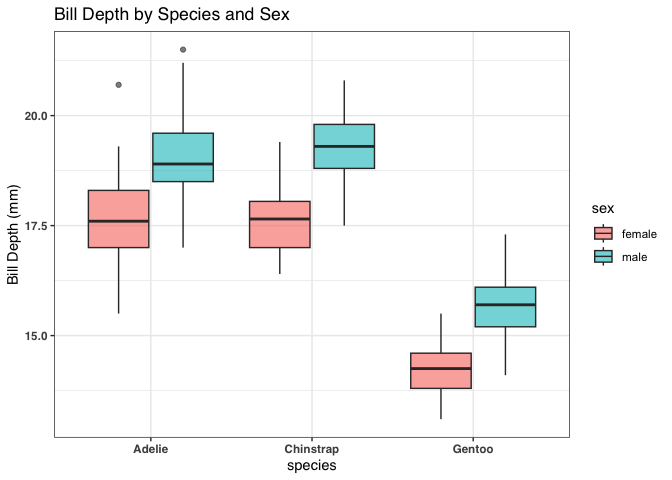

``` r
# Model (with interaction)
rawdata2_interct2 <- lm(bill_depth_mm ~ species * sex, data = rawdata2)
Anova(rawdata2_interct, type = 3)
```

    Anova Table (Type III tests)

    Response: flipper_length_mm
                 Sum Sq  Df    F value    Pr(>F)    
    (Intercept) 2574475   1 80497.6819 < 2.2e-16 ***
    species       21416   2   334.8078 < 2.2e-16 ***
    sex             778   1    24.3221 1.299e-06 ***
    species:sex     329   2     5.1442  0.006314 ** 
    Residuals     10458 327                         
    ---
    Signif. codes:  0 '***' 0.001 '**' 0.01 '*' 0.05 '.' 0.1 ' ' 1

``` r
# Model (with additive); though there is interaction above
rawdata2_addtv2 <- lm(bill_depth_mm ~ species + sex, data = rawdata2)
pr_out <- Anova(rawdata2_addtv, type = 2)
pr_out
```

    Anova Table (Type II tests)

    Response: flipper_length_mm
              Sum Sq  Df F value    Pr(>F)    
    species    50185   2  765.30 < 2.2e-16 ***
    sex         3906   1  119.12 < 2.2e-16 ***
    Residuals  10787 329                      
    ---
    Signif. codes:  0 '***' 0.001 '**' 0.01 '*' 0.05 '.' 0.1 ' ' 1

``` r
pr_out$`Pr(>F)` |> na.omit()
```

    [1] 1.815459e-124  7.109600e-24
    attr(,"na.action")
    [1] 3
    attr(,"class")
    [1] "omit"

``` r
tidy(pr_out)
```

    # A tibble: 3 × 5
      term       sumsq    df statistic    p.value
      <chr>      <dbl> <dbl>     <dbl>      <dbl>
    1 species   50185.     2      765.  1.82e-124
    2 sex        3906.     1      119.  7.11e- 24
    3 Residuals 10787.   329       NA  NA        

``` r
#Post-Hoc: pairwise comparisons for species (adjusted for sex)
species_tukey2 <-
  summary(glht(
    model = rawdata2_addtv2,
    linfct = mcp(species = "Tukey")
  ))
species_tukey2
```


         Simultaneous Tests for General Linear Hypotheses

    Multiple Comparisons of Means: Tukey Contrasts


    Fit: lm(formula = bill_depth_mm ~ species + sex, data = rawdata2)

    Linear Hypotheses:
                            Estimate Std. Error t value Pr(>|t|)    
    Chinstrap - Adelie == 0  0.07333    0.12227    0.60    0.819    
    Gentoo - Adelie == 0    -3.36959    0.10286  -32.76   <1e-05 ***
    Gentoo - Chinstrap == 0 -3.44292    0.12660  -27.19   <1e-05 ***
    ---
    Signif. codes:  0 '***' 0.001 '**' 0.01 '*' 0.05 '.' 0.1 ' ' 1
    (Adjusted p values reported -- single-step method)

``` r
species_tukey2$test$pvalues
```

    [1] 0.8193442 0.0000000 0.0000000
    attr(,"error")
    [1] 5.613579e-06

``` r
tidy(species_tukey2) |>
  select(-null.value)
```

    # A tibble: 3 × 6
      term    contrast           estimate std.error statistic adj.p.value
      <chr>   <chr>                 <dbl>     <dbl>     <dbl>       <dbl>
    1 species Chinstrap - Adelie   0.0733     0.122     0.600       0.819
    2 species Gentoo - Adelie     -3.37       0.103   -32.8         0    
    3 species Gentoo - Chinstrap  -3.44       0.127   -27.2         0    

``` r
summary(glht(
  model = rawdata2_addtv2,
  linfct = mcp(species = "Tukey")
))
```


         Simultaneous Tests for General Linear Hypotheses

    Multiple Comparisons of Means: Tukey Contrasts


    Fit: lm(formula = bill_depth_mm ~ species + sex, data = rawdata2)

    Linear Hypotheses:
                            Estimate Std. Error t value Pr(>|t|)    
    Chinstrap - Adelie == 0  0.07333    0.12227    0.60    0.819    
    Gentoo - Adelie == 0    -3.36959    0.10286  -32.76   <1e-05 ***
    Gentoo - Chinstrap == 0 -3.44292    0.12660  -27.19   <1e-05 ***
    ---
    Signif. codes:  0 '***' 0.001 '**' 0.01 '*' 0.05 '.' 0.1 ' ' 1
    (Adjusted p values reported -- single-step method)

``` r
#Post-Hoc: pairwise comparisons for species (adjusted for sex)
sex_tukey2 <- 
  glht(model = rawdata2_addtv2,
       linfct = mcp(sex = "Tukey"))
sex_tukey2
```


         General Linear Hypotheses

    Multiple Comparisons of Means: Tukey Contrasts


    Linear Hypotheses:
                       Estimate
    male - female == 0    1.505

``` r
sex_tukey2$test$pvalues
```

    NULL

``` r
tidy(sex_tukey2) |>
  select(-null.value)
```

    # A tibble: 1 × 6
      term  contrast      estimate std.error statistic adj.p.value
      <chr> <chr>            <dbl>     <dbl>     <dbl>       <dbl>
    1 sex   male - female     1.50    0.0913      16.5           0

``` r
summary(glht(
  model = rawdata2_addtv2,
  linfct = mcp(sex = "Tukey")
))
```


         Simultaneous Tests for General Linear Hypotheses

    Multiple Comparisons of Means: Tukey Contrasts


    Fit: lm(formula = bill_depth_mm ~ species + sex, data = rawdata2)

    Linear Hypotheses:
                       Estimate Std. Error t value Pr(>|t|)    
    male - female == 0  1.50491    0.09128   16.49   <2e-16 ***
    ---
    Signif. codes:  0 '***' 0.001 '**' 0.01 '*' 0.05 '.' 0.1 ' ' 1
    (Adjusted p values reported -- single-step method)

checking the model

``` r
# x11() #interactive only!
#quartz() #for mac
# from package performance
check_model(rawdata2_interct2)
```


``` r
check_model(rawdata2_addtv2)
```


``` r
# dev.off()
```

### Model 6: DV Flipper Length & IV Species + Sex + Body Weight

``` r
#graphical exploration
#Separate regression lines per sex and species
ggplot(rawdata2, aes(x = body_mass_g, y = flipper_length_mm, color = sex)) +
  geom_point(alpha = 0.4) +
  geom_smooth(method = "lm", se = FALSE) +
  facet_wrap(~species) +
  labs(title = "ANCOVA: Flipper Length modeled by Body Mass, Sex, and Species",
       x = "Body Weight (g)", y = "Flipper Length (mm)")
```

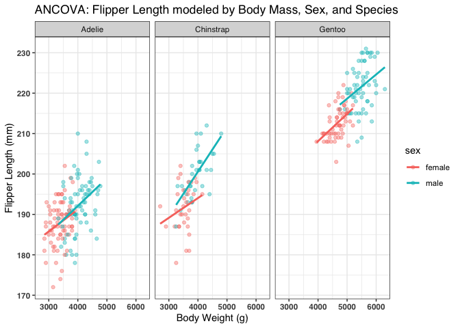

``` r
# Model
rawdata2_interct3 <- lm(flipper_length_mm ~ species * sex + body_mass_g, data = rawdata2)
rawdata2_interct3
```


    Call:
    lm(formula = flipper_length_mm ~ species * sex + body_mass_g, 
        data = rawdata2)

    Coefficients:
                 (Intercept)          speciesChinstrap             speciesGentoo  
                  164.737098                  2.856835                 15.940104  
                     sexmale               body_mass_g  speciesChinstrap:sexmale  
                   -0.001140                  0.006844                  5.359358  
       speciesGentoo:sexmale  
                    3.324894  

``` r
Anova(rawdata2_interct3, type = 3)
```

    Anova Table (Type III tests)

    Response: flipper_length_mm
                Sum Sq  Df   F value    Pr(>F)    
    (Intercept)  72127   1 2614.9973 < 2.2e-16 ***
    species       2982   2   54.0503 < 2.2e-16 ***
    sex              0   1    0.0000  0.999155    
    body_mass_g   1466   1   53.1639 2.342e-12 ***
    species:sex    381   2    6.8984  0.001163 ** 
    Residuals     8992 326                        
    ---
    Signif. codes:  0 '***' 0.001 '**' 0.01 '*' 0.05 '.' 0.1 ' ' 1

``` r
rawdata2_addtv3 <- lm(flipper_length_mm ~ species + sex + body_mass_g, data = rawdata2)
rawdata2_addtv3
```


    Call:
    lm(formula = flipper_length_mm ~ species + sex + body_mass_g, 
        data = rawdata2)

    Coefficients:
         (Intercept)  speciesChinstrap     speciesGentoo           sexmale  
           164.58872           5.54444          18.02132           2.47772  
         body_mass_g  
             0.00655  

``` r
Anova(rawdata2_addtv3, type = 2)
```

    Anova Table (Type II tests)

    Response: flipper_length_mm
                Sum Sq  Df F value    Pr(>F)    
    species     5075.7   2 88.8174 < 2.2e-16 ***
    sex          240.5   1  8.4165   0.00397 ** 
    body_mass_g 1414.9   1 49.5157 1.155e-11 ***
    Residuals   9372.3 328                      
    ---
    Signif. codes:  0 '***' 0.001 '**' 0.01 '*' 0.05 '.' 0.1 ' ' 1

``` r
#Post-hoc: 
# Tukey Pairwise Comparisons for Species (adjusted for Sex)
species_tukey3 <- 
  glht(model = rawdata2_addtv3, 
       linfct = mcp(species = "Tukey"))
summary(species_tukey3)
```


         Simultaneous Tests for General Linear Hypotheses

    Multiple Comparisons of Means: Tukey Contrasts


    Fit: lm(formula = flipper_length_mm ~ species + sex + body_mass_g, 
        data = rawdata2)

    Linear Hypotheses:
                            Estimate Std. Error t value Pr(>|t|)    
    Chinstrap - Adelie == 0   5.5444     0.7852   7.061   <1e-10 ***
    Gentoo - Adelie == 0     18.0213     1.4425  12.493   <1e-10 ***
    Gentoo - Chinstrap == 0  12.4769     1.4972   8.333   <1e-10 ***
    ---
    Signif. codes:  0 '***' 0.001 '**' 0.01 '*' 0.05 '.' 0.1 ' ' 1
    (Adjusted p values reported -- single-step method)

``` r
tidy(species_tukey3) |> select(-null.value)
```

    # A tibble: 3 × 6
      term    contrast           estimate std.error statistic adj.p.value
      <chr>   <chr>                 <dbl>     <dbl>     <dbl>       <dbl>
    1 species Chinstrap - Adelie     5.54     0.785      7.06    1.78e-11
    2 species Gentoo - Adelie       18.0      1.44      12.5     0       
    3 species Gentoo - Chinstrap    12.5      1.50       8.33    5.11e-15

``` r
# Tukey Pairwise Comparisons for Sex (adjusted for Species)
sex_tukey3 <- 
  glht(model = rawdata2_addtv3, 
       linfct = mcp(sex = "Tukey"))
summary(sex_tukey3)
```


         Simultaneous Tests for General Linear Hypotheses

    Multiple Comparisons of Means: Tukey Contrasts


    Fit: lm(formula = flipper_length_mm ~ species + sex + body_mass_g, 
        data = rawdata2)

    Linear Hypotheses:
                       Estimate Std. Error t value Pr(>|t|)   
    male - female == 0   2.4777     0.8541   2.901  0.00397 **
    ---
    Signif. codes:  0 '***' 0.001 '**' 0.01 '*' 0.05 '.' 0.1 ' ' 1
    (Adjusted p values reported -- single-step method)

``` r
# x11() #interactive only!
#quartz() #for mac
# from package performance
check_model(rawdata2_interct3)
```


``` r
check_model(rawdata2_addtv3)
```


``` r
# dev.off()
```

linear mixed model

``` r
##graphical exploration
vis1 <- ggplot(rawdata2, aes(body_mass_g, bill_depth_mm)) +
  geom_point() +
  scale_y_continuous(breaks = seq(13, 22, 1), limits = c(13, 22)) +
  scale_x_continuous(breaks = seq(2500, 6500, 500), limits = c(2500, 6500)) +
  #geom_smooth(linewidth = 2) +
  geom_smooth(method = lm, se = F, color = "red", fullrange = TRUE)
vis1
```

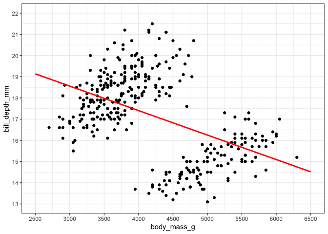

random intercept model

package nlme

``` r
lme_out <- nlme::lme(bill_depth_mm ~ body_mass_g,
  data = rawdata2,
  random = ~ 1 | species
) # RIntercept
lme_out
```

    Linear mixed-effects model fit by REML
      Data: rawdata2 
      Log-restricted-likelihood: -445.7192
      Fixed: bill_depth_mm ~ body_mass_g 
    (Intercept) body_mass_g 
    10.90483908  0.00152009 

    Random effects:
     Formula: ~1 | species
            (Intercept)  Residual
    StdDev:    3.160565 0.8779478

    Number of Observations: 333
    Number of Groups: 3 

``` r
Anova(lme_out)
```

    Analysis of Deviance Table (Type II tests)

    Response: bill_depth_mm
                 Chisq Df Pr(>Chisq)    
    body_mass_g 210.34  1  < 2.2e-16 ***
    ---
    Signif. codes:  0 '***' 0.001 '**' 0.01 '*' 0.05 '.' 0.1 ' ' 1

``` r
lmer_out <- lme4::lmer(bill_depth_mm ~ body_mass_g + (1 | species),
  data = rawdata2
)

lmer_out
```

    Linear mixed model fit by REML ['lmerMod']
    Formula: bill_depth_mm ~ body_mass_g + (1 | species)
       Data: rawdata2
    REML criterion at convergence: 891.4385
    Random effects:
     Groups   Name        Std.Dev.
     species  (Intercept) 3.1606  
     Residual             0.8779  
    Number of obs: 333, groups:  species, 3
    Fixed Effects:
    (Intercept)  body_mass_g  
       10.90484      0.00152  

``` r
Anova(lmer_out)
```

    Analysis of Deviance Table (Type II Wald chisquare tests)

    Response: bill_depth_mm
                 Chisq Df Pr(>Chisq)    
    body_mass_g 210.34  1  < 2.2e-16 ***
    ---
    Signif. codes:  0 '***' 0.001 '**' 0.01 '*' 0.05 '.' 0.1 ' ' 1

### Visualization the models

``` r
(lmer_out_param <- model_parameters(lmer_out, group_level = TRUE))
```

    # Fixed Effects

    Parameter   | Coefficient |       SE |        95% CI | t(329) |      p
    ----------------------------------------------------------------------
    (Intercept) |       10.90 |     1.88 | [7.21, 14.60] |   5.81 | < .001
    body mass g |    1.52e-03 | 1.05e-04 | [0.00,  0.00] |  14.50 | < .001

    # Random Effects: species

    Parameter               | Coefficient |   SE |         95% CI
    -------------------------------------------------------------
    (Intercept) [Adelie]    |        1.81 | 0.07 | [ 1.67,  1.95]
    (Intercept) [Chinstrap] |        1.84 | 0.11 | [ 1.63,  2.05]
    (Intercept) [Gentoo]    |       -3.65 | 0.08 | [-3.80, -3.49]

``` r
intercept_all <- lmer_out_param$Coefficient[1]
slope_mass <- lmer_out_param$Coefficient[2]

#plotting 
plotdata <- tibble(
  species = lmer_out_param$Level[-(1:2)],
  intercept = lmer_out_param$Coefficient[-(1:2)] +
    intercept_all
)

p1 <- ggplot(rawdata, aes(x = body_mass_g, y = bill_depth_mm, color = species)) +
  geom_point(alpha = 0.4) +
  # Parallel custom trendlines for each species
  geom_abline(
    data = plotdata,
    aes(color = species, intercept = intercept, slope = slope_mass),
    linewidth = 1
  ) +
  # Global underlying population baseline trend
  geom_abline(
    intercept = intercept_all, slope = slope_mass,
    color = "black", linetype = 3, linewidth = 1.2
  ) +
  theme_minimal() +
  theme(plot.title = element_text(hjust = 0.5)) +
  labs(
    title = "Random Intercept Model (Parallel Slopes)",
    x = "Body Mass (g)", y = "Bill Depth (mm)"
  )
p1
```

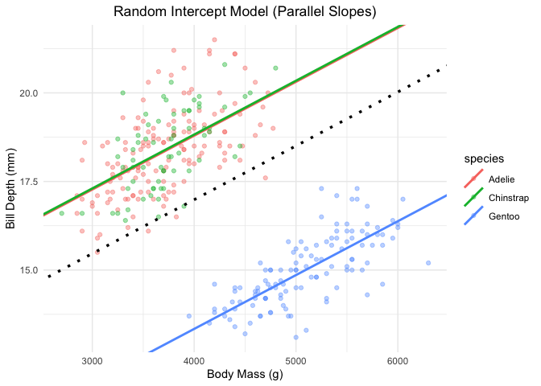
