# Normality Test
Reuben Njue

``` r
pacman::p_load(conflicted, tidyverse, wrappedtools,
               rlist, flextable, palmerpenguins,
               patchwork, ggbeeswarm, gt)

conflicts_prefer(dplyr::filter, 
                 dplyr::select,
                 palmerpenguins::penguins)

# Setup a crisp, dark-mode safe flextable template for GitHub
set_flextable_defaults(
  big.mark = " ",
  font.size = 9,
  theme_fun = theme_vanilla,
  padding.bottom = 3,
  padding.top = 3,
  padding.left = 3,
  padding.right = 4,
  font.family = "sans",            # Changed from xkcd to sans
  background.color = "#FFFFFF",    # Forces crisp white contrast 
  text.color = "#222222",          # Dark charcoal font text
  border.color = "#CCCCCC"         # Clean borders
)

theme_set(theme_bw())
theme_update(
  plot.title = element_text(family = "sans"),
  plot.caption = element_text(family = "sans"),
  axis.title = element_text(family = "sans"),
  axis.text = element_text(family = "sans"),
  strip.text = element_text(family = "sans"),
  legend.text = element_text(family = "sans"),
  legend.title = element_text(family = "sans")
)
```

Each chunk is doing a group of functions.

``` r
rawdata <- penguins |>
  drop_na() |> 
  mutate(year=factor(year))
#changed class
```

# Test for Normal Distribution

We are testing all numerical measures for a ***gaussian*** distribution.

## Step 1: single measure, all penguins

``` r
p_ks <- ksnormal(rawdata$body_mass_g,lillie = F) |> 
  formatP(ndigits = 5,mark = T, pretext = T)
p_sw <- shapiro.test(rawdata$body_mass_g) |> 
  pluck("p.value") |> 
  formatP(,ndigits = 5,mark = T, pretext = T)
ggplot(rawdata,aes(body_mass_g))+
  geom_density()+
  ggtitle(paste0("KS-Test: p ",p_ks,
                 " / Shapiro-Test: p ", p_sw))+
  labs(caption = paste0("KS-Test: p ",p_ks,
                        " / Shapiro-Test: p ", p_sw))+
  annotate(geom = 'label',
           family="xkcd",
           x = 5500, y = 4*10^-4,
           label=paste0("KS-Test: p ",p_ks,
                        "\nShapiro-Test: p ", p_sw))
```

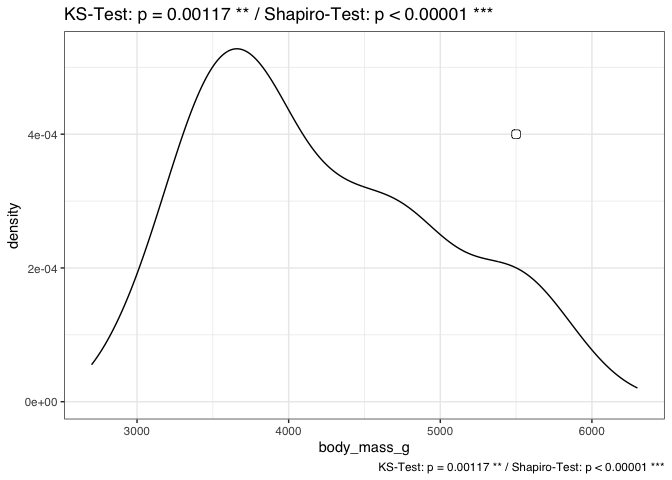

``` r
ggplot(rawdata,aes(body_mass_g, color = "distribtion type"))+
  geom_line(stat = "density", linewidth = 1,
            aes(color="empirical"))+  
  stat_function(fun = dnorm, 
                args = list(mean = mean(rawdata$body_mass_g),
                            sd = sd(rawdata$body_mass_g)),
                aes(color = "theoretical"),
                linewidth = 1)+
  scale_color_manual(
    name = "distribution type",
    values = c("empirical" = "black",
               "theoretical" = "darkgreen"))+
  ggtitle(paste0("KS-Test: p ",p_ks,
                 " / Shapiro-Test: p ", p_sw))
```

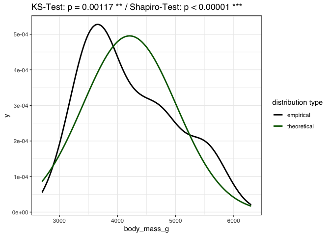

## Step 2: single measure, by species/sex

``` r
rawdata |> 
  filter(species == "Adelie") |> 
  pull(body_mass_g) |> 
  ksnormal()
```

    p_Normal_Lilliefors 
             0.06416173 

``` r
rawdata |> 
  filter(species == "Adelie", sex == "female") |> 
  pull(body_mass_g) |> 
  shapiro.test()
```


        Shapiro-Wilk normality test

    data:  pull(filter(rawdata, species == "Adelie", sex == "female"), body_mass_g)
    W = 0.97684, p-value = 0.1985

``` r
rawdata |> 
  group_by(species) |>
  summarize(
    `pGauss (KS)` = ksnormal(body_mass_g),
    `pGauss (Shapiro)` = shapiro.test(body_mass_g) |> 
      pluck("p.value")
  )
```

    # A tibble: 3 × 3
      species   `pGauss (KS)` `pGauss (Shapiro)`
      <fct>             <dbl>              <dbl>
    1 Adelie           0.0642             0.0423
    2 Chinstrap        0.157              0.561 
    3 Gentoo           0.176              0.261 

``` r
norm_test_out <- 
  rawdata |> 
  group_by(species, sex) |> 
  summarize(
    `pGauss (KS)` = ksnormal(body_mass_g),
    `pGauss (Shapiro)` = shapiro.test(body_mass_g) |> 
      pluck("p.value"),
    .groups = "drop")
norm_test_out |> 
  flextable() |> 
  set_table_properties(width = 1) #|> 
```

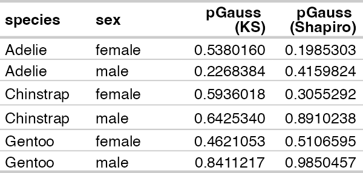

``` r
  #flex2rmd()
ggplot(rawdata,aes(body_mass_g))+
  geom_density()+
  geom_label(data=norm_test_out,
             family="sans",
             x = Inf,#6000, 
             hjust=1.1,
             y = Inf,#1.2*10^-3
             vjust=1.1,
             size=2.5,
             aes(label=paste("p (KS):\n",formatP(`pGauss (KS)`))))+
  facet_grid(cols=vars(sex), rows = vars(species))
```

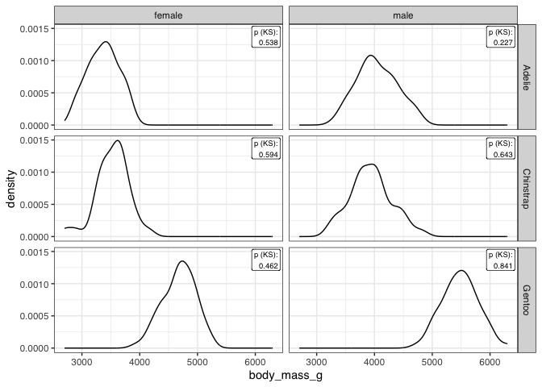

## Step 3: several Within Species

``` r
numvarsV1 <- ColSeeker(data = rawdata, # this is set even by default, see help
                       namepattern = c("_"))
numvarsV2 <- ColSeeker(varclass = c('numeric',
                                    'integer'),
                       exclude = "year")

# ggplot in a loop

for(var_i in numvarsV1$names){
  plot_temp <- 
    ggplot(rawdata,aes(x = .data[[var_i]]))+
    geom_density()
  print(plot_temp)
}
```

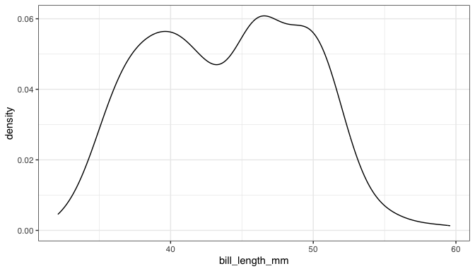

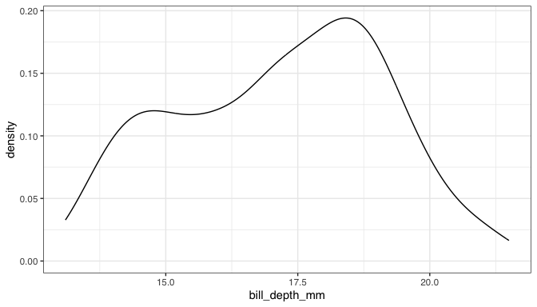

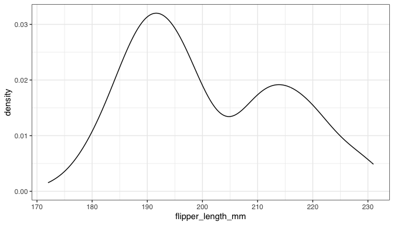

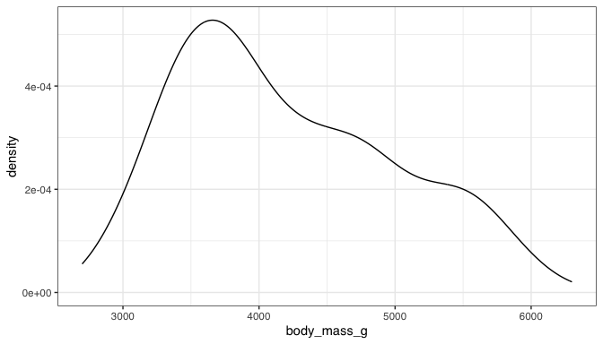

``` r
quickcheck <- 
  rawdata |> 
  summarise(across(.cols = all_of(numvarsV1$names),
                   .fns = ksnormal))

# when function arguments are needed or a pipe is usefull, use ~fct(.x)  
rawdata |> 
  summarise(across(.cols = all_of(numvarsV1$names),
                   .fns = ~ksnormal(.x,lillie = FALSE) |> 
                     formatP()))
```

    # A tibble: 1 × 4
      bill_length_mm bill_depth_mm flipper_length_mm body_mass_g
      <chr>          <chr>         <chr>             <chr>      
    1 0.070          0.028         0.001             0.001      

``` r
if(interactive()){
  print(quickcheck)
}
#create a tibble for p-values with 0 rows
## what are the species?
sp_levels <- levels(rawdata$species)
sex_levels <- levels(rawdata$sex)
normaltable <- tibble(Measurement='',
                      g1="",g2="",g3="",
                      .rows = 0)
colnames(normaltable)[-1] <- sp_levels

# create a list for plots
plotlist <- list()

#create loop structure
# loop index??
for(var_i in numvarsV2$names){
  # compute shapiro
  shapiro_p <-
    rawdata |> 
    group_by(species) |> 
    summarise(
      pShapiro=shapiro.test(
        .data[[var_i]]) |>
        pluck("p.value") |>
        formatP(mark = T))
  
  # put varname and p in results
  normaltable <- add_row(normaltable,
                         Measurement=var_i,
                         Adelie=shapiro_p$pShapiro[1],
                         Gentoo=shapiro_p$pShapiro[2],
                         Chinstrap=shapiro_p$pShapiro[3])
  
  # normaltable[nrow(normaltable),2:4] <-
  #   shapiro_p$pShapiro |>
  #   as.list()
  
  plot_hist <-
    rawdata |>
    ggplot(aes(x = .data[[var_i]],
               fill=species))+
    geom_histogram(color='black', 
                   alpha = .4)+
    facet_grid(rows = vars(species),
               margins=TRUE)#+
    # scale_fill_discrete(
    #   "Species\n(p Shapiro)",
    #   labels = paste0(sp_levels,"\n(",
    #                   shapiro_p$pShapiro,")")
    # )+
    # guides(fill="none")
  # print(plot_hist)
  plotlist <- list.append(plotlist,plot_hist)
  names(plotlist)[length(plotlist)] <-
    paste0(var_i,'_hist')
  # ggsave(plot = plot_hist, 
  #        filename = paste0("Graphs/",var_i,'_hist', ".png"),
  #        width = 10, height = 10, units = "cm", dpi = 300)
  #+
  # ggtitle(paste(sp_levels,
  #               shapiro_p$pShapiro,collapse = "\n"))+
  # labs(caption = paste(sp_levels,
  #                      shapiro_p$pShapiro,
  #                      collapse = " / "))
  #+
  # theme(legend.position = 'bottom')
  plot_dens <-
    rawdata |>
    ggplot(aes(x = .data[[var_i]], fill = species))+
    geom_density(alpha = .4, color = "black")+
    facet_grid(rows = vars(species),
               #cols=vars(sex),
               margins = TRUE)+
    # scale_fill_discrete(
    #   "Species\n(p Shapiro)",
    #   labels = paste0(sp_levels,"\n(",
    #                   shapiro_p$pShapiro,")")
    # )+
    scale_x_continuous(guide = guide_axis(n.dodge = 2))#+
    # guides(fill="none")+
    # theme(legend.position="bottom")
  plotlist <- list.append(plotlist,plot_dens)
  names(plotlist)[length(plotlist)] <-
    paste0(var_i,'_dens')
  # print(plot_dens)
  print(plot_hist+plot_dens+ 
          plot_layout(#guides = "collect",
            widths = c(1,1.75)))
  print(plot_hist+plot_dens+ 
          plot_layout(guides = "collect",
                      widths = c(1,1.75))) 
  print((plot_hist+guides(fill = "none")+plot_dens+ 
                       plot_layout(guides = "collect",
                         widths = c(1,1.75))) & 
  theme(legend.position = "bottom"))
  # ggsave(plot = plot_dens_hist, 
  #          filename = paste0("Graphs/",var_i,'_dens_hist', ".png"),
  #          width = 15, height = 10, units = "cm", dpi = 300)
  
  cat('&nbsp;\n\n')
}
```

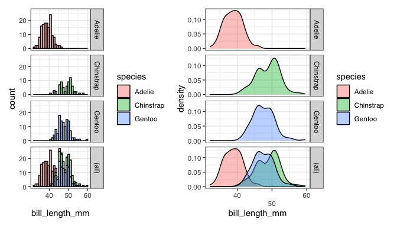

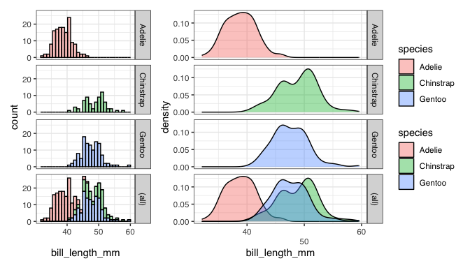

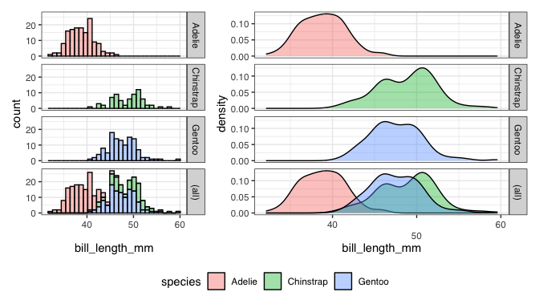

    &nbsp;

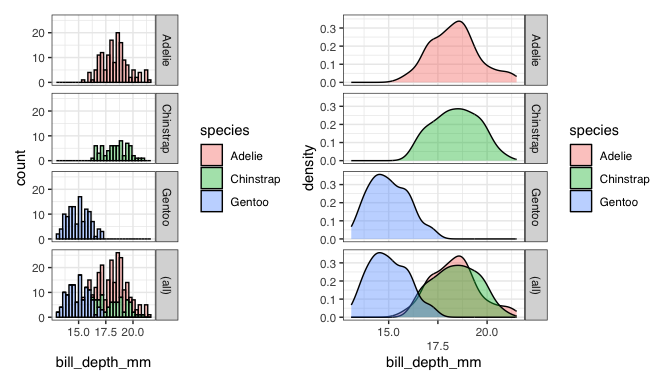

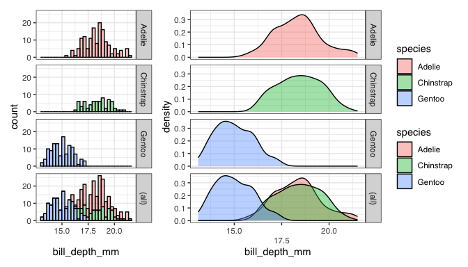

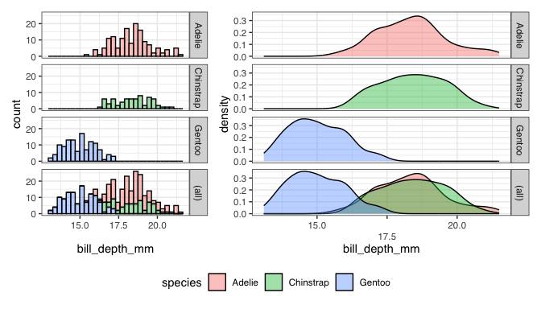

    &nbsp;

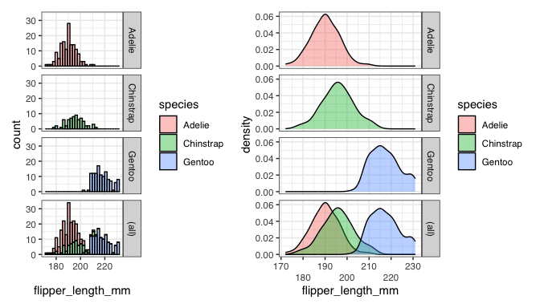

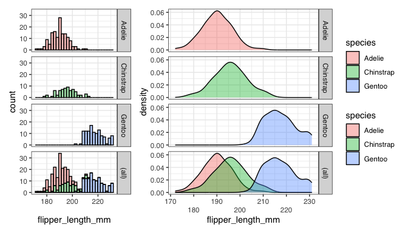

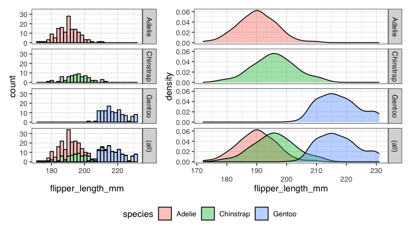

    &nbsp;

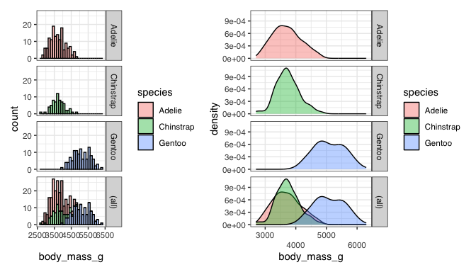

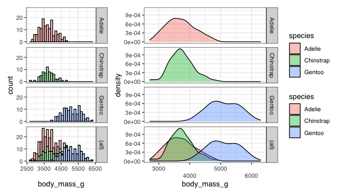

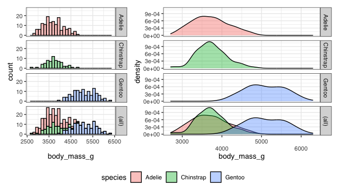

    &nbsp;

``` r
# cat("&nbsp;\n\n")
cat("\\newpage\n\n")
```

    \newpage

``` r
normaltable |> 
  flextable() |> 
  bold(~str_detect(Adelie,"\\*"),j = 2,bold = T) |> 
  # bg(~str_detect(Adelie,"\\*"),j = 2,
  #    bg = 'deeppink') |> 
  bg(~str_detect(Chinstrap,"\\*"),j = 3,
     bg = 'deeppink') |> 
  bg(~str_detect(Gentoo,"\\*"),j = 4,
     bg = 'deeppink') |> 
  color(~!Adelie<.05,j = 2,
        color = "green") |> 
  set_caption("Test for normality within species") |> 
  set_table_properties(width = 1,layout = 'autofit')
```

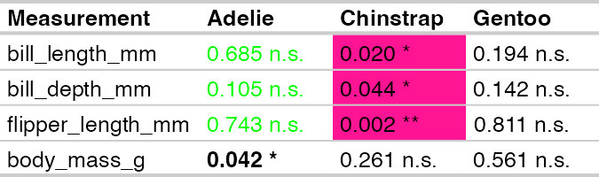

``` r
cat('&nbsp;\n\n')
```

    &nbsp;

``` r
walk(plotlist,print)
```

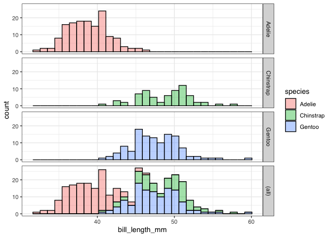

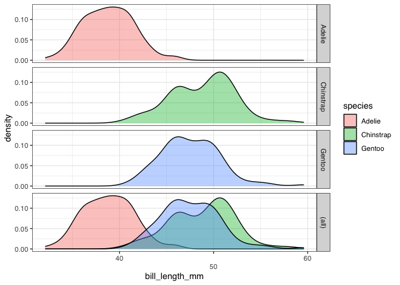

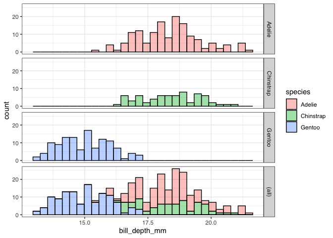

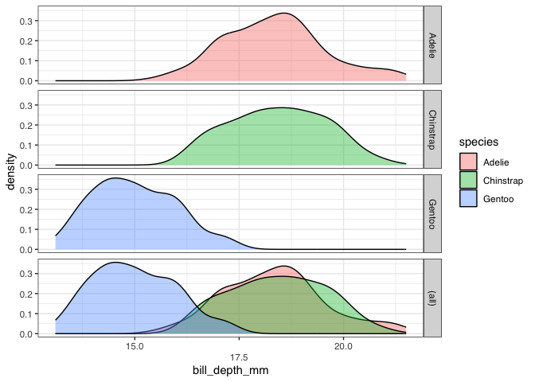

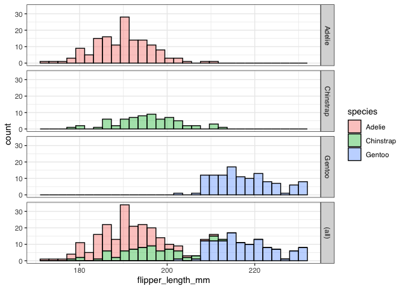

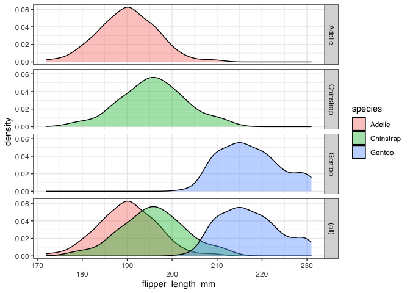

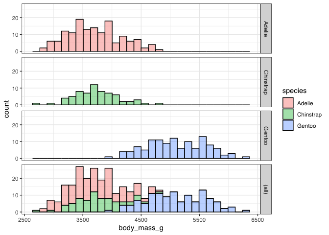

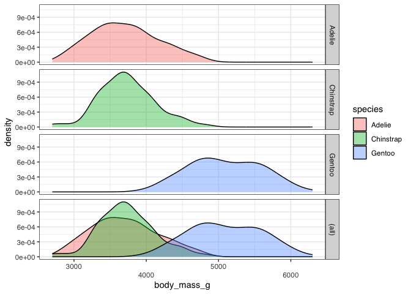

## Step 4 several within Species and Sex

``` r
normality_test <-
  rawdata |> 
  group_by(species, sex) |> 
  summarise(
    across(.cols = where(is.numeric),
           .fns = list(
             pKS = ~ksnormal(.x,lillie = F) |> 
               formatP(mark = T)),
           .names = "{.col}"),#"{.col}:{.fn}"),
    .groups = 'drop') |>
  pivot_longer(cols = where(is.character), # contains("_")
               names_to = "Measure",
               values_to = "p-value (KS-test)") |>
  arrange(Measure, sex) |>
  pivot_wider(names_from = c(sex,species),
              # names_sep=":",
              # names_glue="{species} ({sex})",
              values_from = `p-value (KS-test)`)

normality_test |>
  # mutate(Variable=str_replace(Measure,
  #                             pattern="(.+)_(.+)_(.+)",
  #                             replacement="\\1 \\2 [\\3]" )) |> 
  # select(-Measure) |> 
  # select(Variable, everything()) |> 
  flextable() |>
  set_caption("KS-Test for normality within species and sex") |> 
  separate_header(split = "_") |> 
  # theme_vader() |> 
  set_table_properties(width = 1,layout = 'autofit')
```

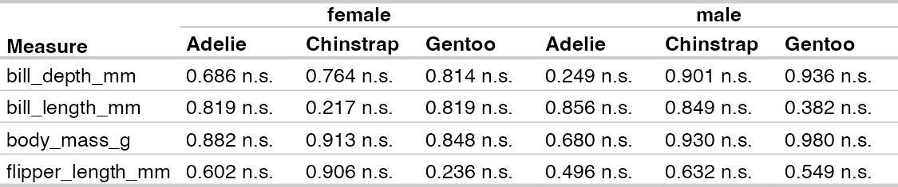

``` r
# #| echo: false
# #| results: asis
# # library(tidyverse)
# # Schleife über die einzigartigen Werte in der `cyl`-Spalte des `mtcars`-Datensatzes
# for (cylinder_count in unique(mtcars$cyl)) {
#   
#   # Filtern Sie die Daten für jede Zylinderanzahl
#   data_subset <- mtcars |>
#     filter(cyl == cylinder_count) |>
#     select(mpg, hp, wt)
#   
#   # Erstellen Sie die dynamische Beschriftung für jede Tabelle
#   dynamic_caption <- paste("Fahrzeuge mit", cylinder_count, "Zylindern")
#   
#   # Generieren Sie die Tabelle mit der dynamischen Beschriftung
#   # Die set_caption()-Funktion muss als erster Schritt des pipe-befehls verwendet werden.
#   ft <- flextable(data_subset) |>
#     set_caption(caption = dynamic_caption)
#   
#   # Ausgabe des flextable-Objekts. Quarto weiß, wie es dies rendern muss.
#   # flextable_to_rmd(ft)
#   print(ft)
#   # Optional: Fügen Sie einen kleinen Abstand hinzu
#   cat("\n\n")
# }
```

``` r
# by vs. group_by

by(data = rawdata$body_mass_g, 
   INDICES = list(species=rawdata$species,sex=rawdata$sex),
   FUN = ksnormal)
```

    species: Adelie
    sex: female
    [1] 0.538016
    ------------------------------------------------------------ 
    species: Chinstrap
    sex: female
    [1] 0.5936018
    ------------------------------------------------------------ 
    species: Gentoo
    sex: female
    [1] 0.4621053
    ------------------------------------------------------------ 
    species: Adelie
    sex: male
    [1] 0.2268384
    ------------------------------------------------------------ 
    species: Chinstrap
    sex: male
    [1] 0.642534
    ------------------------------------------------------------ 
    species: Gentoo
    sex: male
    [1] 0.8411217

``` r
rawdata |> 
  group_by(species,sex) |> 
  summarize(pKS = ksnormal(body_mass_g),
            .groups = 'drop')
```

    # A tibble: 6 × 3
      species   sex      pKS
      <fct>     <fct>  <dbl>
    1 Adelie    female 0.538
    2 Adelie    male   0.227
    3 Chinstrap female 0.594
    4 Chinstrap male   0.643
    5 Gentoo    female 0.462
    6 Gentoo    male   0.841

# nested loop

``` r
loopresults <- tibble(Variable = NA_character_,
                      Species = NA_character_,
                      Sex = NA_character_,
                      pKS = NA_character_,
                      pShapiro = NA_character_,
                      .rows = 0)

for(var_i in numvarsV2$names){
  data_subset <- rawdata |> 
    # filter(species == sp_i) |> 
    pull(.data[[var_i]])
  pKS <- ksnormal(data_subset) |>
    formatP(mark = T)
  pShapiro <- shapiro.test(data_subset) |>
    pluck("p.value") |>
    formatP(mark = T)
  loopresults <- add_row(loopresults,
                         Variable = var_i,
                         Species = "combined",
                         Sex = "combined",
                         pKS = pKS,
                         pShapiro = pShapiro)
  for(sp_i in sp_levels){
    data_subset <- rawdata |> 
      filter(species == sp_i) |> 
      pull(.data[[var_i]])
    pKS <- ksnormal(data_subset) |>
      formatP(mark = T)
    pShapiro <- shapiro.test(data_subset) |>
      pluck("p.value") |>
      formatP(mark = T)
    loopresults <- add_row(loopresults,
                           Variable = var_i,
                           Species = sp_i,
                           Sex = "combined",
                           pKS = pKS,
                           pShapiro = pShapiro)
    for(sex_i in sex_levels) {
      data_subset <- rawdata |> 
        filter(species == sp_i,
               sex == sex_i) |> 
        pull(.data[[var_i]])
      pKS <- ksnormal(data_subset) |>
        formatP(mark = T)
      pShapiro <- shapiro.test(data_subset) |>
        pluck("p.value") |>
        formatP(mark = T)
      loopresults <- add_row(loopresults,
                             Variable = var_i,
                             Species = sp_i,
                             Sex = sex_i,
                             pKS = pKS,
                             pShapiro = pShapiro)
    }
  }
}
loopresults |> 
  flextable() |> 
  set_caption("Test for normality") |>
  set_table_properties(width = 1,layout = 'autofit') |> 
  hline(c(10,20,30)) |> 
  bg(~Species == "combined", j= 2:3, bg = "lightblue") |> 
  bg(~Sex == "combined", j= 3, bg = "lightblue") |> 
  merge_v(j = 1) 
```

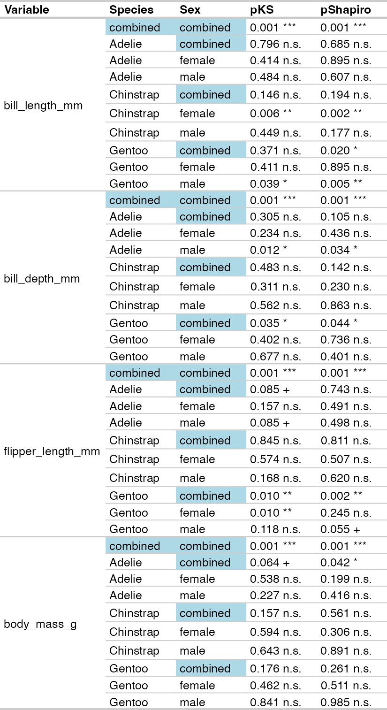

``` r
knitr::knit_print(loopresults)
```

    # A tibble: 40 × 5
       Variable       Species   Sex      pKS        pShapiro  
       <chr>          <chr>     <chr>    <chr>      <chr>     
     1 bill_length_mm combined  combined 0.001 ***  0.001 *** 
     2 bill_length_mm Adelie    combined 0.796 n.s. 0.685 n.s.
     3 bill_length_mm Adelie    female   0.414 n.s. 0.895 n.s.
     4 bill_length_mm Adelie    male     0.484 n.s. 0.607 n.s.
     5 bill_length_mm Chinstrap combined 0.146 n.s. 0.194 n.s.
     6 bill_length_mm Chinstrap female   0.006 **   0.002 **  
     7 bill_length_mm Chinstrap male     0.449 n.s. 0.177 n.s.
     8 bill_length_mm Gentoo    combined 0.371 n.s. 0.020 *   
     9 bill_length_mm Gentoo    female   0.411 n.s. 0.895 n.s.
    10 bill_length_mm Gentoo    male     0.039 *    0.005 **  
    # ℹ 30 more rows

``` r
loopresults |> 
  gt() |> 
  tab_header("Does this title show?") |> 
  tab_caption("and this?")
```

<div id="neikmjacvv" style="padding-left:0px;padding-right:0px;padding-top:10px;padding-bottom:10px;overflow-x:auto;overflow-y:auto;width:auto;height:auto;">
<style>#neikmjacvv table {
  font-family: system-ui, 'Segoe UI', Roboto, Helvetica, Arial, sans-serif, 'Apple Color Emoji', 'Segoe UI Emoji', 'Segoe UI Symbol', 'Noto Color Emoji';
  -webkit-font-smoothing: antialiased;
  -moz-osx-font-smoothing: grayscale;
}
&#10;#neikmjacvv thead, #neikmjacvv tbody, #neikmjacvv tfoot, #neikmjacvv tr, #neikmjacvv td, #neikmjacvv th {
  border-style: none;
}
&#10;#neikmjacvv p {
  margin: 0;
  padding: 0;
}
&#10;#neikmjacvv .gt_table {
  display: table;
  border-collapse: collapse;
  line-height: normal;
  margin-left: auto;
  margin-right: auto;
  color: #333333;
  font-size: 16px;
  font-weight: normal;
  font-style: normal;
  background-color: #FFFFFF;
  width: auto;
  border-top-style: solid;
  border-top-width: 2px;
  border-top-color: #A8A8A8;
  border-right-style: none;
  border-right-width: 2px;
  border-right-color: #D3D3D3;
  border-bottom-style: solid;
  border-bottom-width: 2px;
  border-bottom-color: #A8A8A8;
  border-left-style: none;
  border-left-width: 2px;
  border-left-color: #D3D3D3;
}
&#10;#neikmjacvv .gt_caption {
  padding-top: 4px;
  padding-bottom: 4px;
}
&#10;#neikmjacvv .gt_title {
  color: #333333;
  font-size: 125%;
  font-weight: initial;
  padding-top: 4px;
  padding-bottom: 4px;
  padding-left: 5px;
  padding-right: 5px;
  border-bottom-color: #FFFFFF;
  border-bottom-width: 0;
}
&#10;#neikmjacvv .gt_subtitle {
  color: #333333;
  font-size: 85%;
  font-weight: initial;
  padding-top: 3px;
  padding-bottom: 5px;
  padding-left: 5px;
  padding-right: 5px;
  border-top-color: #FFFFFF;
  border-top-width: 0;
}
&#10;#neikmjacvv .gt_heading {
  background-color: #FFFFFF;
  text-align: center;
  border-bottom-color: #FFFFFF;
  border-left-style: none;
  border-left-width: 1px;
  border-left-color: #D3D3D3;
  border-right-style: none;
  border-right-width: 1px;
  border-right-color: #D3D3D3;
}
&#10;#neikmjacvv .gt_bottom_border {
  border-bottom-style: solid;
  border-bottom-width: 2px;
  border-bottom-color: #D3D3D3;
}
&#10;#neikmjacvv .gt_col_headings {
  border-top-style: solid;
  border-top-width: 2px;
  border-top-color: #D3D3D3;
  border-bottom-style: solid;
  border-bottom-width: 2px;
  border-bottom-color: #D3D3D3;
  border-left-style: none;
  border-left-width: 1px;
  border-left-color: #D3D3D3;
  border-right-style: none;
  border-right-width: 1px;
  border-right-color: #D3D3D3;
}
&#10;#neikmjacvv .gt_col_heading {
  color: #333333;
  background-color: #FFFFFF;
  font-size: 100%;
  font-weight: normal;
  text-transform: inherit;
  border-left-style: none;
  border-left-width: 1px;
  border-left-color: #D3D3D3;
  border-right-style: none;
  border-right-width: 1px;
  border-right-color: #D3D3D3;
  vertical-align: bottom;
  padding-top: 5px;
  padding-bottom: 6px;
  padding-left: 5px;
  padding-right: 5px;
  overflow-x: hidden;
}
&#10;#neikmjacvv .gt_column_spanner_outer {
  color: #333333;
  background-color: #FFFFFF;
  font-size: 100%;
  font-weight: normal;
  text-transform: inherit;
  padding-top: 0;
  padding-bottom: 0;
  padding-left: 4px;
  padding-right: 4px;
}
&#10;#neikmjacvv .gt_column_spanner_outer:first-child {
  padding-left: 0;
}
&#10;#neikmjacvv .gt_column_spanner_outer:last-child {
  padding-right: 0;
}
&#10;#neikmjacvv .gt_column_spanner {
  border-bottom-style: solid;
  border-bottom-width: 2px;
  border-bottom-color: #D3D3D3;
  vertical-align: bottom;
  padding-top: 5px;
  padding-bottom: 5px;
  overflow-x: hidden;
  display: inline-block;
  width: 100%;
}
&#10;#neikmjacvv .gt_spanner_row {
  border-bottom-style: hidden;
}
&#10;#neikmjacvv .gt_group_heading {
  padding-top: 8px;
  padding-bottom: 8px;
  padding-left: 5px;
  padding-right: 5px;
  color: #333333;
  background-color: #FFFFFF;
  font-size: 100%;
  font-weight: initial;
  text-transform: inherit;
  border-top-style: solid;
  border-top-width: 2px;
  border-top-color: #D3D3D3;
  border-bottom-style: solid;
  border-bottom-width: 2px;
  border-bottom-color: #D3D3D3;
  border-left-style: none;
  border-left-width: 1px;
  border-left-color: #D3D3D3;
  border-right-style: none;
  border-right-width: 1px;
  border-right-color: #D3D3D3;
  vertical-align: middle;
  text-align: left;
}
&#10;#neikmjacvv .gt_empty_group_heading {
  padding: 0.5px;
  color: #333333;
  background-color: #FFFFFF;
  font-size: 100%;
  font-weight: initial;
  border-top-style: solid;
  border-top-width: 2px;
  border-top-color: #D3D3D3;
  border-bottom-style: solid;
  border-bottom-width: 2px;
  border-bottom-color: #D3D3D3;
  vertical-align: middle;
}
&#10;#neikmjacvv .gt_from_md > :first-child {
  margin-top: 0;
}
&#10;#neikmjacvv .gt_from_md > :last-child {
  margin-bottom: 0;
}
&#10;#neikmjacvv .gt_row {
  padding-top: 8px;
  padding-bottom: 8px;
  padding-left: 5px;
  padding-right: 5px;
  margin: 10px;
  border-top-style: solid;
  border-top-width: 1px;
  border-top-color: #D3D3D3;
  border-left-style: none;
  border-left-width: 1px;
  border-left-color: #D3D3D3;
  border-right-style: none;
  border-right-width: 1px;
  border-right-color: #D3D3D3;
  vertical-align: middle;
  overflow-x: hidden;
}
&#10;#neikmjacvv .gt_stub {
  color: #333333;
  background-color: #FFFFFF;
  font-size: 100%;
  font-weight: initial;
  text-transform: inherit;
  border-right-style: solid;
  border-right-width: 2px;
  border-right-color: #D3D3D3;
  padding-left: 5px;
  padding-right: 5px;
}
&#10;#neikmjacvv .gt_stub_row_group {
  color: #333333;
  background-color: #FFFFFF;
  font-size: 100%;
  font-weight: initial;
  text-transform: inherit;
  border-right-style: solid;
  border-right-width: 2px;
  border-right-color: #D3D3D3;
  padding-left: 5px;
  padding-right: 5px;
  vertical-align: top;
}
&#10;#neikmjacvv .gt_row_group_first td {
  border-top-width: 2px;
}
&#10;#neikmjacvv .gt_row_group_first th {
  border-top-width: 2px;
}
&#10;#neikmjacvv .gt_summary_row {
  color: #333333;
  background-color: #FFFFFF;
  text-transform: inherit;
  padding-top: 8px;
  padding-bottom: 8px;
  padding-left: 5px;
  padding-right: 5px;
}
&#10;#neikmjacvv .gt_first_summary_row {
  border-top-style: solid;
  border-top-color: #D3D3D3;
}
&#10;#neikmjacvv .gt_first_summary_row.thick {
  border-top-width: 2px;
}
&#10;#neikmjacvv .gt_last_summary_row {
  padding-top: 8px;
  padding-bottom: 8px;
  padding-left: 5px;
  padding-right: 5px;
  border-bottom-style: solid;
  border-bottom-width: 2px;
  border-bottom-color: #D3D3D3;
}
&#10;#neikmjacvv .gt_grand_summary_row {
  color: #333333;
  background-color: #FFFFFF;
  text-transform: inherit;
  padding-top: 8px;
  padding-bottom: 8px;
  padding-left: 5px;
  padding-right: 5px;
}
&#10;#neikmjacvv .gt_first_grand_summary_row {
  padding-top: 8px;
  padding-bottom: 8px;
  padding-left: 5px;
  padding-right: 5px;
  border-top-style: double;
  border-top-width: 6px;
  border-top-color: #D3D3D3;
}
&#10;#neikmjacvv .gt_last_grand_summary_row_top {
  padding-top: 8px;
  padding-bottom: 8px;
  padding-left: 5px;
  padding-right: 5px;
  border-bottom-style: double;
  border-bottom-width: 6px;
  border-bottom-color: #D3D3D3;
}
&#10;#neikmjacvv .gt_striped {
  background-color: rgba(128, 128, 128, 0.05);
}
&#10;#neikmjacvv .gt_table_body {
  border-top-style: solid;
  border-top-width: 2px;
  border-top-color: #D3D3D3;
  border-bottom-style: solid;
  border-bottom-width: 2px;
  border-bottom-color: #D3D3D3;
}
&#10;#neikmjacvv .gt_footnotes {
  color: #333333;
  background-color: #FFFFFF;
  border-bottom-style: none;
  border-bottom-width: 2px;
  border-bottom-color: #D3D3D3;
  border-left-style: none;
  border-left-width: 2px;
  border-left-color: #D3D3D3;
  border-right-style: none;
  border-right-width: 2px;
  border-right-color: #D3D3D3;
}
&#10;#neikmjacvv .gt_footnote {
  margin: 0px;
  font-size: 90%;
  padding-top: 4px;
  padding-bottom: 4px;
  padding-left: 5px;
  padding-right: 5px;
}
&#10;#neikmjacvv .gt_sourcenotes {
  color: #333333;
  background-color: #FFFFFF;
  border-bottom-style: none;
  border-bottom-width: 2px;
  border-bottom-color: #D3D3D3;
  border-left-style: none;
  border-left-width: 2px;
  border-left-color: #D3D3D3;
  border-right-style: none;
  border-right-width: 2px;
  border-right-color: #D3D3D3;
}
&#10;#neikmjacvv .gt_sourcenote {
  font-size: 90%;
  padding-top: 4px;
  padding-bottom: 4px;
  padding-left: 5px;
  padding-right: 5px;
}
&#10;#neikmjacvv .gt_left {
  text-align: left;
}
&#10;#neikmjacvv .gt_center {
  text-align: center;
}
&#10;#neikmjacvv .gt_right {
  text-align: right;
  font-variant-numeric: tabular-nums;
}
&#10;#neikmjacvv .gt_font_normal {
  font-weight: normal;
}
&#10;#neikmjacvv .gt_font_bold {
  font-weight: bold;
}
&#10;#neikmjacvv .gt_font_italic {
  font-style: italic;
}
&#10;#neikmjacvv .gt_super {
  font-size: 65%;
}
&#10;#neikmjacvv .gt_footnote_marks {
  font-size: 75%;
  vertical-align: 0.4em;
  position: initial;
}
&#10;#neikmjacvv .gt_asterisk {
  font-size: 100%;
  vertical-align: 0;
}
&#10;#neikmjacvv .gt_indent_1 {
  text-indent: 5px;
}
&#10;#neikmjacvv .gt_indent_2 {
  text-indent: 10px;
}
&#10;#neikmjacvv .gt_indent_3 {
  text-indent: 15px;
}
&#10;#neikmjacvv .gt_indent_4 {
  text-indent: 20px;
}
&#10;#neikmjacvv .gt_indent_5 {
  text-indent: 25px;
}
&#10;#neikmjacvv .katex-display {
  display: inline-flex !important;
  margin-bottom: 0.75em !important;
}
&#10;#neikmjacvv div.Reactable > div.rt-table > div.rt-thead > div.rt-tr.rt-tr-group-header > div.rt-th-group:after {
  height: 0px !important;
}
</style>

<table class="gt_table" data-quarto-postprocess="true"
data-quarto-disable-processing="false" data-quarto-bootstrap="false">
<caption>and this?</caption>
<thead>
<tr class="gt_heading">
<th colspan="5"
class="gt_heading gt_title gt_font_normal gt_bottom_border">Does this
title show?</th>
</tr>
<tr class="gt_col_headings">
<th id="Variable"
class="gt_col_heading gt_columns_bottom_border gt_left"
data-quarto-table-cell-role="th" scope="col">Variable</th>
<th id="Species" class="gt_col_heading gt_columns_bottom_border gt_left"
data-quarto-table-cell-role="th" scope="col">Species</th>
<th id="Sex" class="gt_col_heading gt_columns_bottom_border gt_left"
data-quarto-table-cell-role="th" scope="col">Sex</th>
<th id="pKS" class="gt_col_heading gt_columns_bottom_border gt_left"
data-quarto-table-cell-role="th" scope="col">pKS</th>
<th id="pShapiro"
class="gt_col_heading gt_columns_bottom_border gt_left"
data-quarto-table-cell-role="th" scope="col">pShapiro</th>
</tr>
</thead>
<tbody class="gt_table_body">
<tr>
<td class="gt_row gt_left" headers="Variable">bill_length_mm</td>
<td class="gt_row gt_left" headers="Species">combined</td>
<td class="gt_row gt_left" headers="Sex">combined</td>
<td class="gt_row gt_left" headers="pKS">0.001 ***</td>
<td class="gt_row gt_left" headers="pShapiro">0.001 ***</td>
</tr>
<tr>
<td class="gt_row gt_left" headers="Variable">bill_length_mm</td>
<td class="gt_row gt_left" headers="Species">Adelie</td>
<td class="gt_row gt_left" headers="Sex">combined</td>
<td class="gt_row gt_left" headers="pKS">0.796 n.s.</td>
<td class="gt_row gt_left" headers="pShapiro">0.685 n.s.</td>
</tr>
<tr>
<td class="gt_row gt_left" headers="Variable">bill_length_mm</td>
<td class="gt_row gt_left" headers="Species">Adelie</td>
<td class="gt_row gt_left" headers="Sex">female</td>
<td class="gt_row gt_left" headers="pKS">0.414 n.s.</td>
<td class="gt_row gt_left" headers="pShapiro">0.895 n.s.</td>
</tr>
<tr>
<td class="gt_row gt_left" headers="Variable">bill_length_mm</td>
<td class="gt_row gt_left" headers="Species">Adelie</td>
<td class="gt_row gt_left" headers="Sex">male</td>
<td class="gt_row gt_left" headers="pKS">0.484 n.s.</td>
<td class="gt_row gt_left" headers="pShapiro">0.607 n.s.</td>
</tr>
<tr>
<td class="gt_row gt_left" headers="Variable">bill_length_mm</td>
<td class="gt_row gt_left" headers="Species">Chinstrap</td>
<td class="gt_row gt_left" headers="Sex">combined</td>
<td class="gt_row gt_left" headers="pKS">0.146 n.s.</td>
<td class="gt_row gt_left" headers="pShapiro">0.194 n.s.</td>
</tr>
<tr>
<td class="gt_row gt_left" headers="Variable">bill_length_mm</td>
<td class="gt_row gt_left" headers="Species">Chinstrap</td>
<td class="gt_row gt_left" headers="Sex">female</td>
<td class="gt_row gt_left" headers="pKS">0.006 **</td>
<td class="gt_row gt_left" headers="pShapiro">0.002 **</td>
</tr>
<tr>
<td class="gt_row gt_left" headers="Variable">bill_length_mm</td>
<td class="gt_row gt_left" headers="Species">Chinstrap</td>
<td class="gt_row gt_left" headers="Sex">male</td>
<td class="gt_row gt_left" headers="pKS">0.449 n.s.</td>
<td class="gt_row gt_left" headers="pShapiro">0.177 n.s.</td>
</tr>
<tr>
<td class="gt_row gt_left" headers="Variable">bill_length_mm</td>
<td class="gt_row gt_left" headers="Species">Gentoo</td>
<td class="gt_row gt_left" headers="Sex">combined</td>
<td class="gt_row gt_left" headers="pKS">0.371 n.s.</td>
<td class="gt_row gt_left" headers="pShapiro">0.020 *</td>
</tr>
<tr>
<td class="gt_row gt_left" headers="Variable">bill_length_mm</td>
<td class="gt_row gt_left" headers="Species">Gentoo</td>
<td class="gt_row gt_left" headers="Sex">female</td>
<td class="gt_row gt_left" headers="pKS">0.411 n.s.</td>
<td class="gt_row gt_left" headers="pShapiro">0.895 n.s.</td>
</tr>
<tr>
<td class="gt_row gt_left" headers="Variable">bill_length_mm</td>
<td class="gt_row gt_left" headers="Species">Gentoo</td>
<td class="gt_row gt_left" headers="Sex">male</td>
<td class="gt_row gt_left" headers="pKS">0.039 *</td>
<td class="gt_row gt_left" headers="pShapiro">0.005 **</td>
</tr>
<tr>
<td class="gt_row gt_left" headers="Variable">bill_depth_mm</td>
<td class="gt_row gt_left" headers="Species">combined</td>
<td class="gt_row gt_left" headers="Sex">combined</td>
<td class="gt_row gt_left" headers="pKS">0.001 ***</td>
<td class="gt_row gt_left" headers="pShapiro">0.001 ***</td>
</tr>
<tr>
<td class="gt_row gt_left" headers="Variable">bill_depth_mm</td>
<td class="gt_row gt_left" headers="Species">Adelie</td>
<td class="gt_row gt_left" headers="Sex">combined</td>
<td class="gt_row gt_left" headers="pKS">0.305 n.s.</td>
<td class="gt_row gt_left" headers="pShapiro">0.105 n.s.</td>
</tr>
<tr>
<td class="gt_row gt_left" headers="Variable">bill_depth_mm</td>
<td class="gt_row gt_left" headers="Species">Adelie</td>
<td class="gt_row gt_left" headers="Sex">female</td>
<td class="gt_row gt_left" headers="pKS">0.234 n.s.</td>
<td class="gt_row gt_left" headers="pShapiro">0.436 n.s.</td>
</tr>
<tr>
<td class="gt_row gt_left" headers="Variable">bill_depth_mm</td>
<td class="gt_row gt_left" headers="Species">Adelie</td>
<td class="gt_row gt_left" headers="Sex">male</td>
<td class="gt_row gt_left" headers="pKS">0.012 *</td>
<td class="gt_row gt_left" headers="pShapiro">0.034 *</td>
</tr>
<tr>
<td class="gt_row gt_left" headers="Variable">bill_depth_mm</td>
<td class="gt_row gt_left" headers="Species">Chinstrap</td>
<td class="gt_row gt_left" headers="Sex">combined</td>
<td class="gt_row gt_left" headers="pKS">0.483 n.s.</td>
<td class="gt_row gt_left" headers="pShapiro">0.142 n.s.</td>
</tr>
<tr>
<td class="gt_row gt_left" headers="Variable">bill_depth_mm</td>
<td class="gt_row gt_left" headers="Species">Chinstrap</td>
<td class="gt_row gt_left" headers="Sex">female</td>
<td class="gt_row gt_left" headers="pKS">0.311 n.s.</td>
<td class="gt_row gt_left" headers="pShapiro">0.230 n.s.</td>
</tr>
<tr>
<td class="gt_row gt_left" headers="Variable">bill_depth_mm</td>
<td class="gt_row gt_left" headers="Species">Chinstrap</td>
<td class="gt_row gt_left" headers="Sex">male</td>
<td class="gt_row gt_left" headers="pKS">0.562 n.s.</td>
<td class="gt_row gt_left" headers="pShapiro">0.863 n.s.</td>
</tr>
<tr>
<td class="gt_row gt_left" headers="Variable">bill_depth_mm</td>
<td class="gt_row gt_left" headers="Species">Gentoo</td>
<td class="gt_row gt_left" headers="Sex">combined</td>
<td class="gt_row gt_left" headers="pKS">0.035 *</td>
<td class="gt_row gt_left" headers="pShapiro">0.044 *</td>
</tr>
<tr>
<td class="gt_row gt_left" headers="Variable">bill_depth_mm</td>
<td class="gt_row gt_left" headers="Species">Gentoo</td>
<td class="gt_row gt_left" headers="Sex">female</td>
<td class="gt_row gt_left" headers="pKS">0.402 n.s.</td>
<td class="gt_row gt_left" headers="pShapiro">0.736 n.s.</td>
</tr>
<tr>
<td class="gt_row gt_left" headers="Variable">bill_depth_mm</td>
<td class="gt_row gt_left" headers="Species">Gentoo</td>
<td class="gt_row gt_left" headers="Sex">male</td>
<td class="gt_row gt_left" headers="pKS">0.677 n.s.</td>
<td class="gt_row gt_left" headers="pShapiro">0.401 n.s.</td>
</tr>
<tr>
<td class="gt_row gt_left" headers="Variable">flipper_length_mm</td>
<td class="gt_row gt_left" headers="Species">combined</td>
<td class="gt_row gt_left" headers="Sex">combined</td>
<td class="gt_row gt_left" headers="pKS">0.001 ***</td>
<td class="gt_row gt_left" headers="pShapiro">0.001 ***</td>
</tr>
<tr>
<td class="gt_row gt_left" headers="Variable">flipper_length_mm</td>
<td class="gt_row gt_left" headers="Species">Adelie</td>
<td class="gt_row gt_left" headers="Sex">combined</td>
<td class="gt_row gt_left" headers="pKS">0.085 +</td>
<td class="gt_row gt_left" headers="pShapiro">0.743 n.s.</td>
</tr>
<tr>
<td class="gt_row gt_left" headers="Variable">flipper_length_mm</td>
<td class="gt_row gt_left" headers="Species">Adelie</td>
<td class="gt_row gt_left" headers="Sex">female</td>
<td class="gt_row gt_left" headers="pKS">0.157 n.s.</td>
<td class="gt_row gt_left" headers="pShapiro">0.491 n.s.</td>
</tr>
<tr>
<td class="gt_row gt_left" headers="Variable">flipper_length_mm</td>
<td class="gt_row gt_left" headers="Species">Adelie</td>
<td class="gt_row gt_left" headers="Sex">male</td>
<td class="gt_row gt_left" headers="pKS">0.085 +</td>
<td class="gt_row gt_left" headers="pShapiro">0.498 n.s.</td>
</tr>
<tr>
<td class="gt_row gt_left" headers="Variable">flipper_length_mm</td>
<td class="gt_row gt_left" headers="Species">Chinstrap</td>
<td class="gt_row gt_left" headers="Sex">combined</td>
<td class="gt_row gt_left" headers="pKS">0.845 n.s.</td>
<td class="gt_row gt_left" headers="pShapiro">0.811 n.s.</td>
</tr>
<tr>
<td class="gt_row gt_left" headers="Variable">flipper_length_mm</td>
<td class="gt_row gt_left" headers="Species">Chinstrap</td>
<td class="gt_row gt_left" headers="Sex">female</td>
<td class="gt_row gt_left" headers="pKS">0.574 n.s.</td>
<td class="gt_row gt_left" headers="pShapiro">0.507 n.s.</td>
</tr>
<tr>
<td class="gt_row gt_left" headers="Variable">flipper_length_mm</td>
<td class="gt_row gt_left" headers="Species">Chinstrap</td>
<td class="gt_row gt_left" headers="Sex">male</td>
<td class="gt_row gt_left" headers="pKS">0.168 n.s.</td>
<td class="gt_row gt_left" headers="pShapiro">0.620 n.s.</td>
</tr>
<tr>
<td class="gt_row gt_left" headers="Variable">flipper_length_mm</td>
<td class="gt_row gt_left" headers="Species">Gentoo</td>
<td class="gt_row gt_left" headers="Sex">combined</td>
<td class="gt_row gt_left" headers="pKS">0.010 **</td>
<td class="gt_row gt_left" headers="pShapiro">0.002 **</td>
</tr>
<tr>
<td class="gt_row gt_left" headers="Variable">flipper_length_mm</td>
<td class="gt_row gt_left" headers="Species">Gentoo</td>
<td class="gt_row gt_left" headers="Sex">female</td>
<td class="gt_row gt_left" headers="pKS">0.010 **</td>
<td class="gt_row gt_left" headers="pShapiro">0.245 n.s.</td>
</tr>
<tr>
<td class="gt_row gt_left" headers="Variable">flipper_length_mm</td>
<td class="gt_row gt_left" headers="Species">Gentoo</td>
<td class="gt_row gt_left" headers="Sex">male</td>
<td class="gt_row gt_left" headers="pKS">0.118 n.s.</td>
<td class="gt_row gt_left" headers="pShapiro">0.055 +</td>
</tr>
<tr>
<td class="gt_row gt_left" headers="Variable">body_mass_g</td>
<td class="gt_row gt_left" headers="Species">combined</td>
<td class="gt_row gt_left" headers="Sex">combined</td>
<td class="gt_row gt_left" headers="pKS">0.001 ***</td>
<td class="gt_row gt_left" headers="pShapiro">0.001 ***</td>
</tr>
<tr>
<td class="gt_row gt_left" headers="Variable">body_mass_g</td>
<td class="gt_row gt_left" headers="Species">Adelie</td>
<td class="gt_row gt_left" headers="Sex">combined</td>
<td class="gt_row gt_left" headers="pKS">0.064 +</td>
<td class="gt_row gt_left" headers="pShapiro">0.042 *</td>
</tr>
<tr>
<td class="gt_row gt_left" headers="Variable">body_mass_g</td>
<td class="gt_row gt_left" headers="Species">Adelie</td>
<td class="gt_row gt_left" headers="Sex">female</td>
<td class="gt_row gt_left" headers="pKS">0.538 n.s.</td>
<td class="gt_row gt_left" headers="pShapiro">0.199 n.s.</td>
</tr>
<tr>
<td class="gt_row gt_left" headers="Variable">body_mass_g</td>
<td class="gt_row gt_left" headers="Species">Adelie</td>
<td class="gt_row gt_left" headers="Sex">male</td>
<td class="gt_row gt_left" headers="pKS">0.227 n.s.</td>
<td class="gt_row gt_left" headers="pShapiro">0.416 n.s.</td>
</tr>
<tr>
<td class="gt_row gt_left" headers="Variable">body_mass_g</td>
<td class="gt_row gt_left" headers="Species">Chinstrap</td>
<td class="gt_row gt_left" headers="Sex">combined</td>
<td class="gt_row gt_left" headers="pKS">0.157 n.s.</td>
<td class="gt_row gt_left" headers="pShapiro">0.561 n.s.</td>
</tr>
<tr>
<td class="gt_row gt_left" headers="Variable">body_mass_g</td>
<td class="gt_row gt_left" headers="Species">Chinstrap</td>
<td class="gt_row gt_left" headers="Sex">female</td>
<td class="gt_row gt_left" headers="pKS">0.594 n.s.</td>
<td class="gt_row gt_left" headers="pShapiro">0.306 n.s.</td>
</tr>
<tr>
<td class="gt_row gt_left" headers="Variable">body_mass_g</td>
<td class="gt_row gt_left" headers="Species">Chinstrap</td>
<td class="gt_row gt_left" headers="Sex">male</td>
<td class="gt_row gt_left" headers="pKS">0.643 n.s.</td>
<td class="gt_row gt_left" headers="pShapiro">0.891 n.s.</td>
</tr>
<tr>
<td class="gt_row gt_left" headers="Variable">body_mass_g</td>
<td class="gt_row gt_left" headers="Species">Gentoo</td>
<td class="gt_row gt_left" headers="Sex">combined</td>
<td class="gt_row gt_left" headers="pKS">0.176 n.s.</td>
<td class="gt_row gt_left" headers="pShapiro">0.261 n.s.</td>
</tr>
<tr>
<td class="gt_row gt_left" headers="Variable">body_mass_g</td>
<td class="gt_row gt_left" headers="Species">Gentoo</td>
<td class="gt_row gt_left" headers="Sex">female</td>
<td class="gt_row gt_left" headers="pKS">0.462 n.s.</td>
<td class="gt_row gt_left" headers="pShapiro">0.511 n.s.</td>
</tr>
<tr>
<td class="gt_row gt_left" headers="Variable">body_mass_g</td>
<td class="gt_row gt_left" headers="Species">Gentoo</td>
<td class="gt_row gt_left" headers="Sex">male</td>
<td class="gt_row gt_left" headers="pKS">0.841 n.s.</td>
<td class="gt_row gt_left" headers="pShapiro">0.985 n.s.</td>
</tr>
</tbody>
</table>

</div>
